# Bölüm 1 Tanıtım

Doç. Dr. Mehmet Dinçer Erbaş Bolu Abant İzzet Baysal Üniversitesi Mühendislik Fakültesi Bilgisayar Mühendisliği Bölümü

 All material copyright 1996-2020 J.F Kurose and K.W. Ross, All Rights Reserved Slaytlar ders kitabından adapte edilmiştir.

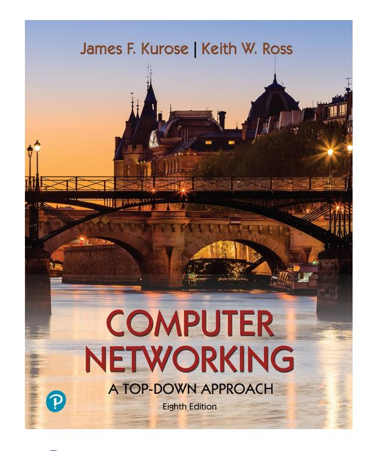

*Computer Networking: A Top-Down Approach*  8 th edition Jim Kurose, Keith Ross Pearson, 2020

# Bölüm 1: Tanıtım

### *Amacımız:*

- Terminoloji hakkında bilgi vereceğiz
- Daha detaylı olarak ilerleyen bölümlerde
- Yaklaşım:
  - İnternet'i örnek olarak inceleyeceğiz

### *Genel bakış*:

- İnternet nedir?
- Ağ protokolü nedir?
- Ağ kenarı; uç sistemler, erişim ağları, fiziksel yapı
- Ağ çekirdeği: paket/devre anahtarlama, Internet yapısı
- Performans: kayıp, gecikme, iş hacmi kavramları
- Güvenlik
- Protokol katmanları, hizmet modelleri
- İnternetin kısa tarihçesi

# Bölüm 1: Yol haritası

- 1.1 İnternet nedir?
- 1.2 Ağ kenarı
  - Uç sistemler, erişim ağları, bağlantı türleri
- 1.3 Ağ çekirdeği
  - paket anahtarlama, devre anahtarlama, ağ yapısı
- 1.4 Ağlarda Gecikme, kayıp, iş hacmi
- 1.5 Protokol katmanları, hizmet modelleri
- 1.6 Ağ güvenliği
- 1.7 İnternetin kısa tarihçesi

## İnternet nedir? İçerik açısından

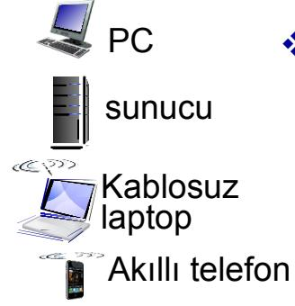

- Milyarlarca birbirine bağlı cihaz
  - cihazlar = uç sistemler
  - Ağ uygulaması çalıştırır

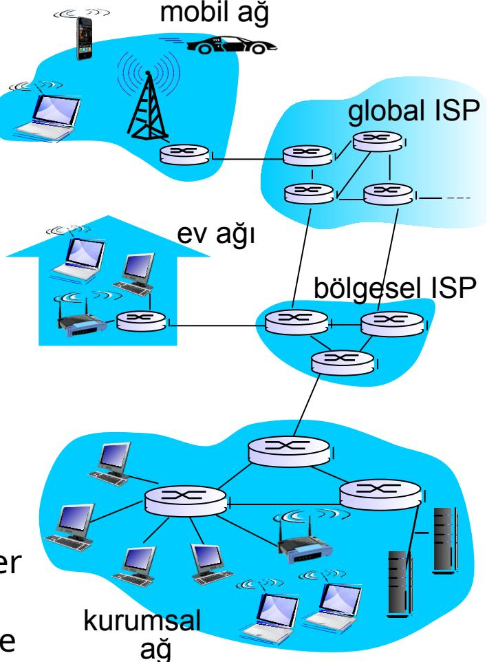


- fiber, bakır, radyo, uydu
- İletim miktarı: Bant genişliği

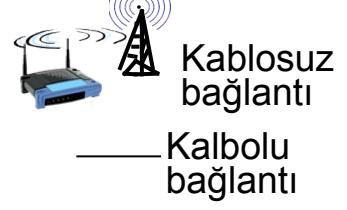

İnternet çekirdeği


 Yönlendirici (İng: router) ve anahtarlayıcı (ing: switch)

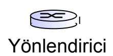

## "Eğlenceli" internet uygulamaları


IP picture frame

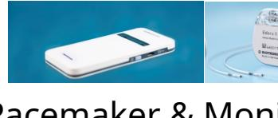

Pacemaker & Monitor


Tweet-a-watt: monitor energy use


Security Camera


Web-enabled toaster + weather forecaster

bed

sensorized,

mattress


scooters


Internet phones

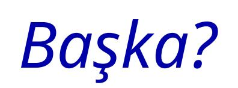


Internet refrigerator


## İnternet nedir? Genel yapısı

- *Internet:* "ağların ağı"
  - Birbirine bağlı ISP'ler
  - Internet hizmet sağlayıcı
- *Protokoller* mesaj gönderimini ve alımını kontrol eder
  - Örnekler: TCP, IP, HTTP, Skype, 802.11
- *Internet standartları*
  - RFC: Request for comments
    - Standartları tanımlar.
  - IETF: Internet Engineering Task Force
    - Standartları belirler.

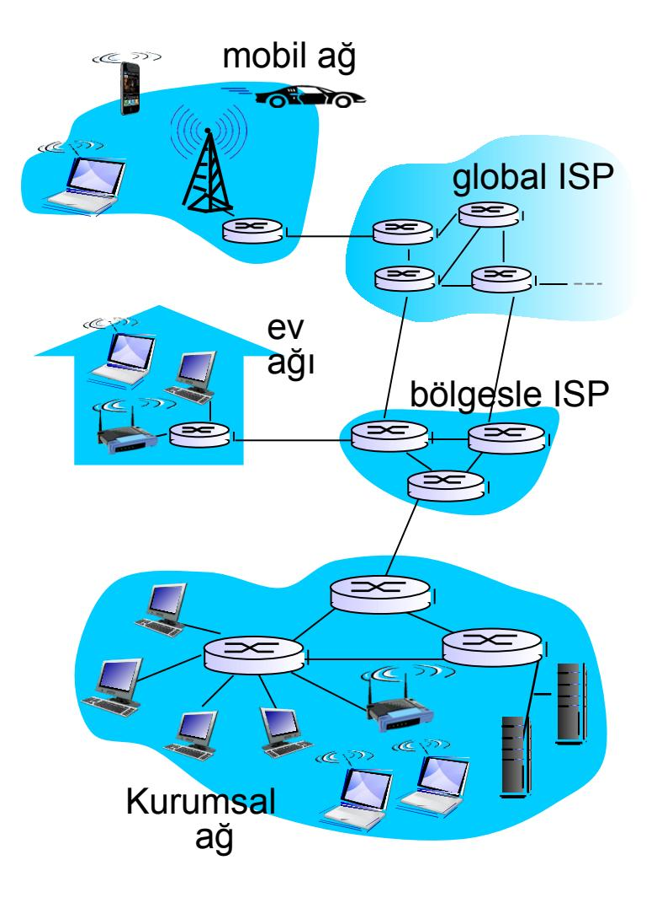

## İnternet nedir? Verdiği hizmet

- *Uygulamalara hizmet veren altyapı:*
  - Web, VoIP, e-posta, oyunlar, e-ticaret, sosyal ağlar …
- *Uygulamalara programlama arayüzü sağlar*
  - Mesaj alan ve gönderen uygulamaların internete bağlanabilmesi gerekli araçları sunar.
  - Posta hizmetlerinde olduğu gibi farklı hizmet seçenekleri sunar.

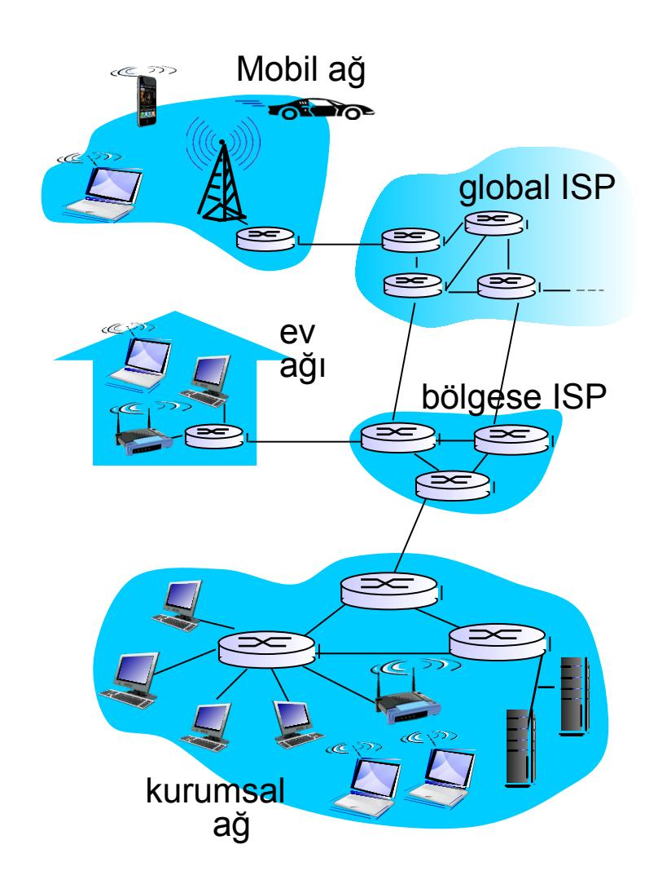

# Protokol nedir?

### *insan protokolleri:*

- "Saat kaç?"
- "Bir soru sorabilir miyim?"
- Kendini tanıtma
- … belli mesajlar gönderilir
- … mesaj alındığında veya belli durumlarda belli aksiyonlar alınır.

### *ağ protokolleri:*

- Insanlar yerine makineler
- İnternet üzerindeki her türlü iletişim protokoller ile yönetilir.

*Protokoller ağ birimleri arasında gönderilen ve alınan mesajların yapısı ve sıralaması ile bu mesajların iletimi esnasında uygulanan aksiyonları tanımlar*

# Protokol nedir?

Bir insan protokolü ile makine protokolü

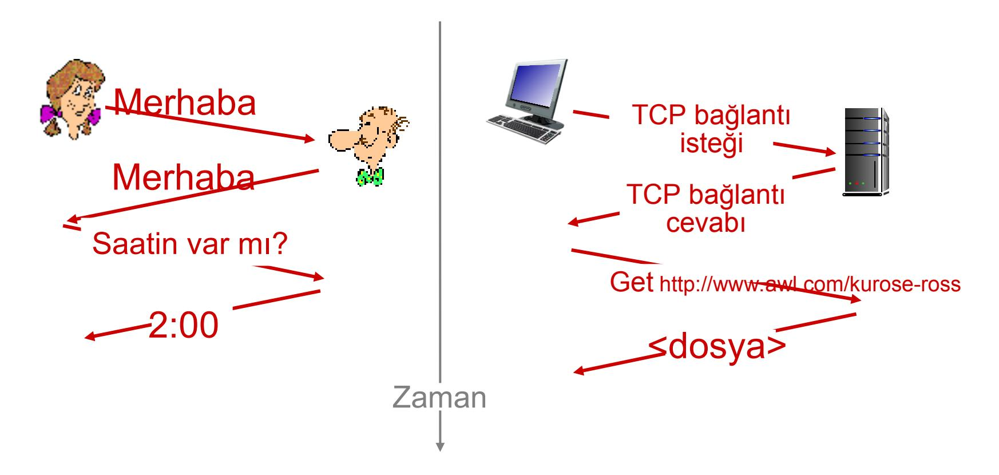

*S:* başka insan protokolü?

# Bölüm 1: Yol haritası

- 1.1 İnternet nedir?
- 1.2 Ağ kenarı
  - Uç sistemler, erişim ağları, bağlantı türleri
- 1.3 Ağ çekirdeği
  - paket anahtarlama, devre anahtarlama, ağ yapısı
- 1.4 Ağlarda Gecikme, kayıp, iş hacmi
- 1.5 Protokol katmanları, hizmet modelleri
- 1.6 Ağ güvenliği
- 1.7 İnternetin kısa tarihçesi

## Ağ yapısına yakından bakalım

- *ağ kenarı:*
  - cihazlar: istemci ve sunucu
  - Veri merkezlerinde genellikle sunucular
- *ulaşım ağları, fiziksel bağlar:* kablolu, kablosuz iletişim bağları

- *ağ çekirdeği:* 
  - Birbirine bağlı yönlendiriciler
  - Ağların ağı

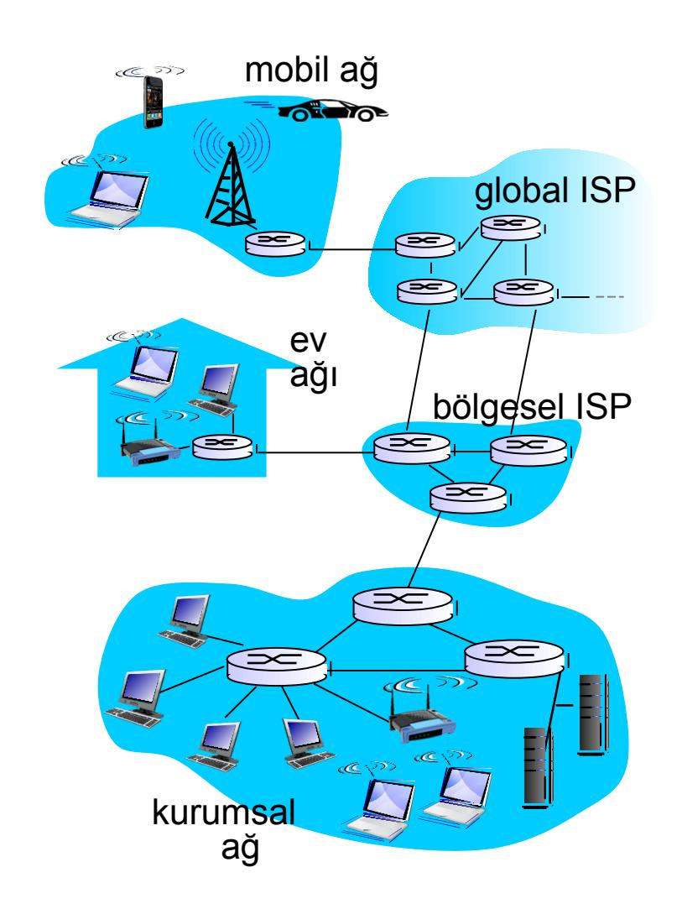

## Erişim ağları ve fiziksel bağlar

#### *S: Uç sistemleri kenar yönlendiriciye nasıl bağlarız?*

- Yerleşik erişim ağları
- kurumsal erişim ağları (okul, şirket)
- Mobil erişim ağları

#### *Unutulmamalı*

- Erişim ağlarının bant genişliği (bits / saniye)?
- Paylaşımlı mı? Ayrılmış mı?

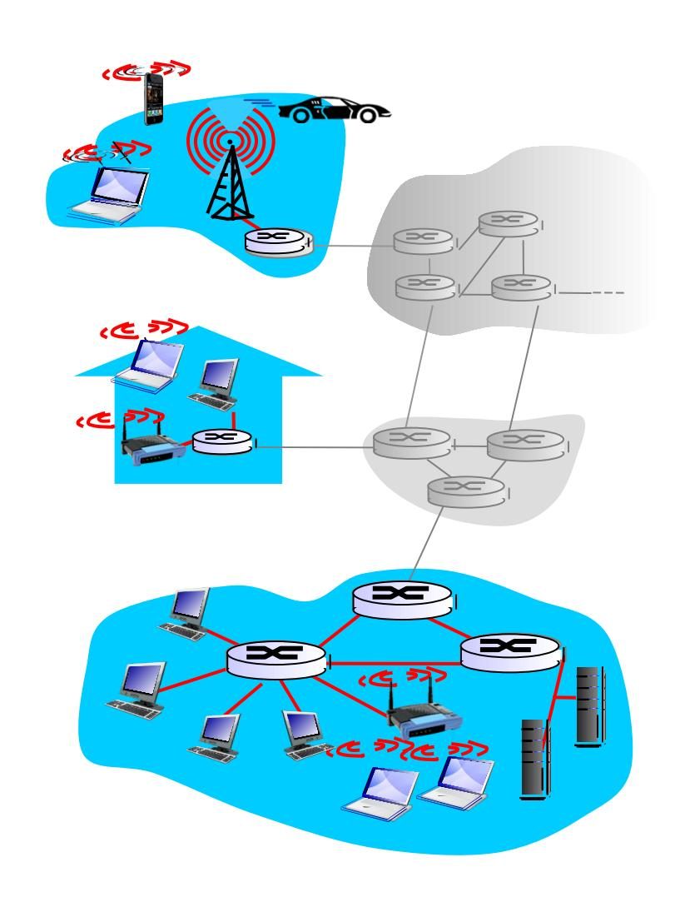

### Erişim ağları: digital subscriber line (DSL)

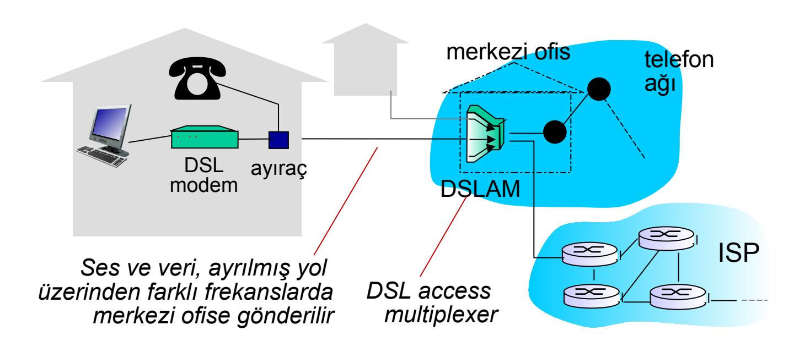

- Mevcut telefon bağı üzerinden merkezi ofisteki DSLAM sistemine bağlantı kurulur
  - DSL telefon ağı üzerinden giden veri İnternete gider
  - DSL telefon ağı üzerinden giden ses telefon ağına gider.
- 24-52 Megabit/saniye ayrılmış indirme hızı
- 3.5-16 Mb/s ayrılmış yükleme hızı

## Erişim ağları: kablo ağı

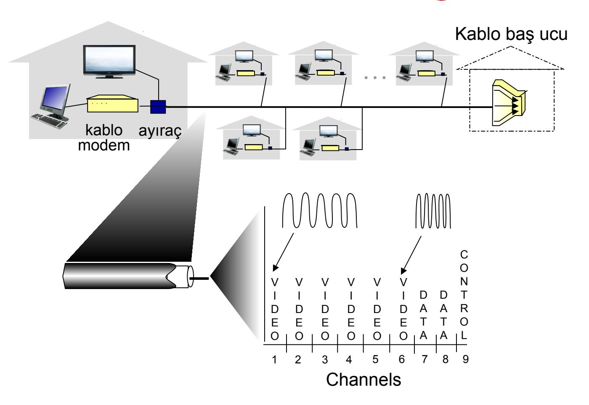

Frekans bölüşümlü çoğullama: Farklı frekans kümelerinde farklı kanallar iletilir.

## Erişim ağları: kablo ağı

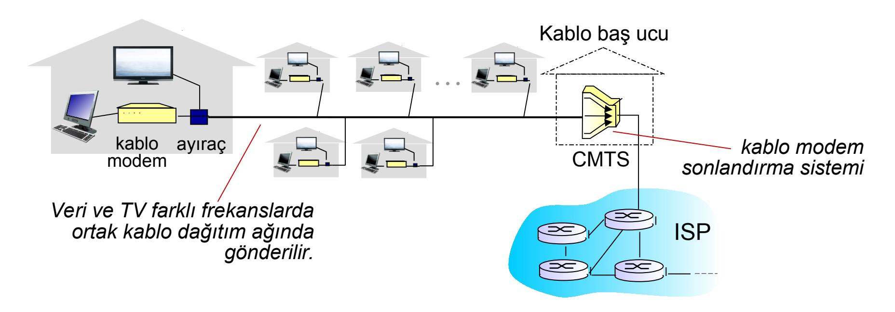

- HFC: Hibrit fiber koaksiyel
  - Asimetrik: 40Mb/s 1.2Gb/s hıza kadar indirme iletim hızı, 30 100 Mbps hıza kadar yükleme iletim hızı
- Kablo ağı, fiber kablo ile evler ISP yönlendiriciye bağlanır.
  - Evler kablo baş ucuna erişim ağını paylaşır
  - DSL sisteminde ise her evin merkezi ofise kendine ait bağlantısı vardır.

## Erişim ağları: Ev ağı

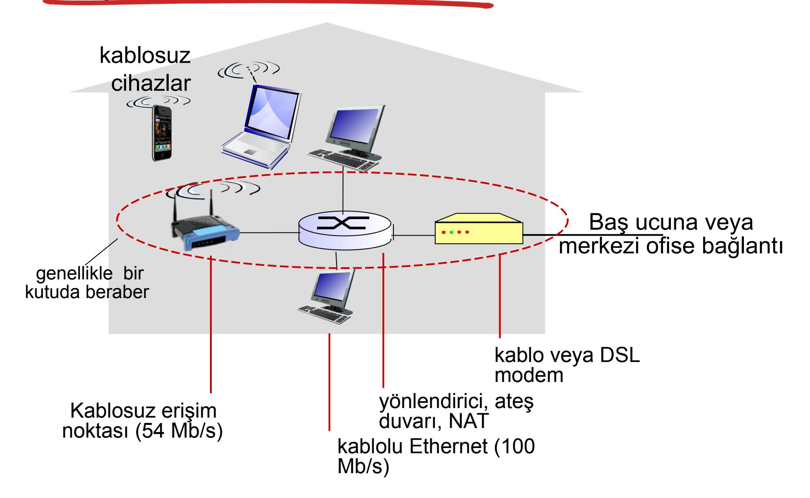

## Firma erişim ağı (Ethernet)

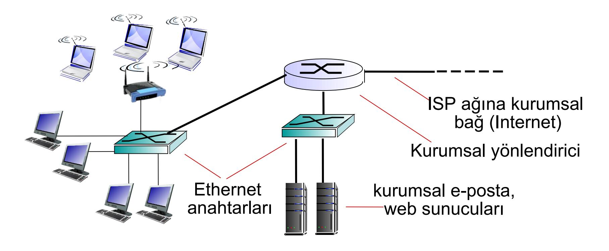

- Genelde şirketler, üniversiteler vb. kullanılır.
- Kablolu ve kablosuz bağlantı teknolojileri ile yönlendirici/anahtarlayıcı ağları içerir.
- Ethernet: 100Mb/s, 1Gb/s, 10Gb/s iletim hızları
- Kablosuz: Kablosuz erişim noktası (11, 54, 450 Mb/s)

## Kablosuz erişim ağları

- Ortak kablosuz erişim ağı uç sistemleri yönlendiriciye bağlar
  - Erişim noktası olarak bilinen istasyondan kablosuz yerel erişim ağları (LAN): Kablosuz geniş ağ erişim ağları (WAN):
    - Bina içerisinde (30 m)
    - 802.11b/g (WiFi): 11, 54, 450
       Mb/s iletim hızı

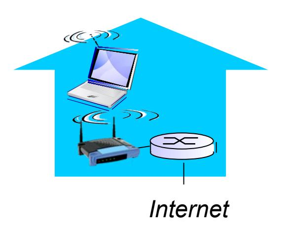

- Telekom sağlayıcı tarafından sağlanır, 10'larca km
- 10 Mb/s arasında
- 4G, 4.5G hücresel ağlar (5G yakında)

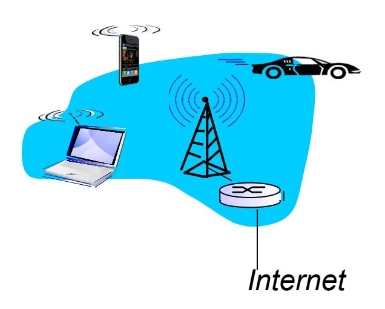

## Erişim Ağları: Veri merkezi ağları

 Yüksek bant genişliğine sahip bağlar içerir (10'larca - 100'lerce Gb/s). Yüzlerce veya binlerce sunucuyu birbirine ve daha sonra Internete bağlar.

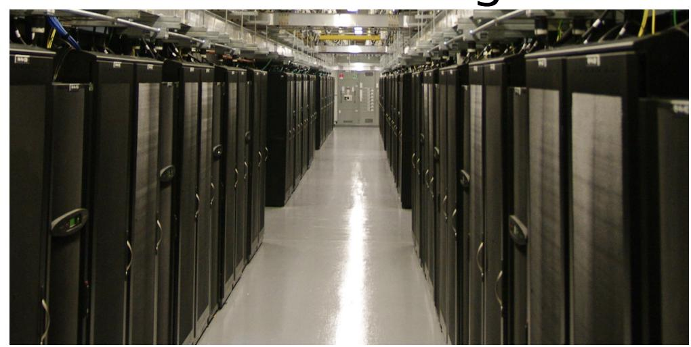

*Alıntı:* Massachusetts Green High Performance Computing Center (mghpcc.org)

# Bölüm 1 Tanıtım

Doç. Dr. Mehmet Dinçer Erbaş Bolu Abant İzzet Baysal Üniversitesi Mühendislik Fakültesi Bilgisayar Mühendisliği Bölümü

 All material copyright 1996-2020 J.F Kurose and K.W. Ross, All Rights Reserved Slaytlar ders kitabından adapte edilmiştir.


*Computer Networking: A Top-Down Approach*  8 th edition Jim Kurose, Keith Ross Pearson, 2020

## Cihazlar: veri paketleri gönderir

### Cihazın gönderim fonksiyonu

- \*Uygulama mesajını alır
- \*Mesajını paket olarak adlandırılan, L bit uzunluğunda parçalara ayırır.
- \*Paketleri iletim hızı R olan erişim ağına iletir.
  - ağ iletim hızı, ayrıca bağ kapasitesi veya bant genişliği olarak bilinir.

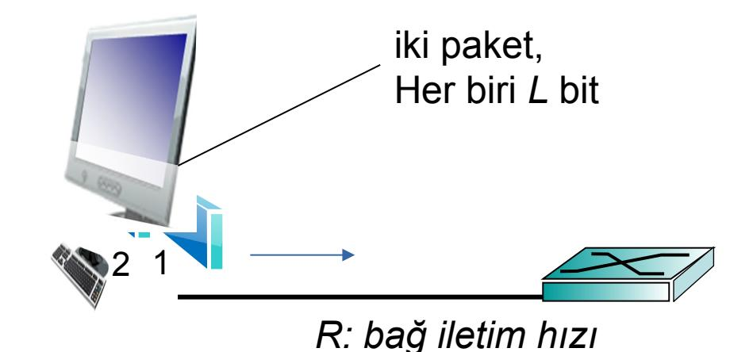

cihaz

paket iletim gecikmesi = 
$$L$$
-bit paketi bağ =  $L$  (bit)  $R$  (bit/saniye)

## Fiziksel ortam

- bit: Alıcı/gönderici çifti arasında yayılır
- Fiziksel bağ: Alıcı/gönderici arasında bulunur
- Güdümlü ortam:
  - Sinyal katı medya içerisinde yayılır: ör: bakır, fiber, koaksiyel
- Güdümsüz ortam:
  - Sinyal serbest yayılır: ör: radyo

### *Bükümlü çift*

- İki izole edilmiş bakır kablo
  - Kategori 5: 100 Mb/s, 1 Gp/s Ethernet
  - Katogeri 6: 10Gb/s

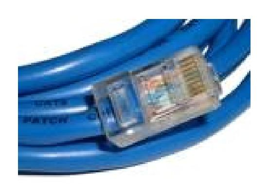

## Fiziksel ortam: koaksiyel, fiber

### *koaksiyel kablo:*

- Iki eşmerkezli bakır kondüktör
- Çift yönlü
- Geniş bant:
  - Kablo üzerinde çoklu kanal
  - HFC

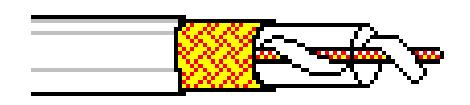

### *fiber optik kablo:*

- cam fiber ışık atımları taşır, her atım bir bit
- Yüksek-hız operasyon:
  - Yüksek-hız noktadan noktaya iletim (e.g., 10'larc a-100'lerce Gp/s iletim hızı)
- Düşük hata oranı:
  - Çoklayıcılar birbirinden uzağa yerleştirilebilir.
  - Elektromanyetik gürültüden etkilenmez

## Fiziksel ortam: radyo

- Sinyal electromanyetik spektrumda taşınır
- Fiziksel "kablo" yok
- Çok yönlü
- Yayılım üzerinde çevresel etkiler:
  - yansıma
  - Nesneler tarafından engelleme
  - karışma

#### *radyo bağ çeşitleri:*

- karasal mikrodalga
  - e.g. 45 Mbps kanallara kadar
- Kablosuz LAN (WiFi)
  - 10-100 Mb/s, 10'larca metre
- Geniş alan (WAN) (e.g., hücresel 4G)
  - 10'larca Mb/s 10 Km
- Bluetooth: (kablo yerine)
  - Kısa mesafe, sınırlı bant genişliği
- uydu
  - 45Mb/s bant genişliğine kadar
  - 270 ms uçtan uca gecikme
  - Alan vs yükseklik.

# Bölüm 1: Yol haritası

- 1.1 İnternet nedir?
- 1.2 Ağ kenarı
  - Uç sistemler, erişim ağları, bağlantı türleri
- 1.3 Ağ çekirdeği
  - paket anahtarlama, devre anahtarlama, ağ yapısı
- 1.4 Ağlarda Gecikme, kayıp, iş hacmi
- 1.5 Protokol katmanları, hizmet modelleri
- 1.6 Ağ güvenliği
- 1.7 İnternetin kısa tarihçesi

# Ağ çekirdeği

- Birbirine bağlı yönlendiri ağı
- paket-anahtarlama: cihazlar uygulama katmanı mesajlarını paketlere ayırır.
  - Paketler bir yönlendiriden diğerine, kaynaktan hedefe doğru iletilir.

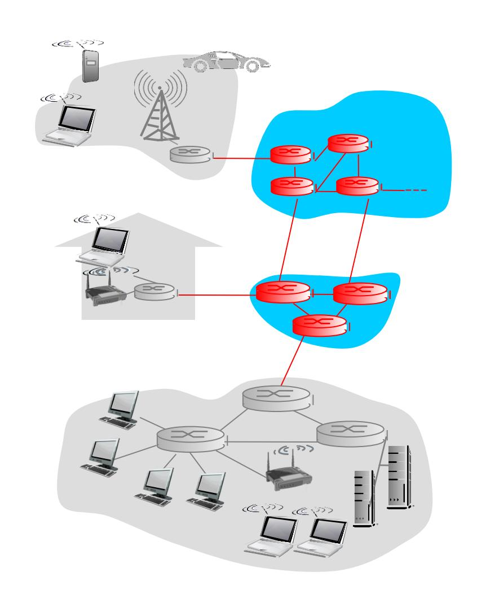

## Paket-anahtarlama: Sakla-ve-yolla

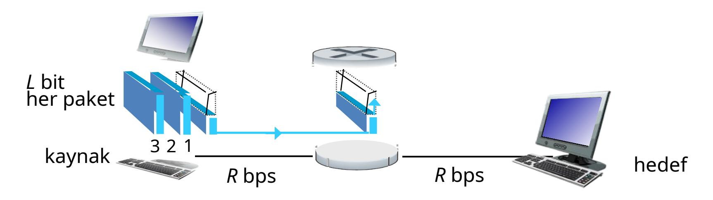

- L bit paketi R bps saniye kapasiteli bağa göndermek için L/R saniye gerekir
- *sakla-ve-yolla:* Bir sonraki bağa gönderebilmek için paketin tamamının yönlendiriciye gelmesi gerekir.
- Sondan-sona gecikme = 2*L*/*R* (Yayılma gecikmesi yok ise)

### *Bir-durak sayısal örnek:*

- *L* = 7.5 Mbits
- *R* = 1.5 Mbps
- Bir-durak iletim gecikmesi = 5 saniye

Gecikme konusuna döneceğiz

### Paket Anahtarlama: sıralama gecikmesi, kayıp

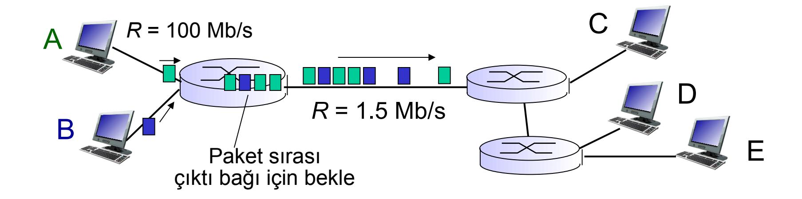

Kuyruk, işlerin geliş hızı servis hızını geçtiğinde oluşur.


### Paket Anahtarlama: sıralama gecikmesi, kayıp

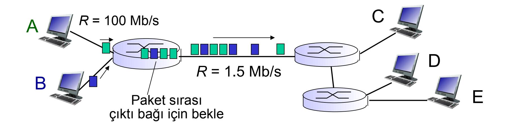

### sıralama ve kayıp:

- Eğer geliş hızı (bit) bir süre zarfında iletim hızını geçerse
  - Paketler sıraya girer, gönderilmeyi beklemeye başlarlar
  - Eğer yönlendiricinin hafızası (buffer) dolarsa paketler düşürülebilir (kayıp)

## İki anahtar ağ-çekirdeği fonksiyonu

Yönlendirme (İng: routing):
paketlerin kaynaktan hedefe
alacağı yol belirlenir
yönlendirme algoritması

Yollama (İng: forwarding): paketi yönlendiricinin girdisinden uygun çıktısına taşır

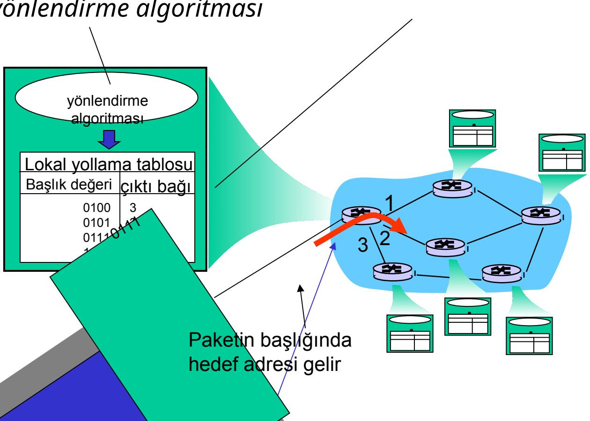

## İki anahtar ağ-çekirdeği fonksiyonu

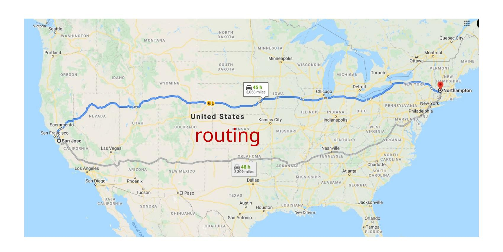

## İki anahtar ağ-çekirdeği fonksiyonu

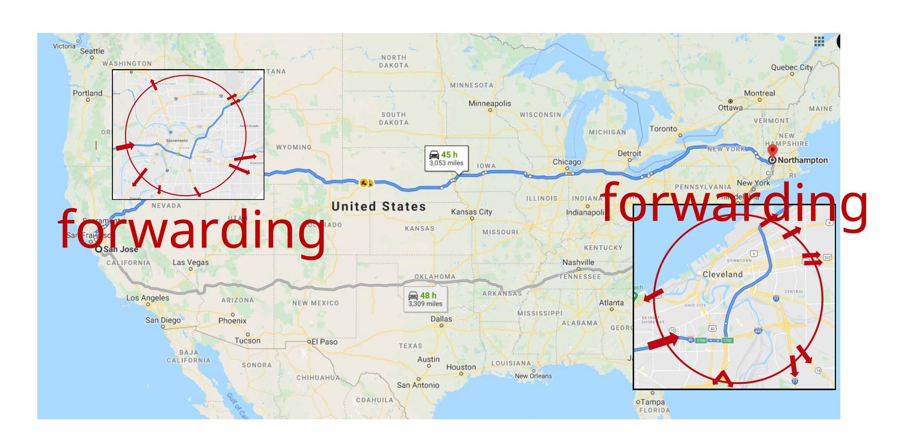

Introduction: 1-13

### Alternatif çekirdek: devre anahtarlama

Uçtan-uca kaynaklar "çağrı" için kaynak & hedef arası rezerv edilir:

- diyagramda, her bağ dört devreye sahiptir.
  - Çağrı yukarı bağda 2. devre ve sağdaki bağda 1. devreyi kullanıyor
- Ayrılmış kaynaklar: paylaşım yok
  - devre-benzeri (garanti) performans

Eğer çağrı tarafından kullanılmazsa devre kesiti boşa gider *(paylaşım yok)*

 Telefon ağlarında genellikle bu yöntem kullanılır.

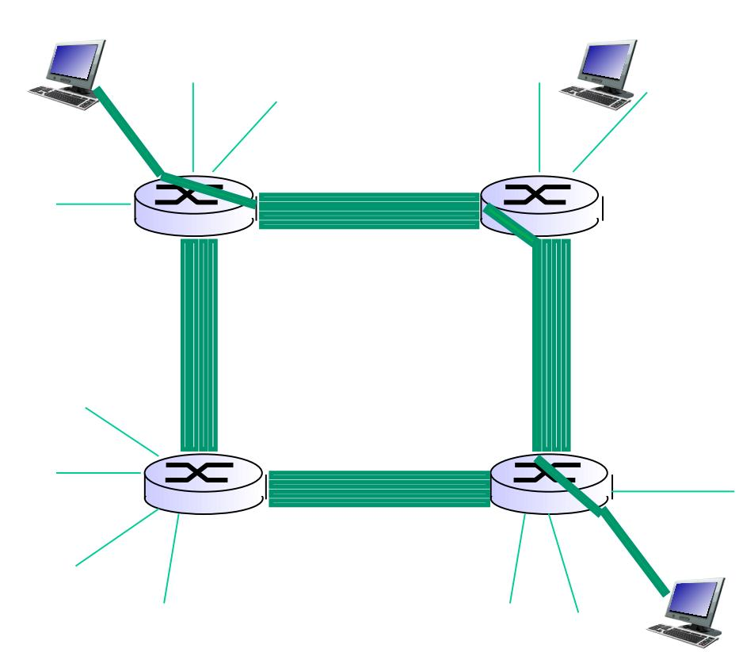

### Devre anahtarlama: FDM vs TDM

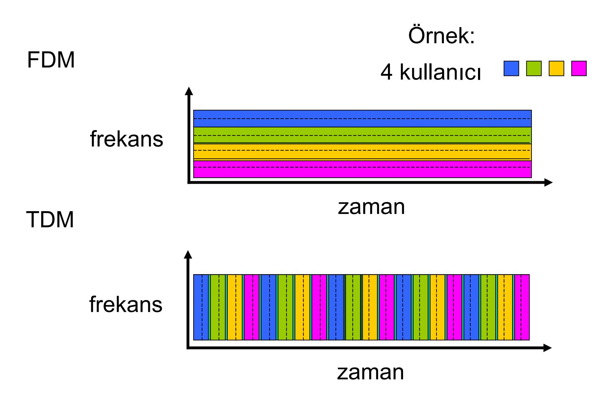

### Paket anahtarlama vs devre anahtarlama

# Paket anahtarlama daha fazla kullanıcının ağı kullanmasına olanak sağlar!

#### Örnek:

- 1 Mb/s bağ
- her kullanıcı:
  - 100 kb/s "aktif" olduğunda
  - Zamanın %10 aktif
- devre-anahtarlama:
  - 10 kullanıcı
- Paket anahtarlama:
  - 35 kullanıcı ile, 11 veya daha fazla kullanıcının aynı anda aktif olma olasılığı < 0.0004</li>

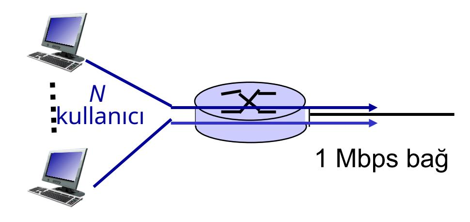

S: 0.0004 olasılığını nasıl hesapladık?

S: 35 kullanıcıdan fazla olursa?

### Paket Anahtarlamalı vs Devre Anahtarlamalı

### Paket anahtarlamalı her zaman daha iyi midir?

- Patlamalı veri akışı için oldukça kullanışlıdır
  - Kaynak paylaşımına izin verir
  - Daha basittir, çağrı kurulumu yoktur.

### Aşırı sıkışıklık olabilir: paket gecikmesi ve kaybı

 Bu nedenle güvenilir veri transferi ve sıkışıklık kontrolü için protokoller gereklidir.

### *S:* Devre davranışı göstermesi nasıl sağlanabilir?

- ses/görüntü uygulamaları için bant genişliği garantisi verilebilmelidir.
- Halen çözülmemiş bir problemdir (bölüm 7)

*S:* İnsan ilişkilerinden rezerve edilen kaynaklar (devre anahtarlama) ile istek anında ayrılan kaynaklar (paket anahtarlamalı) örnekleri verebilir misiniz?

- Uç sistemler erişim İnternet sağlayıcısı (ISP, Internet Service Provider) üzerinden internete bağlanırlar.
  - Yerleşim, şirket ve üniversite için ISP
- Erişim ISP sistemleri birbirine bağlı olmalıdır.
  - Böylece İnternete bağlı herhangi iki cihaz birbiri ile haberleşebilir.
- Ortaya çıkan ağların ağı oldukça karmaşıktır.
  - İnternetin gelişimi ekonomik ve milli politikalardan oldukça etkilenmiştir.
- Adım adım İnternetin gelişimini inceleyeceğiz

Soru: Milyonlarca erişim ISP var ise, bunların her birini nasıl baylayacağız?

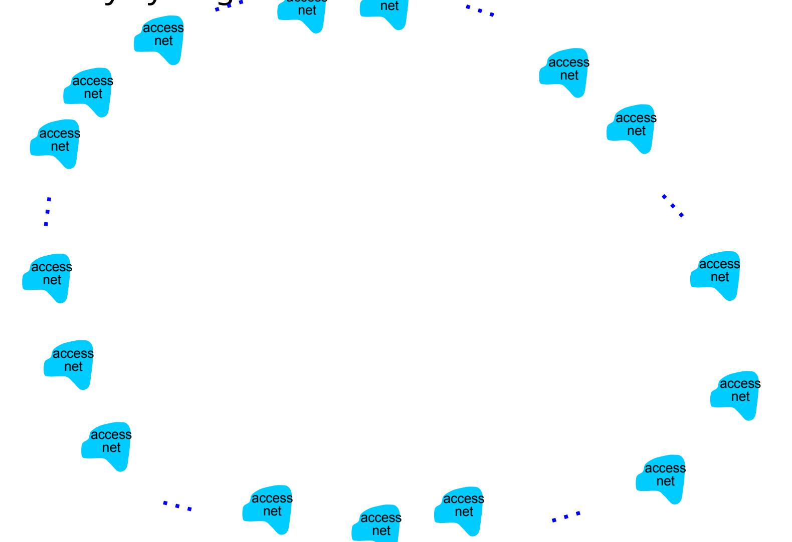

Seçenek: Her bir ISP diğer ISP'ye bağlanır.

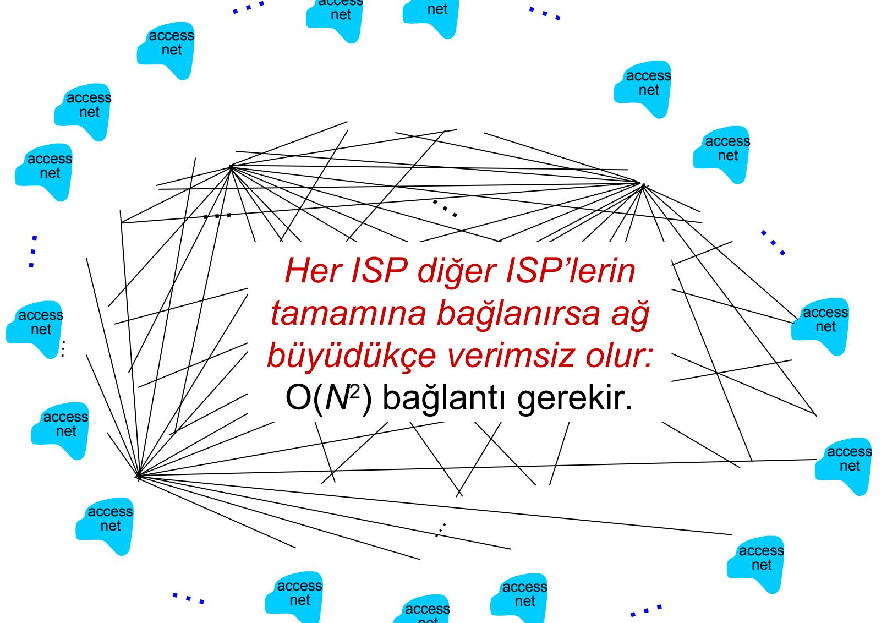

Seçenek: Her ISP bir global ISP'ye bağlanır. Tüketici ve sağlayıcı ISP'ler arasında ekonomik anlaşmalar yapılışı

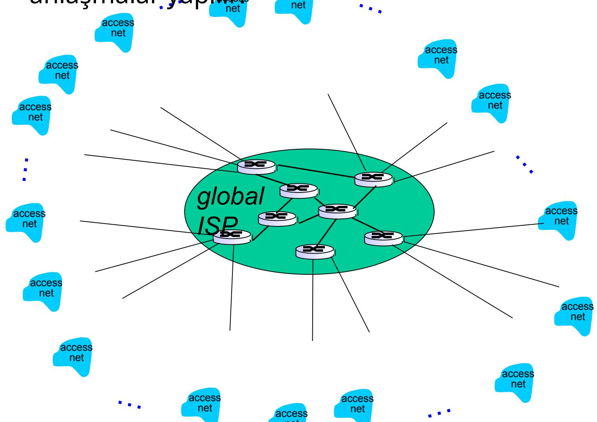

## <u>Internet yapısı: Ağların ağı</u>

Normal olarak ISP işi karlışe, başka ISP sahipleri ortaya çıkacaktır.

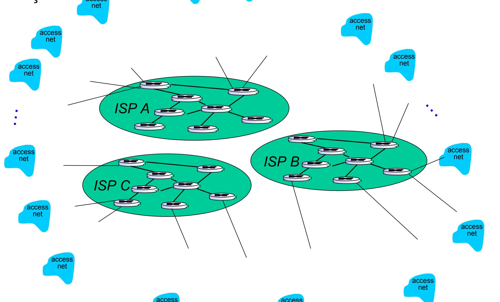

<u>Internet yapısı: Ağların ağı</u>

Normal olarak ISP işi karlı ise, başka ISP sahipleri ortaya çıkacaktır... bu farklı global ISP'ler birbirine gağlamınalıdır.

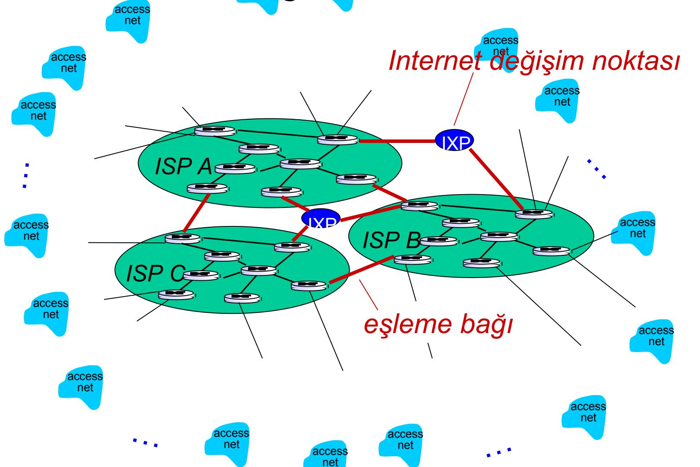

... ve erişim ağlarını ISP'lere bağlayan bölgesel ağlar oluşturulabilir.

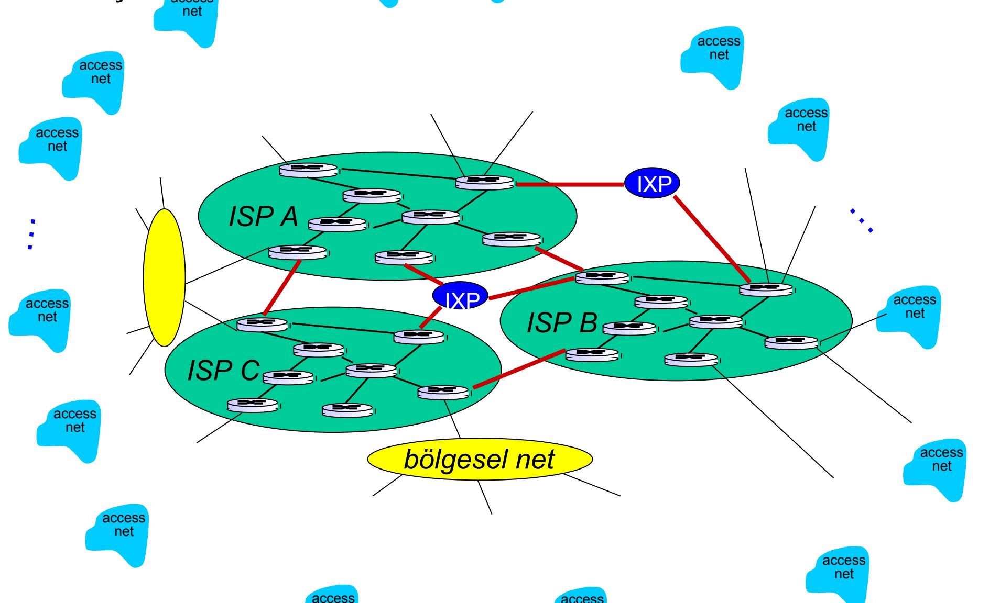

... ve ayrıca içerik sağlayıcı ağlarıçörneğin Google, Microsoft, Akamai gibi) kendi ağ<mark>ların</mark>ı ol<mark>uştur</mark>abilir. Böylece kullanıcılara hizmet<mark>i dah</mark>a yakından verebilirler.

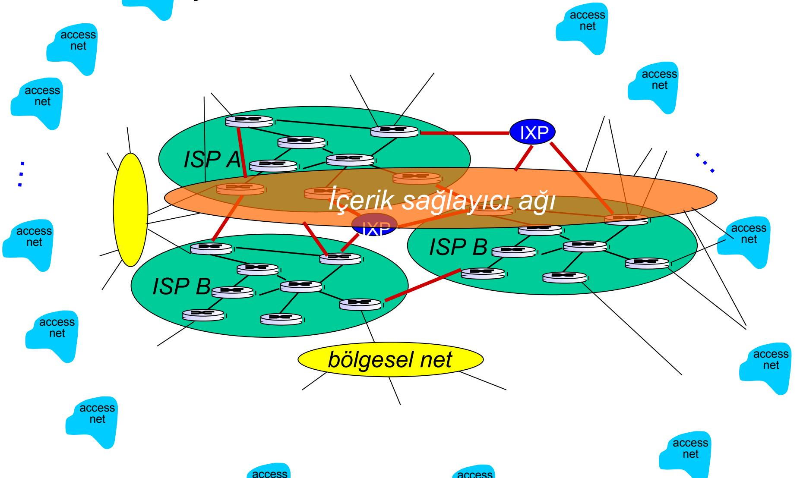

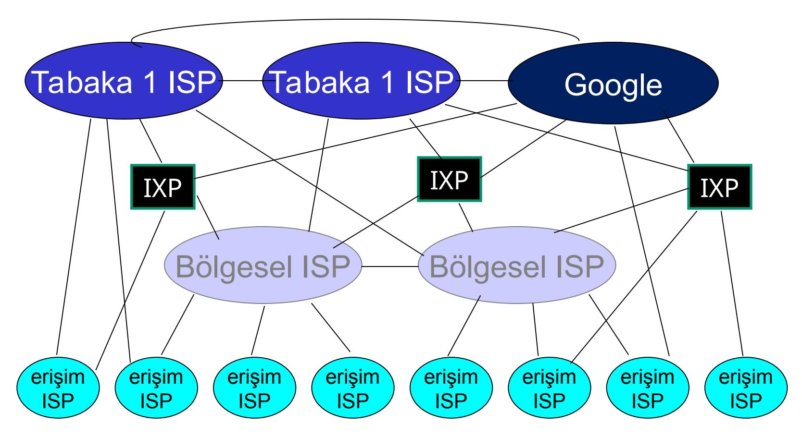

- Merkezde: az sayıda birbirine iyi bağlanmış büyük ağ
  - "tabaka-1" ticari ISPs (e.g., Level 3, Sprint, AT&T, NTT), milli & milletlerarası kapsama
  - Tanıtım Içerik sağlama ağı (e.g, Google): Veri merkezlerini İnternet ağına bağlayan özel ağlar, genellikle tabaka-1 ISP'leri ve bölgesel ISP'leri pas geçer. 1-26

# Tabaka-1 ISP: e.g., Sprint

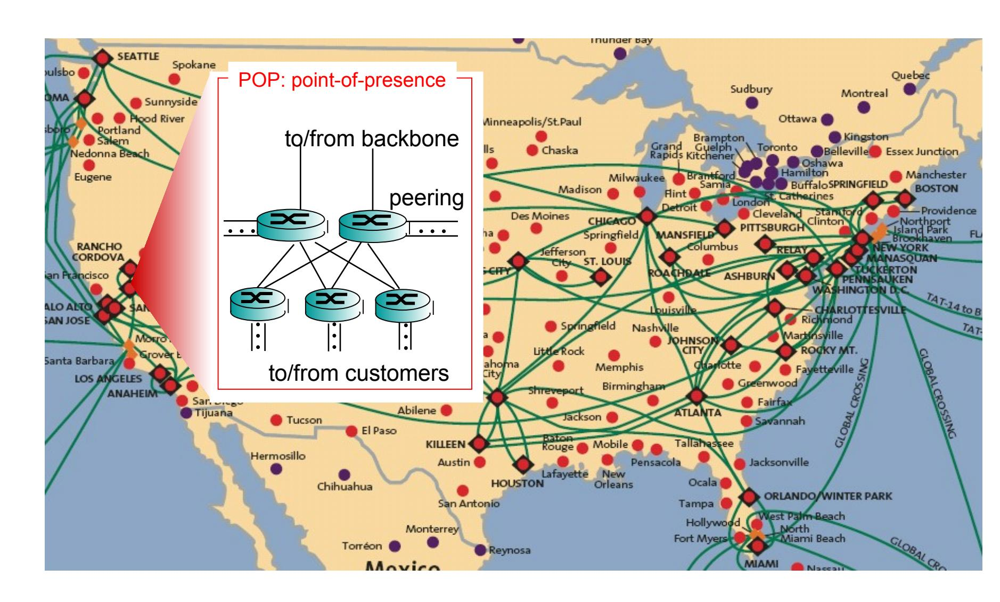

# Bölüm 1: Yol haritası

- 1.1 İnternet nedir?
- 1.2 Ağ kenarı
  - Uç sistemler, erişim ağları, bağlantı türleri
- 1.3 Ağ çekirdeği
  - paket anahtarlama, devre anahtarlama, ağ yapısı
- 1.4 Ağlarda Gecikme, kayıp, iş hacmi
- 1.5 Protokol katmanları, hizmet modelleri
- 1.6 Ağ güvenliği
- 1.7 İnternetin kısa tarihçesi

## Kayıp ve gecikme nasıl gerçekleşir

Yönlendirici önbelleklerinde paketler sıraya girebilir.

 Bağ üzerindeki paket varış hızı (bir süre için) paket çıktı kapasitesini aşabilir.

Bu durumda paketler sıraya girip sıranın kendilerine

gelmesini bekler.

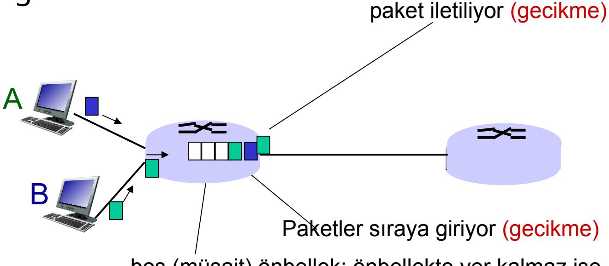

boş (müsait) önbellek: önbellekte yer kalmaz ise yeni gelen paketler düşürülür.

## Paket gecikmesinin dört kaynağı

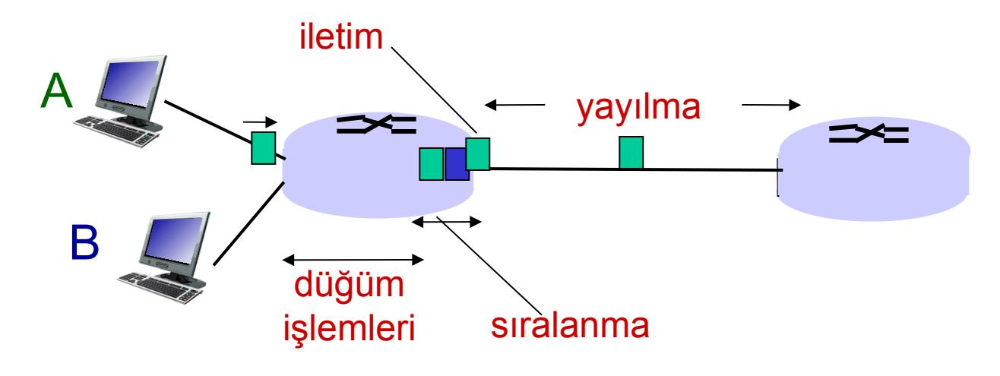

$$d_{d\ddot{u}\ddot{g}\ddot{u}m} = d_{islem} + d_{siralama} + d_{iletim} + d_{yayılma}$$

### *dişlem*: düğüm işlemleri

- bit hataları kontrolü
- Çıktı bağına karar verme
- genelde < msec

### *dsıralanma*: sıralanma gecikmesi

- İletim için çıktı bağını bekleme süresi
- Yönlendirici üzerindeki sıkışmaya bağlıdır.

## Paket gecikmesinin dört kaynağı

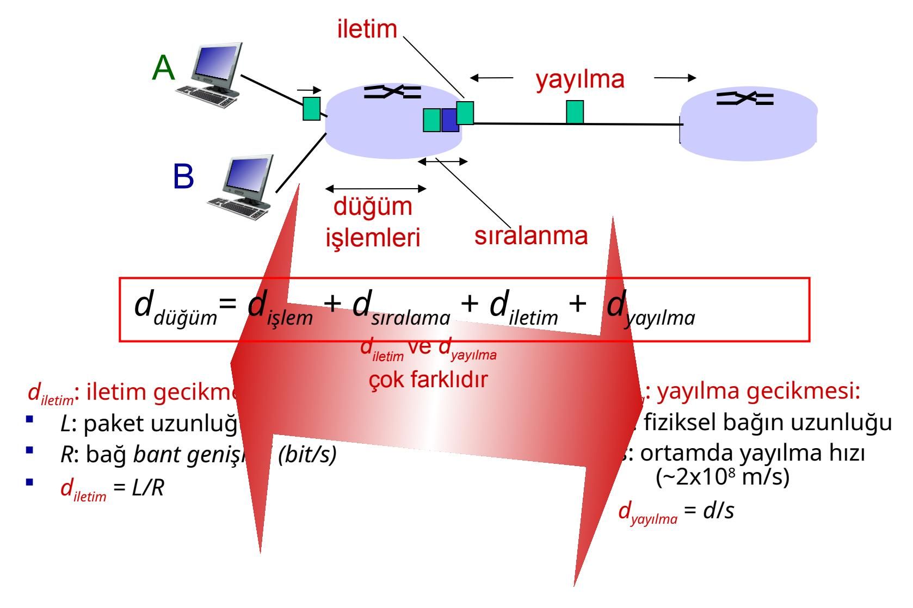

# Konvoy örneklemesi

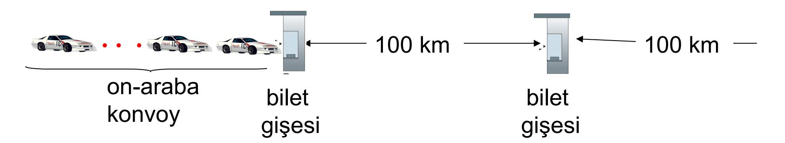

- Arabalar 100 km/saat hızla "yayılıyorlar"
- Bilet gişesi her arabayı 12 saniyede işleme alıyor (bit iletim hızı).
- araba~bit; konvoy ~ paket
- *S:* Konvoyun 2. bilet gişesinin önünde sıralanması için ne kadar süre geçer?

- Konvoyun tamamını ilk bilet gişesinden geçirmek için gereken süre = 12\*10 = 120 sn
- Son arabanın 1. gişeden 2. gişeye yayılması için gereken süre: 100km/(100km/saat)= 1 saat
- *A:* 62 dakika

## Konvoy örneklemesi (devam)

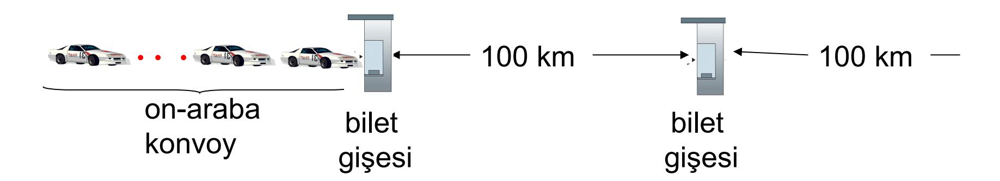

- Şimdi ise arabalar 1000 km/saat hızla "yayılıyor" farzedelim.
- Ve ayrıca bilet gişesi her arabayı 1 dakikada işleme alıyor farzedelim.
- *S:* Bütün arabalar 1. bilet gişesinde işleme alınmadan önce arabalar 2. bilet gişesine varır mı?
  - *C: Evet!* 7 dakika geçtiğinde ilk araba 2. bilet gişesine varır; henüz üç araba 1. bilet gişesindedir.

## <u>Sıralanma geci</u>kmesi (tekrar)

- \* R: bağ bant genişliği (b/sn)
- \* L: paket uzunluğu (bit)
- a: ortalama paket varış hızı

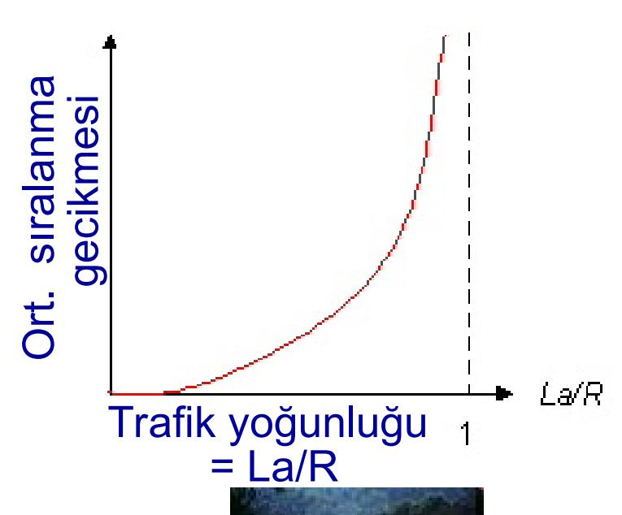

- La/R ~ 0: ort. sıralanma gecikmesi küçük
- ❖ *La/R* -> 1: ort. sıralanma gecikmesi büyük
- La/R > 1: hizmet verilebileceğinden daha fazla iş geliyor, ortalama gecikme sonsuz


 $La/R \sim 0$ 

La/R -> 1

### "Gerçek" İnternet yolları ve gecikmeleri

- "Gerçek" İnternet gecikme ve kayıpları nasıl görünür?
- traceroute program: kaynaktan hedefe kadar aradaki tüm yönlendiriciler için gecikme hesabı yapar. Her *i* yönlendiricisi için*:*
  - Hedef yönünde i yönlendiricisine ulaşacak üç paket yollar
  - yönlendirici *i* paketi göndericiye geri yollayacaktır.
  - Gönderici iletim ile cevap arasında geçen süreyi hesaplar.

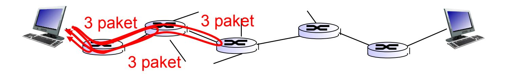

### "Gerçek" Internet gecikmeleri, yolları

traceroute: gaia.cs.umass.edu to www.eurecom.fr

```
3 gecikme hesabı from
                                           gaia.cs.umass.edu to cs-gw.cs.umass.edu
1 cs-gw (128.119.240.254) 1 ms 1 ms 2 ms
2 border1-rt-fa5-1-0.gw.umass.edu (128.119.3.145) 1 ms 1 ms 2 ms
3 cht-vbns.gw.umass.edu (128.119.3.130) 6 ms 5 ms 5 ms
4 jn1-at1-0-0-19.wor.vbns.net (204.147.132.129) 16 ms 11 ms 13 ms
5 in1-so7-0-0.wae.vbns.net (204.147.136.136) 21 ms 18 ms 18 ms
6 abilene-vbns.abilene.ucaid.edu (198.32.11.9) 22 ms 18 ms 22 ms
7 nycm-wash.abilene.ucaid.edu (198.32.8.46) 22 ms 22 ms 22 ms
                                                                        trans-oceanic
8 62.40.103.253 (62.40.103.253) 104 ms 109 ms 106 ms 4 9 de2-1.de1.de.geant.net (62.40.96.129) 109 ms 102 ms 104 ms
                                                                        link
10 de.fr1.fr.geant.net (62.40.96.50) 113 ms 121 ms 114 ms
11 renater-gw.fr1.fr.geant.net (62.40.103.54) 112 ms 114 ms 112 ms
12 nio-n2.cssi.renater.fr (193.51.206.13) 111 ms 114 ms 116 ms
13 nice.cssi.renater.fr (195.220.98.102) 123 ms 125 ms 124 ms
14 r3t2-nice.cssi.renatèr.fr (195.220.98.110) 126 ms 126 ms 124 ms
15 eurecom-valbonne.r3t2.ft.net (193.48.50.54) 135 ms 128 ms 133 ms 16 194.214.211.25 (194.214.211.25) 126 ms 128 ms 126 ms
                      cevap yok anlamına gelir (paket kayboldu veya yönlendirici cevap vermiyor
19 fantasia.eurecom.fr (193.55.113.142) 132 ms 128 ms 136 ms
```

# Paket kaybı

- Önceki bağ ait sıra (veya önbellek) belli bir kapasiteye sahiptir.
- Dolmuş bir sıraya gelen paketler düşürülür (kayıp)
- Kaybolan paket önceki düğüm veya kaynak uç sistemi tarafından tekrar iletilebilir. Yada tekrar iletilmez.

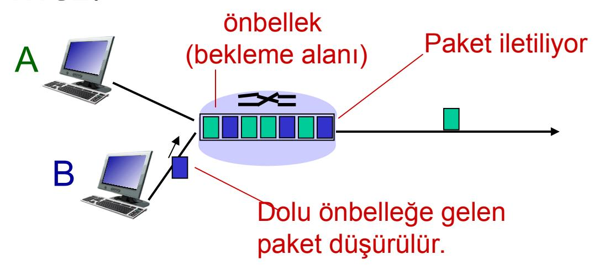

# İş hacmi

- *Iş hacmi (İng: throughput):* bitlerin gönderici/alıcı arasında nakil hızı (bit/zaman birimi)
  - *anlık:* belli bir zamanda hız
  - *ortalama:* uzun bir zaman süresince hız

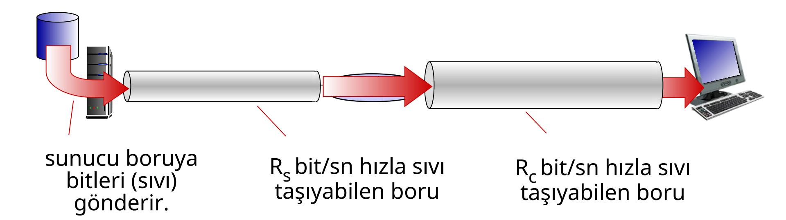

# İş hacmi (devam)

 $R_s < R_c$  Uçtan uca iş hacmi ne olur?

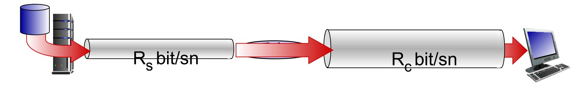

 $R_s > R_c$  Uçtan uca iş hacmi ne olur?

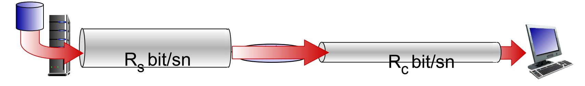

darboğaz bağ

Uçtan uca yol üzerinde iş hacmini kısıtlayan bağ

# İş hacmi: Internet senaryosu

- Bağlantı başına uçtan uca iş hacmi: min(R<sub>c</sub>,R<sub>s</sub>,R/10)
- Pratikte: R<sub>c</sub> veya R<sub>s</sub> genellikle darboğaz oluşturur.

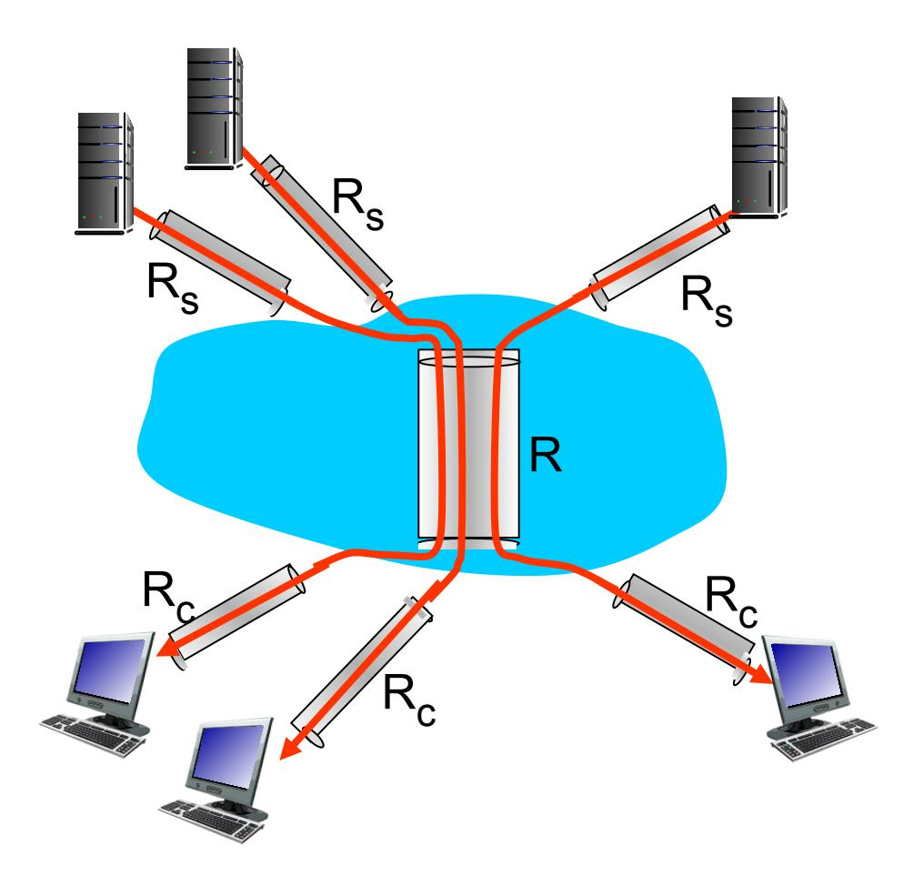

10 bağlantı (adilce) R bit/sn kapasiteli omurga darboğaz bağı paylaşıyor

# Bölüm 1 Tanıtım

Doç. Dr. Mehmet Dinçer Erbaş Bolu Abant İzzet Baysal Üniversitesi Mühendislik Fakültesi Bilgisayar Mühendisliği Bölümü

 All material copyright 1996-2020 J.F Kurose and K.W. Ross, All Rights Reserved Slaytlar ders kitabından adapte edilmiştir.

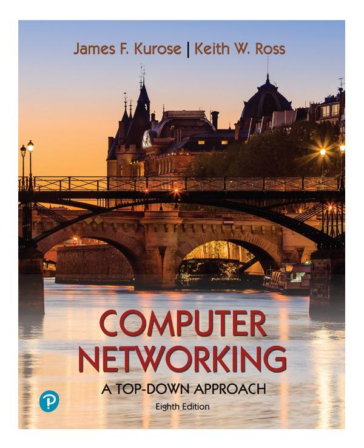

*Computer Networking: A Top-Down Approach*  8 th edition Jim Kurose, Keith Ross Pearson, 2020

# Bölüm 1: Yol haritası

- 1.1 İnternet nedir?
- 1.2 Ağ kenarı
  - Uç sistemler, erişim ağları, bağlantı türleri
- 1.3 Ağ çekirdeği
  - paket anahtarlama, devre anahtarlama, ağ yapısı
- 1.4 Ağlarda Gecikme, kayıp, iş hacmi
- 1.5 Protokol katmanları, hizmet modelleri
- 1.6 Ağ güvenliği
- 1.7 İnternetin kısa tarihçesi

# Protokol "katmanları"

*Ağlar oldukça karmaşıktır, birçok "parçaya*" sahiptirler*:*

- cihazlar
- yönlendiriciler
- Farklı ortama sahip bağlar
- uygulamalar
- protokoller
- donanım, yazılım

### *Soru:*

ağın yapısını düzenlemek mümkün müdür?

## Uçuş yolculuğunun organizasyonu

bilet (satın al) bilet (şikayet)

bavul (kontrol) bavul (geri al)

kapılar (bin) kapılar (in)

pistten kalkış piste iniş

uçak yön bulma uçak yön bulma

uçak yön bulma

Bir adımlar serisi

### Havayolları işleminin katmanlara ayrılması

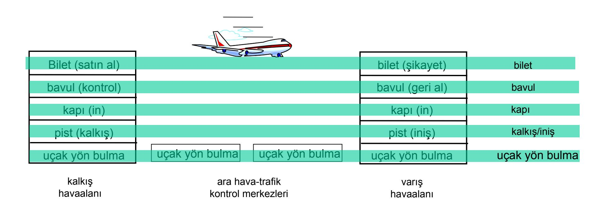

### *katmanlar:* her katman belli bir hizmeti gerçekleştirir

- Kendi katman-içi aksiyonlarını uygular.
- Önceki katmanların hizmetlerinden yararlanır.

# Neden katmanlama?

### Karmaşık sistemleri yönetmek:

- Belirgin yapılar karmaşık sistemin parçalarının kimliğini ve ilişkilerini tanımlamamıza olanak verir
  - Katmanlı referans modelleri oluşturulmuştur.
- Modüler yapı sistemin bakım ve yenilenmesini kolaylaştırır.
  - Herhangi bir katmanda yaplan değişiklik diğer katmanları etkilemez.
  - Örneğin, kapı numaralandırmasını değiştirsek, sistemin geri kalanı etkilenmez.
- Katmanlı yapının kötü yanları var mıdır?

# Internet protokol dizisi

- uygulama: ağ uygulamalarını destekler
  - FTP, SMTP, HTTP
- \* taşıma: işlem-işlem veri transferi
  - TCP, UDP
- ağ: cihaz-cihaz veri transferi, datagramların kaynaktan hedefe yönlendirilmesi
  - IP, yönlendirme protokolleri
- Veri bağlantı: komşu ağ elemanları arasında veri transferi
  - Ethernet, 802.111 (WiFi), PPP
- \* *fiziksel:* bitler "kablo üzerinde"

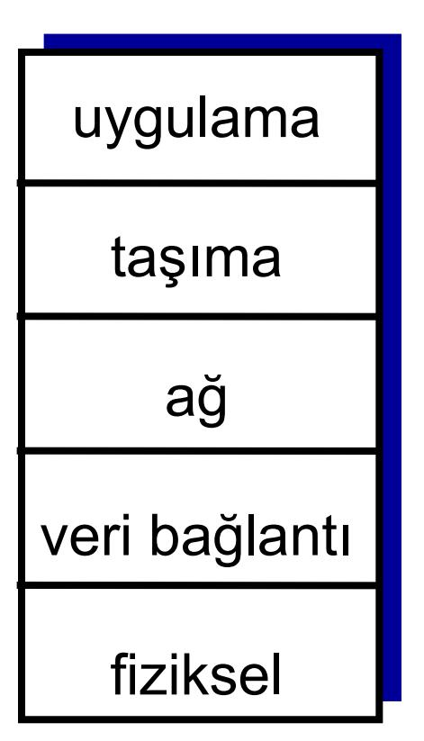

## ISO/OSI referans modeli

- *sunum:* uygulamaların verinin anlamını yorumlamasını sağlar e.g., şifreleme, sıkıştırma, makineye özel çeviriler.
- *Oturum:* senkronizasyon, denetim noktası koyma, veri alışverişini kurtarma
- Internet dizisi bu katmanları "içermez"!
  - Bu hizmetler, eğer gerekiyorsa, uygulama tarafından yapılır
  - Gerekli mi?

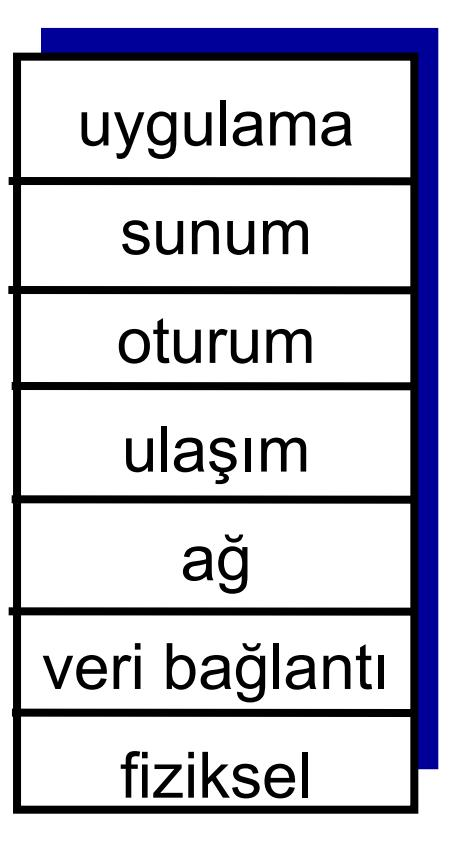

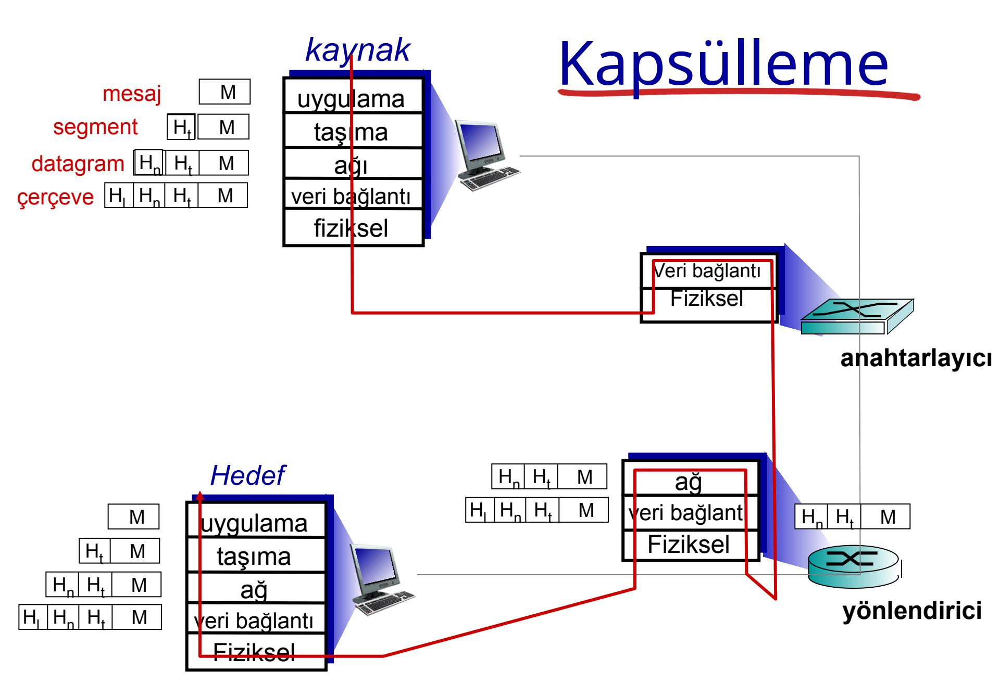

# Bölüm 1: Yol haritası

- 1.1 İnternet nedir?
- 1.2 Ağ kenarı
  - Uç sistemler, erişim ağları, bağlantı türleri
- 1.3 Ağ çekirdeği
  - paket anahtarlama, devre anahtarlama, ağ yapısı
- 1.4 Ağlarda Gecikme, kayıp, iş hacmi
- 1.5 Protokol katmanları, hizmet modelleri
- 1.6 Ağ güvenliği
- 1.7 İnternetin kısa tarihçesi

# Ağ güvenliği

- Ağ güvenliği alanı:
  - Kötü niyetli insanlar bilgisayar ağlarına saldırı yöntemleri.
  - Saldırılara karşı ağları koruma.
  - Saldırılara karşı bağışıklığı olan mimariler oluşturma.
- Internet ilk oluşturulduğunda güvenlik kısmı pek düşünülmemiş
  - *Orijinal versiyon:* bir grup birbirine güvenen kullanıcı saydam bir ağa bağlanır
  - İnternet protokol tasarlayıcıları bu eksiği gidermeye çalışmaktadır.
  - Her katmanda güvenlik düşünülebilir.

### Kötü niyetliler: cihazlara İnternet üzerinden zararlı yazılım yüklerler

- Zararlı yazılım (İng: malware) cihazlara aşağıdaki şekillerde bulaşabilir:
  - *Virus:* kendini-çoklayan enfeksiyon, zararlı nesneyi alma/çalıştırma ile bulaşır (e.g., e-posta eklenti)
  - *worm:* kendini çoklayan enfeksiyon, kendi kendini çalıştıran nesneyi alma ile bulaşır.
- Casus yazılım tuş basışları, ziyaret edilen web sitelerini kaydedebilir, kaydedilen bilgileri toplama sitesine gönderebilir.
- Enfekte olmuş cihaz spam gönderimi veya DDoS saldırıları için kullanılan bir botnet haline dönüşebilir.

### Kötü niyetliler: sunucu veya ağ altyapısına saldırabilir

*Denial of Service (DoS):* Saldırgan, aşırı sahte trafik yaratarak kaynaklara (sunucu veya bant genişliği) erişimi engeller.

- 1. hedef seç
- 2. ağ içerisindeki cihazlara gir
- 3. elegeçirilmiş cihazlardan hedefe paketler gönder

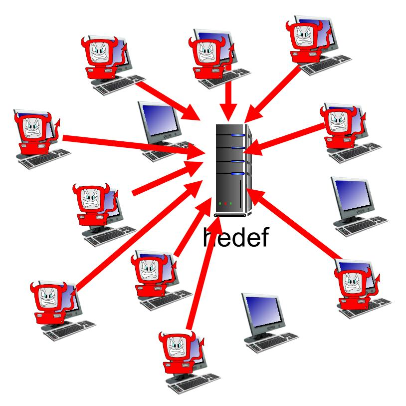

## Kötü niyetliler paketleri yoklayabilir

## *paket "yoklayıcı*" (İng: sniffer)*:*

- yayım ortamı (paylaşılan ethernet, kablosuz)
- Seçici olmayan ağ arayüzü geçmekte olan her paketi okur/kaydeder (e.g., parolalar dahil!)

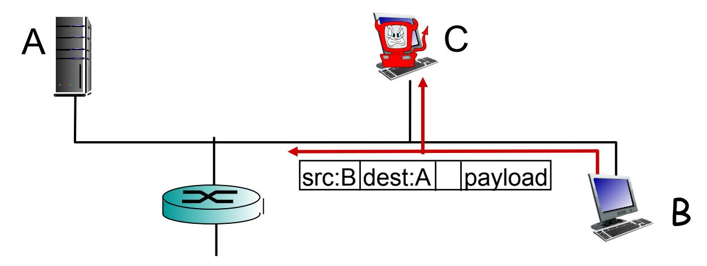

 Wireshark yazılımı ücretsiz bir paket yoklama aracıdır.

### Kötü niyetliler sahte adres kullanabilir

*IP yanıltma* (İng: IP spoofing)*:* sahte gönderici adresi içeren paketler gönder

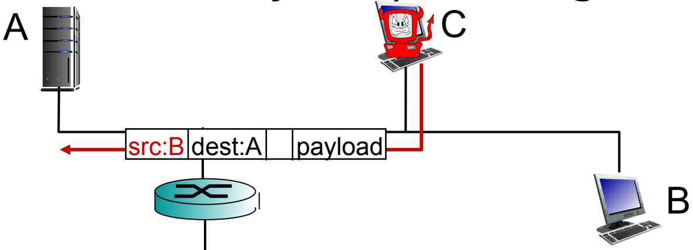

*… güvenlik konusunda daha çok konu mevcut (Bölüm 8)*

# Bölüm 1: Yol haritası

- 1.1 İnternet nedir?
- 1.2 Ağ kenarı
  - Uç sistemler, erişim ağları, bağlantı türleri
- 1.3 Ağ çekirdeği
  - paket anahtarlama, devre anahtarlama, ağ yapısı
- 1.4 Ağlarda Gecikme, kayıp, iş hacmi
- 1.5 Protokol katmanları, hizmet modelleri
- 1.6 Ağ güvenliği
- 1.7 İnternetin kısa tarihçesi

### 1961-1972: Erken paket-anahtarlama

prensipleri

- 1961: Kleinrock sıralanma teorisi paketanahtarlamanın verimliliğini göstermiştir.
- 1964: Baran paketanahtarlama askeri ağlarda
- 1967: Advanced Research Projects Agency ARPAnet tasarısını oluşturmuştur.
- 1969: ilk ARPAnet düğümü çalışıyor

- 1972:
  - ARPAnet demo gösterimi
  - NCP (Network Control Protocol) ilk cihazdancihaza protokol
  - ilk e-posta programı
  - ARPAnet 15 düğüme ulaştı

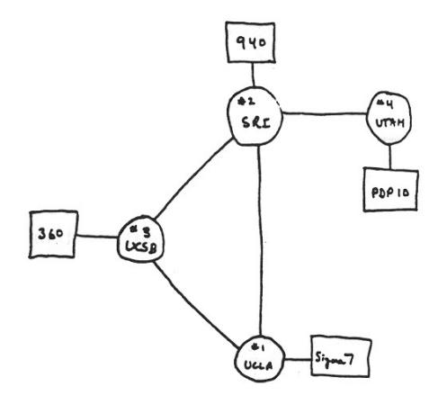

### 1972-1980: Ağlararası iletişim, yeni ve özel ağlar

- 1970: ALOHAnet uydu ağı Hawaii
- 1974: Cerf and Kahn ağları birbirine bağlamak için mimari.
- 1976: Ethernet, Xerox PARC
- late70's: özel mimariler: DECnet, SNA, XNA
- late 70's: sabit uzunlukta paketlere geçiş (ATM öncülü)
- 1979: ARPAnet 200 düğüme sahip

#### Cerf and Kahn' nı ağlar arası prensipleri:

- minimalizm, otonomi ağları birbirine bağlamak için iç değişikliklere gerek yok.
- En iyi gayret hizmet modeli.
- Durum bilgisi tutmayan yönlendiriciler
- Merkezsiz kontrol

günümüz İnternet yapısını tanımlamıştır.

### 1980-1990: yeni protokoller, ağların yaygınlaşması

- 1983: TCP/IP geçilmesi
- 1982: smtp e-posta protokolü tanımlandı
- 1983: isim-IP-adresi çevirisi için DNS tanımlandı
- 1985: ftp protokolü tanımlandı
- 1988: TCP sıkışıklık kontrolü

- yeni milli ağlar: Csnet, BITnet, NSFnet, Minitel
- Ağ konfederasyonuna 100,000 cihaz bağlı durumda.

### *1990, 2000*'ler*: ticarileşme, Web, yeni uygulamalar*

- erken 1990'lar: ARPAnet devreden çıktı
- 1991: NSF NSFnet üzerindeki ticari kısıtlamaları kaldırdı. (devreden çıktı, 1995)
- erken 1990'lar: Web
  - hypertext [Bush 1945, Nelson 1960's]
  - HTML, HTTP: Berners-Lee
  - 1994: Mosaic, sonra Netscape
  - geç 1990'lar: Web'in ticarile mş esi

### geç 1990'lar – 2000'lar:

- Birçok ünlü uygulama: anında mesajlaşma, P2P dosya paylaşımı
- Ağ güvenliği ön plana çıktı
- tahmini 50 milyon cihaz, 100 milyon+ kullanıcı
- omurga bağlar Gb/s hızında çalışıyor.

#### *2005-günümüze*

- ~Milyarlara cihaz
  - Akıllı telefonlar ve tabletler
- Geniş bant erişimi agresif yayılması
- yüksek-hızlı kablosuz erişimin daha çok noktadan erişilebilir hale gelmesi
- Çevrimiçi sosyal ağların ortaya çıkması:
  - Facebook: milyarlarca kullanıcı
- Hizmet sağlayıcılar (Google, Microsoft) kendi alarını oluşturdu
  - Böylece diğer ağları uğramadan arama sonuçları, eposta gibi hizmetlere "anında" erişim imkanı sağladılar.
- E-ticaret, üniversiteler, şirketler hizmetlerini "bulut" (İng: cloud) üzerinde çalıştırdılar (eg, Amazon EC2).

# Tanıtım: özet

### *Birçok konu hakkında konuştuk.*

- Internet genel bakış
- Protokol nedir?
- ağ kenarı, ağ çekirdeği, erişim ağları
  - paket-anahtarlama vs devre-anahtarlama
  - Internet yapısı
- performans: kayıp, gecikme, iş hacmi
- katmanlama, hizmet modelleri
- güvenlik
- tarihçe 1-22

# Bölüm 2 Uygulama Katmanı

Doç. Dr. Mehmet Dinçer Erbaş Bolu Abant İzzet Baysal Üniversitesi Mühendislik Fakültesi Bilgisayar Mühendisliği Bölümü

 All material copyright 1996-2020 J.F Kurose and K.W. Ross, All Rights Reserved Slaytlar ders kitabından adapte edilmiştir.

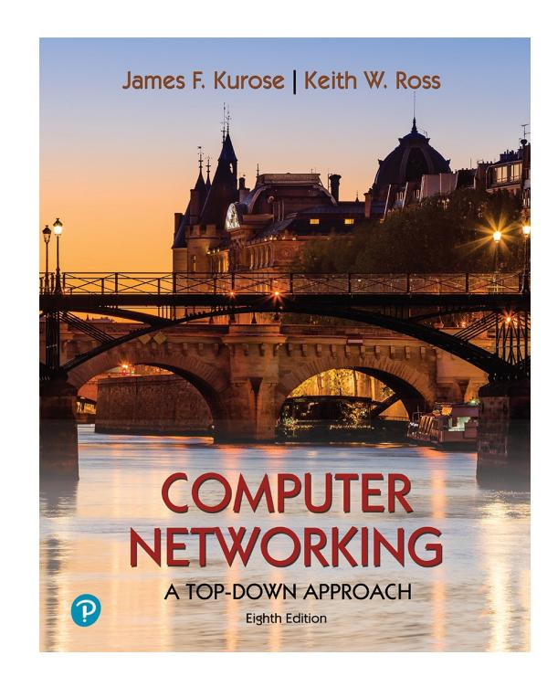

*Computer Networking: A Top-Down Approach*  8 th edition Jim Kurose, Keith Ross Pearson, 2020

# Bölüm 2: konular

- 2.1 Ağ uygulamalarının prensipleri
- 2.2 Web and HTTP
- 2.3 FTP
- 2.4 Electronik posta
  - SMTP, POP3, IMAP
- 2.5 DNS

- 2.6 P2P uygulamaları
- 2.7 UDP ve TCP ile soket programlama

## Bölüm 2: Uygulama katmanı

### hedeflerimiz:

- Ağ uygulama protokollerinin kavramsal ve oluşturulma prensipleri
  - Taşıma katmanı hizmet modelleri
  - Sunucu-istemci mimarisi
  - Eşler arası (İng: Peer-topeer) mimari

- Populer uygulama katmanı protokellerini inceleyeceğiz.
  - HTTP
  - FTP
  - SMTP / POP3 / IMAP
  - DNS
- Ağ uygulaması geliştireceğiz.
  - soket API

# Bilindik ağ uygulamaları

- e-mail
- web
- Metin iletisi
- Uzaktan erişim
- P2P dosya paylaşımı
- Çok-kullanıcılı ağ oyunları
- Saklanmış video yayınlama (YouTube, Hulu, Netflix)

- IP üzerinden sesli arama (e.g., Skype)
- Gerçek-zamanlı video konferans
- Sosyal ağlar
- Arama
- …

Bir ağ uygulaması oluşturma

#### Aağıdakileri yapan uygulamalar:

- (Farklı) Uç cihazlarda çalışır.
- Ağ üzerinden haberleşir.
- e.g., İstemci yazılımı ile haberleşen web sunucusu.

#### Ağ-çekirdeği cihazları için yazılım oluşturmaya gerek yoktur.

- Ağ-çekirdeği cihazları kullanıcı uygulamaları çalıştırmazlar.
- Uç cihazlar için uygulama yazılması hızlı uygulama oluşturulmasına ve uygulamanın hızlı şekilde yayılmasına olanak sağlar.

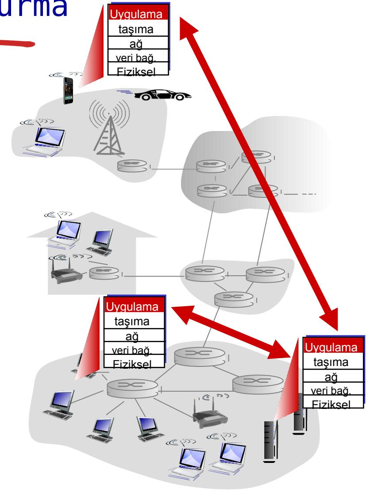

# Uygulama Mimarileri

### Uygulamanın olası yapıları:

- İstemci-sunucu
- Eşler arası: peer-to-peer (P2P)

## İstemci-sunucu mimarisi

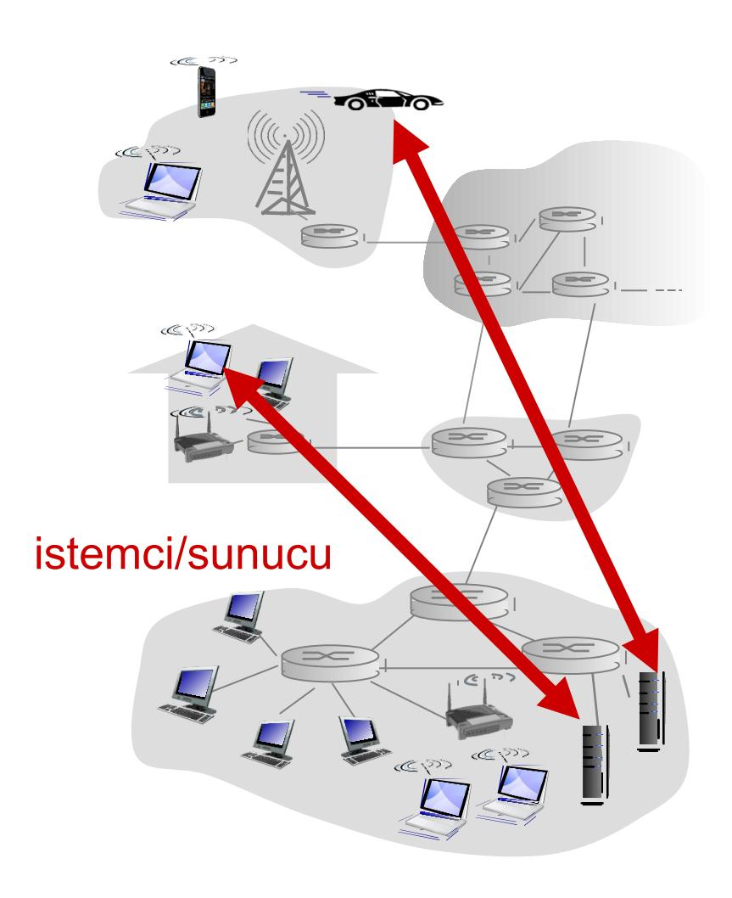

#### sunucu:

- Her zaman açık cihaz
- Sabit IP adresi
- Büyük trafik için veri merkezleri

### İstemci:

- Sunucu ile iletişime geçer
- Aralıklı olarak bağlanabilir.
- Dinamik IP adresine sahip olabilir
- Birbirleri ile direk olarak iletişime geçmez.

# P2P mimarisi

- Her zaman açık sunucu yoktur.
- Rastgele uç sistemler direk olarak haberleşir.
- Üyeler diğer üyelerden hizmet alır ve karşılığında diğer üyelere hizmet verir.
  - *Kendi ölçeklenebilirlik* – yeni üyeler geldikçe yeni hizmet isteği ve hizmet kapasitesi eklenir.
- Üyeler belli aralıklarla bağlanabilir veya IP adresini değiştirebilir.
  - Karmaşık yönetim mevcuttur.

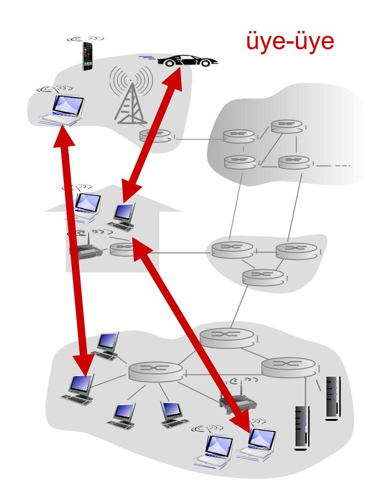

# İşlemler haberleşiyor

- *Işlem (İng: Process): bir cihazda çalışan program*
- Aynı cihaz üzerinde iki farklı işlem, işlemler arası haberleşme ile haberleşirler.
  - İşletim sistemi sağlar.
- Farklı cihazlardaki işlemler mesaj alışverişi ile haberleşirler.

istemciler, sunucular

*İstemci işlemi:* Haberleşmeyi başlatan işlem *Sunucu işlemi:* bağlantı kurulmasını bekleyen işlem

 Ayrıca: P2P mimarisi ile oluşturulmuş uygulamalar da istemci işlemi & sunucu işlemi bulundurur.

# Soketler

- İşlemler mesajlarını soketlerinden gönderir/alır.
- Soketler kapıya benzer.
  - Gönderen işlem mesajını kapıya yollar.
  - Gönderen işlem, karşı taraftaki taşıma altyapısının gönderilen mesajı alıcı işleme ait sokete ulaştıracağını bilir.

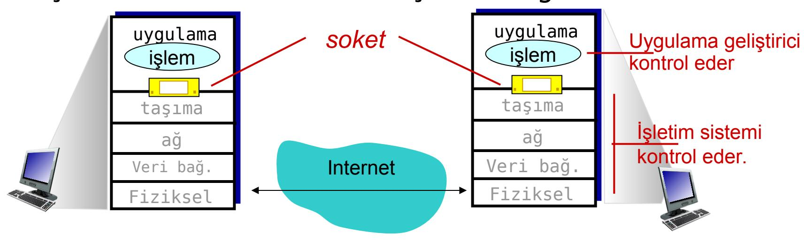

## Adresleme

- İşlem mesajları alabilmek için belirteç sahibi olmalıdır.
- Cihazlar 32-bit benzersiz IP adresine sahiptir.
- *S:* İşlemin calıştığı cihazın IP adresi, işlemi belirlemek için yeterli midir?
  - *C:* hayır, birden fazla işlem aynı cihazda çalışabilir.

- *Belirteç* hem IP adresini hem de cihaz üzerindeki işlem ile alakalı port numarasını içerir.
- Örnek port numaraları:
  - HTTP sunucu: 80
  - Posta sunucu: 25
- gaia.cs.umass.edu web sunucusuna HTTP mesajı göndermek için:
  - IP adres: 128.119.245.12
  - port numarası: 80
- Detaylar daha sonra…

### Uyg. katmanı protokolü şunları tanımlar

- Gönderilen mesaj tipleri,
  - e.g., istek, karşılık
- mesaj sözdizimi kuralları:
  - Mesajda hangi alanlar olmalı & alanlar nasıl ayrılmalı
- Mesaj anlamı
  - Alanlardaki bilgilerin anlamı
- Ne zamann ve nasıl mesaj işlemler mesaj gönderir & mesaja karşılık verir.

### Açık protokoller:

- RFC ile tanımlanmıştır.
- Birlikte işlerliğe (İng: İnteroperability) izin verir
- e.g., HTTP, SMTP özel protokoller:
- e.g., Skype

# Bölüm 2 Uygulama Katmanı

Bolu Abant İzzet Baysal Üniversitesi Mühendislik Fakültesi Bilgisayar Mühendisliği Bölümü

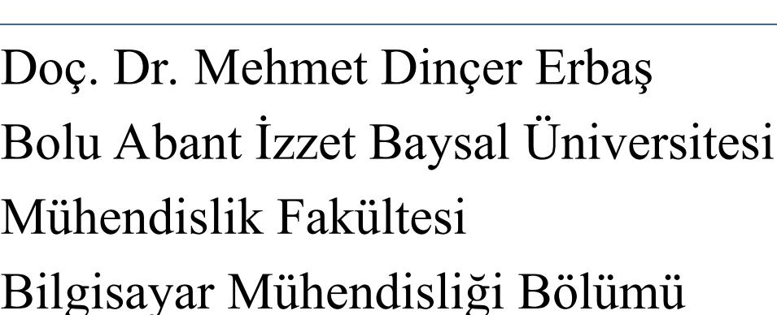


*Computer Networking: A Top-Down Approach*  8 th edition Jim Kurose, Keith Ross Pearson, 2020

 All material copyright 1996-2020 J.F Kurose and K.W. Ross, All Rights Reserved Slaytlar ders kitabından adapte edilmiştir.

### Bir uygulama taşıma hizmeti olarak neye ihtiyaç duyar?

### Veri bütünlüğü

- bazı uygulamalar (e.g., dosya transfer, web işlemleri) %100 güvenilir veri transferi gerektirir.
- başka uygulamalar (e.g., audio) biraz kaybı tolere edebilir.

### Zamanlama

 Bazı uygulamalar apps (e.g., Internet telefon, interaktif oyunlar) çok az gecikme olmasını bekler.

### İş hacmi

- Bazı uygulamalar (e.g., multimedya) belli sürede en az iş hacmi garantisi bekler.
- diğerleri ("elastik uyg.") elde edebildikleri iş hacmi ile idare eder

### Güvenlik

 Şifreleme, veri bütünlüğü, …

### Taşıma hizmeti ihtiyaçları: yaygın uygulamalar

|  | uygulama                                              | Veri kaybı                                | İş hacmi                                              | Zaman hassas                                         |
|--|-------------------------------------------------------|-------------------------------------------|-------------------------------------------------------|------------------------------------------------------|
|  | dosya transfer<br>e-posta<br>Web dosyası              | kayıp yok<br>kayıp yok<br>kayıp yok       | elastik<br>elastik<br>elastik                         | Hayır<br>Hayır<br>Hayır                              |
|  | gerçek-zaman audio/video                              | kayıp-tolere                              | ses: 5kbps-1Mbps<br>video:10kbps-5Mbps                | evet, 100'ler ms                                     |
|  | saklı ses/video<br>interaktif oyunlar<br>metin mesajı | kayıp-tolere<br>kayıp-tolere<br>kayıp yok | Yukarıdaki ile aynı<br>birkaç kbps gerekir<br>elastik | evet, birkaç sn<br>evet, 100'ler ms<br>evet ve hayır |

### İnternet taşıma protokoller hizmetleri

#### TCP hizmeti:

- \* Gönderici ve alıcı işlemler arası güvenilir taşıma.
- \* Akış kontrolü: gönderici aşırı trafik ile alıcıyı boğmaz.
- \* Sıkışma kontrolü: ağ aşırı yüklenildiğinde göndericiyi yavaşlatır.
- \* \$\frac{\mathbf{Sunlar1}}{\mathbf{zamanlama}} \text{sağlamaz:} \\
  zamanlama, minimum iş \\
  hacmi garantisi, \\
  güvenlik
- \* bağlantı-odaklı:
   istemci ve sunucu
   işlemleri arasında
   kurulum gerekli.

#### UDP hizmeti:

- \* Gönderici ve alıcı işlemler arasında güvenilir olmayan taşıma.
- \* Şunları sağlamaz:
  güvenilirlik, akış
  kontrolü, sıkışma
  kontrolü, zamanlama,
  minimum iş hacmi
  garantisi, güvenlik,
  veya bağlantı
  kurulumu.

S: Sizce neden UDP'ye\nihtiyaç duyulmuş?

### Internet uyg.: uygulama, taşıma protokolü

|                       | uygulama         | uygulama<br>katmanı protokolü           | kullandığı<br>taşıma protokolü |
|-----------------------|------------------|-----------------------------------------|--------------------------------|
|                       |                  |                                         |                                |
|                       | e-posta          | SMTP [RFC 2821]                         | TCP                            |
|                       | uzaktan erişim   | Telnet [RFC 854]                        | TCP                            |
|                       | Web              | HTTP [RFC 2616]                         | TCP                            |
|                       | dosya transfer   | FTP [RFC 959]                           | TCP                            |
| çoklu-ortam yayımlama |                  | HTTP (e.g., YouTube),<br>RTP [RFC 1889] | TCP veya UDP                   |
|                       | Internet telefon | SIP, RTP, özel<br>(e.g., Skype)         | TCP veya UDP                   |

## TCP'yi güvene alma

### TCP & UDP

- Şifreleme yok
- Şifreler açık olarak sokete gönderilirse, internet üzerinde açık olarak ilerler.

### SSL

- Şifrelenmiş TCP bağnatısı sağlar.
- Veri bütünlüğü
- Uç-nokta kimlik doğrulama

#### SSL uyg. katmanındadır.

 Uygulamalar SSL kütüphaneleri kullanarak TCP ile "konuşur".

### SSL soket API

- Sokete açık olarak gönderilen şifreler İnternet üzerinde şifrelenmiş olarak ilerler.
- Bölüm 7.

# Bölüm 2: konular

- 2.1 Ağ uygulamalarının prensipleri
- 2.2 Web and HTTP
- 2.3 FTP
- 2.4 Electronik posta
  - SMTP, POP3, IMAP
- 2.5 DNS

- 2.6 P2P uygulamaları
- 2.7 UDP ve TCP ile soket programlama

# Web ve HTTP

### *Genel olarak:*

- *web sayfası, nesnelerden* oluşur*.*
- Nesneler HTML dosyası, JPEG resim, Java aplet, ses dosyası … olabilir.
- Bir web sayfası *referans edilmiş birçok nesneyi* içeren *taban HTML-dosyası* içerir.
- Her nesne bir URL (İng: Uniform Resource Locater) ile erişilebilir.

www.someschool.edu/someDept/pic.gif Cihaz adı Yol adı

## HTTP genel bakış

## HTTP: hypertext transfer protocol

- Web'in uygulama katmanı protokolü
- istemci/sunucu modeli
  - istemci: (HTTP
    protokolü ile) Web
    nesnelerini isteyen, alan ve göstéren tarayıcı.
  - sunucu: Web sunucu istenilen nesneler (HTTP prokolü ile) gönderir.

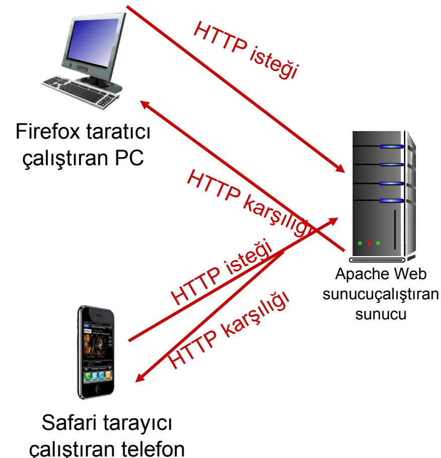

çalıştıran telefon

## HTTP genel bakış (devam)

#### TCP kullanır:

- \* Istemci sunucuya TCP bağlantısı başlatır (soket oluşturur), port 80.
- sunucu istemcinin TCP bağlantısını kabul eder.
- \* Tarayıcı (HTTP
   istemcisi) ile sunucu
   (HTTP sunucusu)
   arasında HTTP mesajı
   alışverişi (uygulama
   katmanı) yapılır.
- \* TCP bağlantısı kapatılır

#### HTTP "durumsuzdur"

\* Sağlayıcı önceki istemci istekleri ile ilgili bilgi saklamaz.

### sebep

## Durum bilgisi saklayan prokoller karmaşıktır.

- geçmiş tarihçe (durum)
  tutulması gerekir
- Sağlayıcı veya istemci bir sorun yaaşrsa, ikisinin durum tarihçesi birbirine uymaz, iki farklı durumun birleştirilmesi gerekir.

# HTTP bağlantıları

### *Kalıcı olmayan HTTP*

- TCP bağlantısı üzerinden en fazla bir nesne gönderilebilir.
  - Daha sonra bağlantı sonlanır.
- Birden fazla nesne indirmek için birden fazla bağlantı gerekir.

### *Kalıcı HTTP*

 Aynı TCP bağlantısı üzerinden birden fazla nesne gönderilebilir.

## Kalıcı olmayan HTTP

### Kullanıcı aşağıdaki URL girsin:

www.someSchool.edu/someDepartment/home.index

(metin ve, 10 jpeg resmine referans içersin)

#### 1a. HTTP istemcisi

www.someSchool.edu

adresinde, port 80'de bekleyen HTTP sağlayıcısına (işlemine) bağlantı başlatır.

- 2. HTTP istemcisi HTTP istek mesajını (URL içeren) TCP bağlantı soketine gönderir. Bu mesaj istemcinin someDepartment/home.ind ex nesnesini istediğini belirtir.
- 1b. www.someSchool.edu
   adresinde, 80 numaralı
   port bekleyen sağlayıcı
   bağlantıyı kabul eder,
   istemciye bildirir.
- 3. HTTP sağlayıcısı istek mesajını alır, istenilen nesneyi içeren karşılık mesajını hazırlar ve bağlantı soketine gönderir.

## Kalıcı olmayan HTTP (devam)


4. HTTP sağlayıcısı TCP bağlantısını kapatır.

- 5. HTTP istemcisi html dosyasını içeren karşılık dosyasını alır. html dosyasını ayrıştırır ve 10 tane referans edilmiş nesne olduğunu bulur.
- 6. 1-5 adımları her bir nesne için tekrar edilir.


### Kalıcı olmayan HTTP: karşılık süresi

GDS - Gidiş-dönüş süresi (İng: RTT) küçük bir paketin istemciden sağlayıcı gidip gelme süresi

#### HTTP karşılık süresi:

- TCP bağlantısı için bir GDS.
- HTTP isteği ve HTTP karşılık mesajının ilk bölümlerinin ulaşması için bir GDS.
- Dosya iletim süresi
- Kalıcı olamayan HTTP karşılık süresi = 2GDS+ dosya iletim süresi

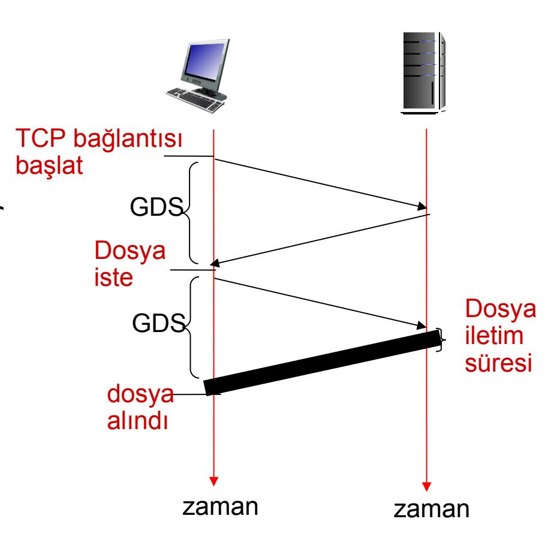

## Kalıcı HTTP

### *Kalıcı olmayan HTTP sorunlar:*

- Her bir nesne için 2 GDS gerekir.
- Her bir TCP bağlantısı için işletim sistemi zaman harcayacaktır.
- Tarayıcılar genellikle birden fazla paralel TCP bağlantısı açarak referans edilmiş nesnesleri hızlıca almaya çalışır.

#### *kalıcı HTTP:*

- Sağlayıcı karşılığı gönderdikten sonra bağlantıyı açık bırakır.
- İstemci ve sağlayıcı arasındaki takip eden mesajlar aynı bağlantı üzerinden gönderilir.
- İstemci referans edilmiş bir nesne ile karşılaşınca isteğini gönderir.
- Her referans edilmiş nesne için yaklaşık bir GDS süre geçer.

## HTTP istek mesajı

```
Uygulama Katmanı 2-16
   iki tip HTTP mesajı: istek (İng: 
    request), karşılık (İng: response).
   HTTP istek mesajı:
       ASCII (okunabilir format)
istek satırı
(GET, POST, 
HEAD komutları)
           başlık
         satırları
Satır başındaki satır 
başı (İng: carriage 
return), satır sonu 
(İng: line feed) başlık satırlarının 
bittiğini söyler.
                  GET /index.html HTTP/1.1\r\n
                  Host: www-net.cs.umass.edu\r\n
                  User-Agent: Firefox/3.6.10\r\n
                  Accept: text/html,application/xhtml+xml\r\n
                  Accept-Language: en-us,en;q=0.5\r\n
                  Accept-Encoding: gzip,deflate\r\n
                  Accept-Charset: ISO-8859-1,utf-8;q=0.7\r\n
                  Keep-Alive: 115\r\n
                  Connection: keep-alive\r\n
                  \r\n
                                                 Satır başı karakteri
                                                Satır sonu karakteri
```

### HTTP istek mesajı: genel format

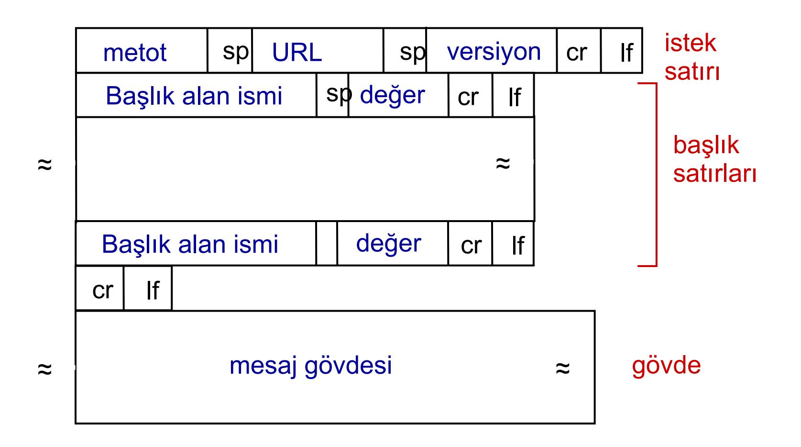

## Form girdisi yükleme

#### POST metodu:

- Web sayfaları genellikle form girdisi içerir.
- Girdi sağlayıcıya mesaj gövdesinde yüklenir.

#### URL metodu:

- GET metodu kullanır
- Girdi URL istek mesajının URL alanında yüklenir:

**www.somesite.com/animalsearch?monkeys&banana**

## Metot tipleri

### HTTP/1.0:

- GET
- POST
- HEAD
  - Sağlayıcı istenilen nesnenin cevabın içerisinde gönderilmemesini söyler.

#### HTTP/1.1:

- GET, POST, HEAD
- PUT
  - URL alanında belirtilen adrese mesaj gövdesinde bulunan dosyayı yükler.
- DELETE
  - URL alanında belirtilen dosyayı siler.

## HTTP karşılık mesajı

```
durum satırı
(protocol
durum kodu
durum ifadesi)
        başlık
      satırları
veri, e.g., 
istenilen
HTML dosyası
                 HTTP/1.1 200 OK\r\n
                 Date: Sun, 26 Sep 2010 20:09:20 GMT\r\n
                 Server: Apache/2.0.52 (CentOS)\r\n
                 Last-Modified: Tue, 30 Oct 2007 17:00:02 
                   GMT\r\n
                 ETag: "17dc6-a5c-bf716880"\r\n
                 Accept-Ranges: bytes\r\n
                 Content-Length: 2652\r\n
                 Keep-Alive: timeout=10, max=100\r\n
                 Connection: Keep-Alive\r\n
                 Content-Type: text/html; charset=ISO-8859-1\
                   r\n
                 \r\n
                 data data data data data ...
```

## HTTP karşılık durum kodları

Durum kodu, sağlayıcıdan istemciye gönderilen karşılık mesajının ilk satırında bulunur:

### **200 OK**

 Istek başarılı, istenilen nesne bu mesajın geri kalanında.

### **301 Moved Permanently**

 Istenilen nesne taşınmış, dosyanın yeni yeri mesajın geri kalanında (Location: ).

### **400 Bad Request**

Istek sağlayıcı tarafından anlaşılamadı.

### **404 Not Found**

İstenilen nesne sağlayıcıda yok.

### **505 HTTP Version Not Supported**

## HTTP denemesi (istemci)

1. Telnet ile bir Web sağlayıcısına bağlanın:

**telnet** gaia.cs.umass.edu 80

gaia.cs.umass.edu adresinde, port 80 (önceden tanımlı HTTP sağlayıcı port) TCP bağlantısı açılır. Gönderilen her metin gaia.cs.umass.edu 80 numaralı port gönderilir.

2. bir GET HTTP istek mesajı yaz:

**GET /kurose\_ross/interactive/index.php HTTP/1.1 Host: gaia.cs.umass.edu**

bu mesajı yazarak (iki kez satır başı ile), bu minimal (ve bütün) GET isteğini HTTP sunucusuna gönderirsiniz.

3. HTTP sağlayıcısı tarafından gönderilen karşılık mesajını inceleyebilirsiniz.

### Kullanıcı-sağlayıcı durumu: Çerezler (İng: Cookies)

Birçok Web sitesi çerez kullanır.

#### *Çerezler dört bölümden oluşur:*

- 1) HTTP karşılık mesajında çerez başlık satırı.
- 2) Bir sonraki HTTP istek mesajında çerez başlık satırı.
- 3) Kullanıcının cihazında kullanıcının tarayıcısı tarafından yönetilen çerez dosyası.
- 4) Web sitesinde geri-uç veritabanı.

#### örnek:

- Ayşe her zaman interete aynı PC üzerinden erişiyor.
- Bir e-ticaret sitesini ilk defa ziyaret ediyor.
- İlk HTTP isteği web sitesine ulaştığında, site aşağıdakileri oluşturur:
  - emsalsiz ID
  - Geri-uç veritabanında ID ile ilgili kayıt.

## Çerezler: "durum" saklarlar

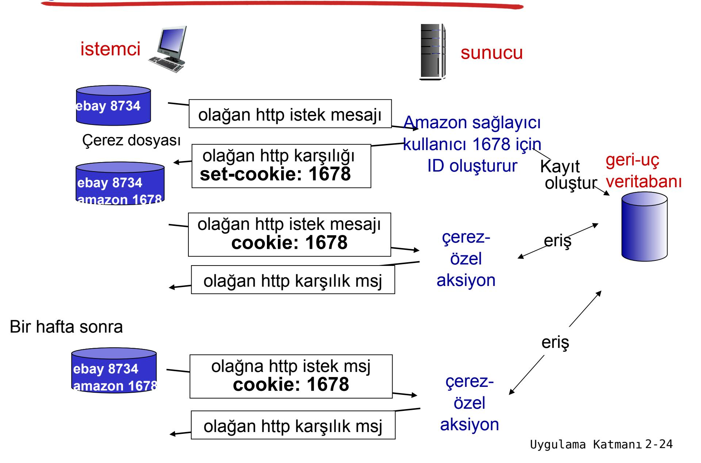

# Çerezler (devam)

#### *Çerezler ne için kullanılabilir:*

- yetkilendirme
- Alışveriş sepetleri
- tavsiyeler
- Kullanıcı oturum durumu (Web e-posta)

#### *Çerezler ve mahremiyet:* Öte yandan

- Çerezler sayesinde web siteleri sizin hakkınızda birçok bilgi toplayabilir.
- Sitelere isim ve e-posta gönderebilirsiniz.

#### *"durum*" nas l saklan r ı ı *:*

- Protokol uçnoktaları: çoklu işlem için gönderici/alıcı tarafında durum saklanır.
- Çerezler: http mesajı durum taşır.

Web önbelleği: vekil sunucu (Ing: Proxy server) TTP istek TP istek hedef: Hedef sunucuyu işin içine sokmadan istemci isteğini gerçekleştirmek. Kullaici ţarayiciyi avarlar: Önbellek üzerinden web erişimi Tarayıcı bütün HTTP vekil isteklerini önbelleğe hedef HTTP Karşılık sunucu istemci HTTP karşılıkı sunucu gönderir. Nesne önbellekte ise: istemciye HTTP istek gönderilir. Değilse, önbellek hedef sunucudan HETP Karşılık nesneyi alır, istemciye gönderir.

istemci

Hedef

sunucu

# Web önbelleği

- Önbellek hem sunucu hem istemci olarak çalışır.
  - Başta istek yapan istemci için sunucu olarak.
  - Hedef sunucuya istemci olarak.
- Genellikle önbellek ISP tarafından oluşturulur. (universite, şirket, yerleşik ISP)

### *Önbelleklemenin yararları*

- İstemci isteği için karşılık süresini azaltır.
- Kurumun erişim bağındaki trafiği azaltır.
- Internet üzerinde birçok önbellek bulunmaktadır. Bu sayede güçsüz içerik sağlayıcılarının efektif hizmet vermesi mümkün olur.

# Önbellekleme örneği:

#### *varsayımlar:*

- Ort nesne büyüklüğü: 1 Mb.
- Tarayıcıdan hedef sunucuya ort istek sıklığı: 15/sn.
- Tarayıcılara ortalama veri hızı: 15 Mb/sn.
- Kurumsal yönlendiriden herhangi bir hedef sunucuya GDS: 2 sn.
- erişim bağ hızı: 15 Mb/sn.

#### *sonuçlar:*

LAN kullanımı: 15%


- Toplam gecikme = Internet gecikmesi + erişim gecikmesi + LAN gecikmesi
- = 2 sn + dakikalar + milisaniyeler

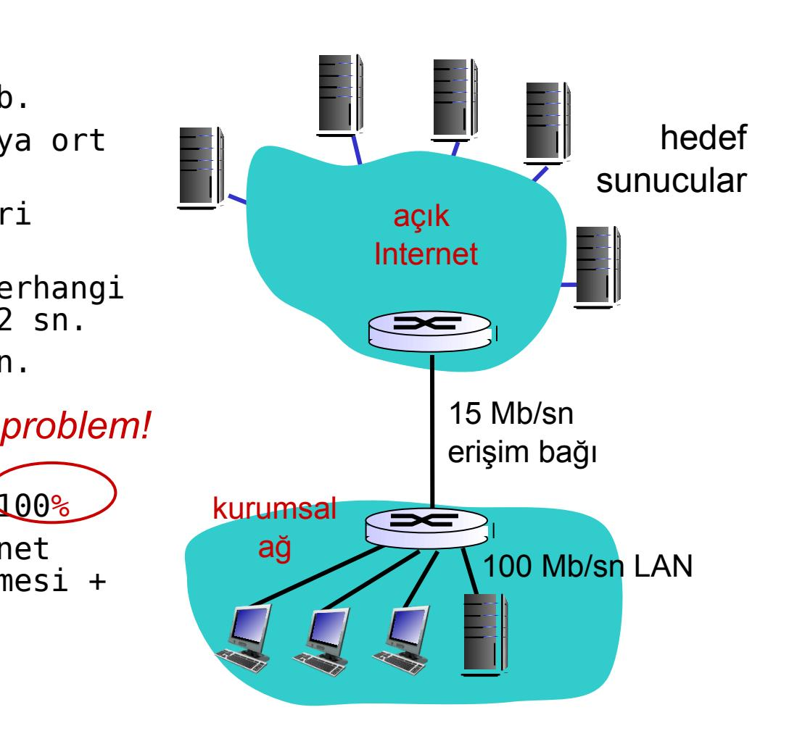

### Önbellekleme örneği: Daha fazla erişim hızı ile

#### *varsayımlar:*

- Ort nesne büyüklüğü: 1 Mb.
- Tarayıcıdan hedef sunucuya ort istek sıklığı: 15/sn.
- Tarayıcılara ortalama veri hızı: 15 Mb/sn.
- Kurumsal yönlendiriden herhangi bir hedef sunucuya GDS: 2 sn.
- erişim bağ hızı: 150 Mb/sn.

#### *sonuçlar:*

- LAN kullanımı: 15%
- Erişim bağı kullanımı = %10
- Toplam gecikme = Internet gecikmesi + erişim gecikmesi + LAN gecikmesi
- = 2 sn + millisaniyeler + milisaniyeler

### Oldukça pahalı bir çözüm!

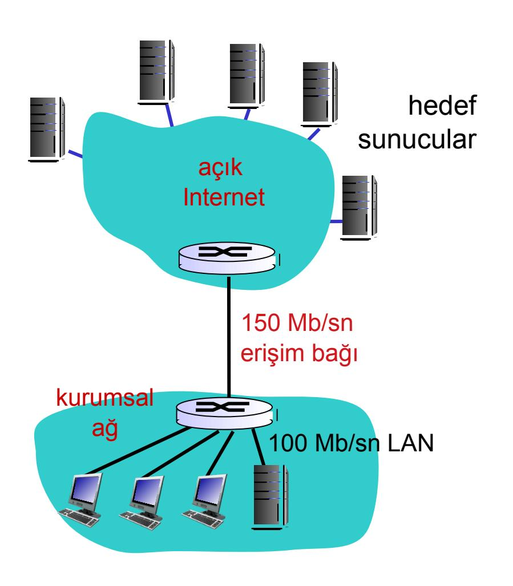

### Önbellekleme örneği: Vekil sunucu kullanımı

#### *varsayımlar:*

- Ort nesne büyüklüğü: 1 Mb.
- Tarayıcıdan hedef sunucuya ort istek sıklığı: 15/sn.
- Tarayıcılara ortalama veri hızı: 15 Mb/sn.
- Kurumsal yönlendiriden herhangi bir hedef sunucuya GDS: 2 sn.
- erişim bağ hızı: 15 Mb/sn.

#### *Vekil sunucu ile ilgili varsayımlar*

- Vekil sunucu isabet oranı %40 olsun
  - İsteklerin %40'ı vekil sunucudan, geri kalan %60'ı hedef sunucudan gelsin.
- Erişim bağı kullanımı: 0.6\*15 Mb/sn = 9 Mb/sn
  - Kullanım: 9/15 = 0.6 ==> %60.


### Önbellekleme örneği: Vekil sunucu kullanımı

#### *varsayımlar:*

- Ort nesne büyüklüğü: 1 Mb.
- Tarayıcıdan hedef sunucuya ort istek sıklığı: 15/sn.
- Tarayıcılara ortalama veri hızı: 15 Mb/sn.
- Kurumsal yönlendiriden herhangi bir hedef sunucuya GDS: 2 sn.
- erişim bağ hızı: 15 Mb/sn.
- Vekil sunucu isabet oranı %40 olsun

#### *Toplam gecikme:*

- = 0.6 \* (hedef sunucudan gecikme) + 0.4 \* (önbellekten alım)
- = 0.6 \* (2.01) + 0.4 \* (milisaniyeler)
- = ~ 1.2 sn
- 10 kat hızlı internet almaktan hem daha hızlı hem de daha ucuz.

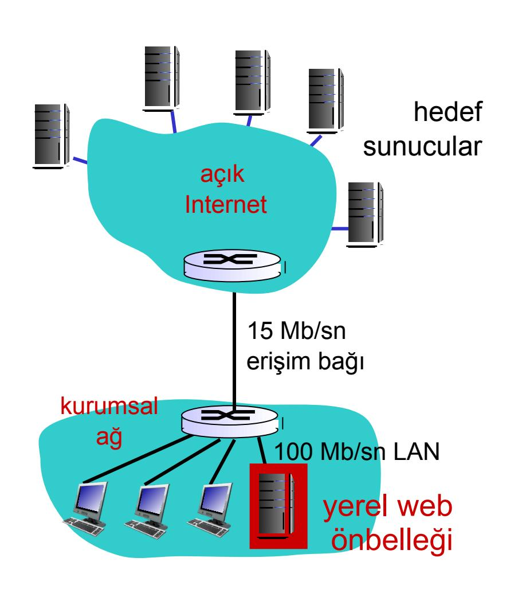

## Koşullu GET

- *Hedef:* önbellekte güncel versiyon var ise nesneyi gönderme.
  - Nesne iletim gecikmesi yok.
  - Düşük bağ kullanımı.
- *Önbellek: HTTP isteği içinde önbelleklenmiş nesnenin tarihini belirt:*

**If-modified-since: <date>**

*sunucu:* önbelleklenmiş nesne güncel ise karşılık mesajında nesneyi gönderme:

> **HTTP/1.0 304 Not Modified**


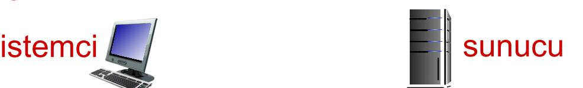

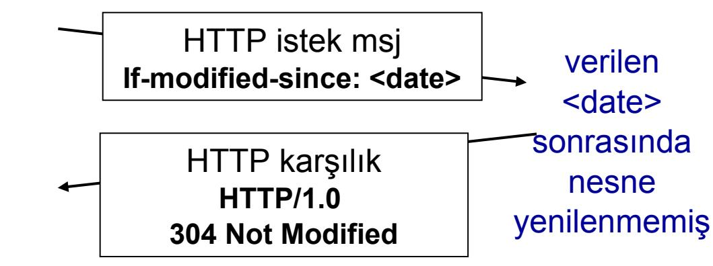

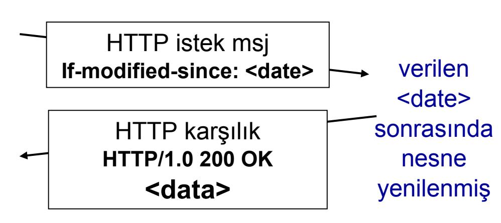

# Bölüm 2: konular

- 2.1 Ağ uygulamalarının prensipleri
- 2.2 Web and HTTP
- 2.3 FTP
- 2.4 Electronik posta
  - SMTP, POP3, IMAP
- 2.5 DNS

- 2.6 P2P uygulamaları
- 2.7 UDP ve TCP ile soket programlama

## FTP: dosya transfer protokolü

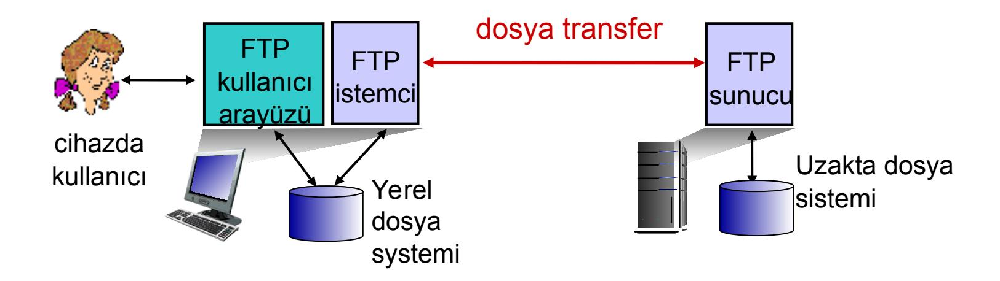

- Uzak cihaza / cihazdan dosya transferi
- istemci/sunucu modeli
  - *istemci:* transferi başlatan taraf (uzak cihaza/cihazdan).
  - *sunucu:* uzak cihaz
- ftp: RFC 959
- ftp sunucu: port 21

### FTP: kontrol ve veri bağlantılarını ayırır

- FTP istemcisi 21 numaralı port üzerinde bekleyen FTP sunucusuna TCP kullanarak bağlanır.
- Istemci kontrol bağlantısı ile yetkilendirilir.
- İstemci uzak klasörü inceler, kontrol bağlantısı üzerinden komutlar gönderir.
- Sunucu dosya transfer emri aldığında, sunucu istemciye 2. TCP bağlantısını (dosya için) açar.
- Bir dosya transferi tamamlandıktan sonra sunucu veri bağlantısını sonlandırır.

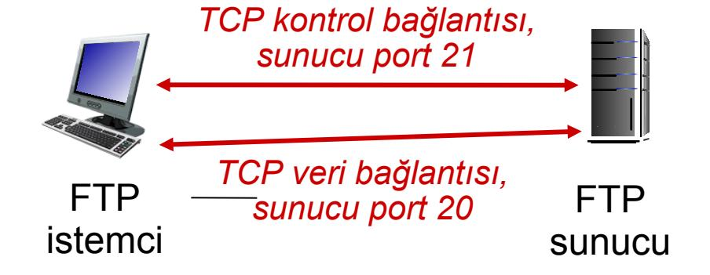

- Sunucu bir başka dosya transferi için bir başka veri bağlantısı açar.
- Kontrol bağlantısı: "bant dışı".
- FTP sunucusu "durum" saklar: Mevcut klasör, önceki yetkilendirme vs.

## FTP komutları, karşılıkları

### *Örnek komutlar:*

- Kontrol kanalından ASCII metin gönderildi.
- **USER** *kullanıcıadı*
- **PASS** *parola*
- **LIST** Mevcut klasördeki dosya listesini döner.
- **RETR dosyaadı** dosyayı alır.
- **STOR dosyaadı** belirtilen dosyayı uzak cihaza gönderir.

### *Örnek dönüş kodları*

- durum kodu ve ifadesi (HTTP benzeri)
- **331 Username OK, password required**
- **125 data connection already open; transfer starting**
- **425 Can't open data connection**
- **452 Error writing file**

# Bölüm 2 Uygulama Katmanı

Bolu Abant İzzet Baysal Üniversitesi Mühendislik Fakültesi Bilgisayar Mühendisliği Bölümü


*Computer Networking: A Top-Down Approach*  8 th edition Jim Kurose, Keith Ross Pearson, 2020

 All material copyright 1996-2020 J.F Kurose and K.W. Ross, All Rights Reserved Slaytlar ders kitabından adapte edilmiştir.

# Bölüm 2: konular

- 2.1 Ağ uygulamalarının prensipleri
- 2.2 Web and HTTP
- 2.3 FTP
- 2.4 Electronik posta
  - SMTP, POP3, IMAP
- 2.5 DNS

- 2.6 P2P uygulamaları
- 2.7 UDP ve TCP ile soket programlama

# Elektronik posta

#### *Üç ana parça:*

- kullanıcı araçları
- Posta sunucuları
- simple mail transfer protocol: SMTP

#### *Kullanıcı aracı*

- "posta okuyucu" olarak bilinir.
- Posta mesajlarının oluşturulmasına, düzenlenmesine ve okunmasına olanak verir.
- e.g., Outlook, Thunderbird, iPhone posta istemcisi
- giden, gelen mesajlar sunucu üzerinde saklanır.

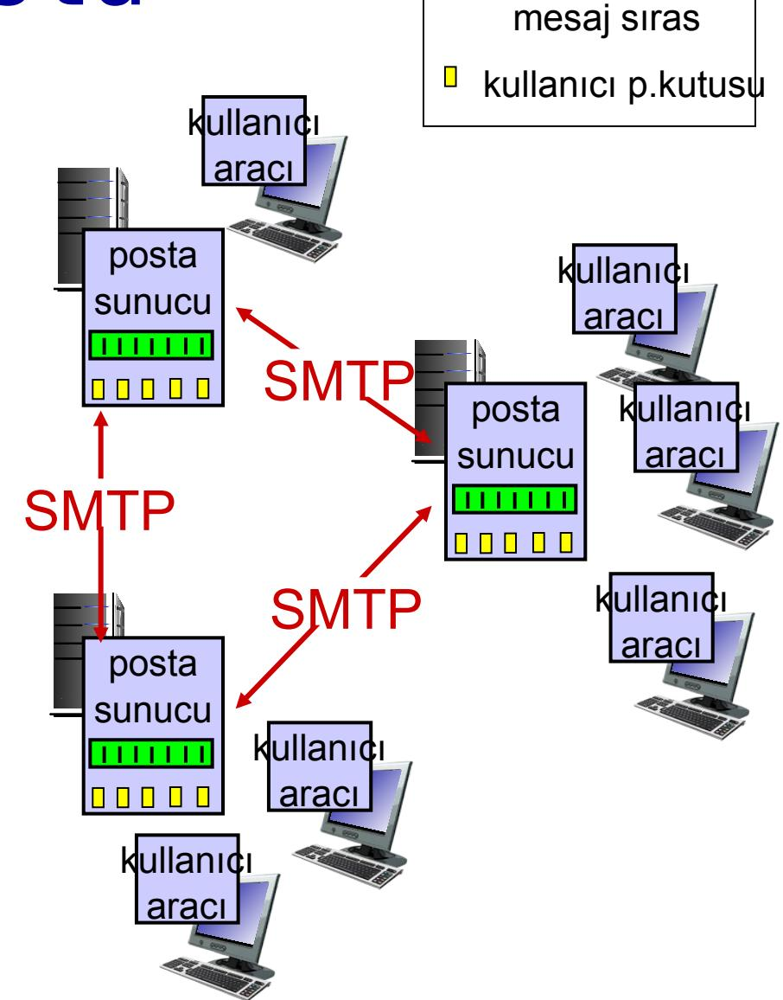

giden

### Elektronik posta: posta sunucuları

#### Posta sunucusu:

- *Posta kutusu* kullanıcıya gelen mesajları içerir.
- *mesaj sırası* gidecek posta mesajlarını (gönderilecek) içerir.
- *SMTP protokolü* posta sunucularu arasında eposta göndermek için.
  - "istemci": gönderen posta sunucusu
  - "sunucu": alan posta sunucusu

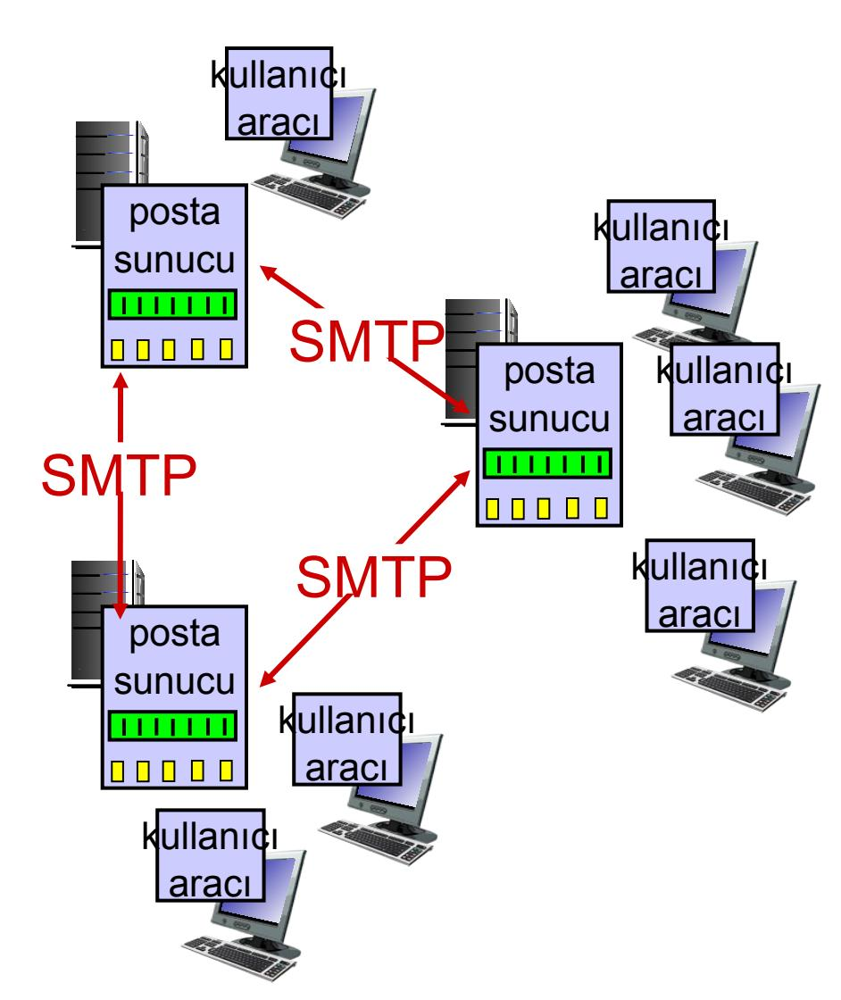

### Elektronik Posta: SMTP [RFC 2821]

- Güvenilir şekilde eposta mesajını tranfer edebilmek için TCP kullanır, port 25.
- direk transfer: gönderen sunucudan alan sunucuya.
- Transferin üç aşaması vardır.
  - El sıkışma (selamlaşma)
  - Mesaj transferi
  - kapanış
- komut/karşılık etkileşimi (HTTP, FTP benzeri)
  - komutlar: ASCII metin
  - karşılıklar: durum kodu ve ifadesi
- Mesajlar 7-bit ASCII olarak yazılmalıdır.

### Senaryo: Ayşe Ali'ye mesaj gönderir

- 1) Ayşe kullanıcı aracını kullanarak ali@someschool.edu adresine mesaj hazırlar.
- 2) Ayşe'nin KA mesajı posta sunucusuna yollar; mesaj mesaj sırasına yerleştirilir.
- 3) SMTP istemci tarafı Ali'nin posta sunucusuna SMTP bağlantısı açar.

- 4) SMTP istemcisi Ayşe'nin mesajını TCP bağlantısı üzerinden yollar.
- 5) Ali'nin posta sunucusu mesajı Ali'nin posta kutusunu koyar.
- 6) Ali kullanıcı aracını çalıştırarak mesajı okur.

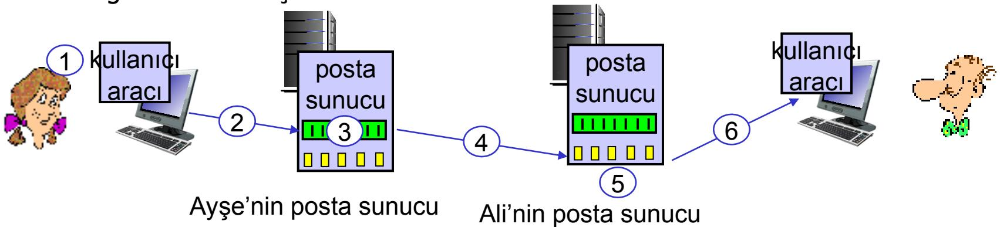

# Örnek SMTP kullanımı

```
 S: 220 hamburger.edu 
 C: HELO crepes.fr 
 S: 250 Hello crepes.fr, pleased to meet you 
 C: MAIL FROM: <alice@crepes.fr> 
 S: 250 alice@crepes.fr... Sender ok 
 C: RCPT TO: <bob@hamburger.edu> 
 S: 250 bob@hamburger.edu ... Recipient ok 
 C: DATA 
 S: 354 Enter mail, end with "." on a line by itself 
 C: Do you like ketchup? 
 C: How about pickles? 
 C: . 
 S: 250 Message accepted for delivery 
 C: QUIT 
 S: 221 hamburger.edu closing connection
```

### SMTP bağlantı kurmayı deneyebilirsiniz.

- **telnet sunucuİsmi 25**
- Sunucudan gelen 220 karşılığını gözlemleyin.
- HELO, MAIL FROM, RCPT TO, DATA, QUIT komutlarını kullanabilirsiniz.

Yukarıda belirtilen komutlar ile e-posta aracı kullanmadan e-posta gönderebilirsiniz.

# SMTP

- SMTP kalıcı bağlantı kullanır.
- SMTP mesajların (başlık ve gövde) 7-bit ASCII olarak yazılmasını gerektirir.
- SMTP sunucusu CRLF.CRLF kullanarak mesajın sonlandığını belirtir.

#### *HTTP ile karşılaştırma:*

HTTP: çekme işlemi

- SMTP: itme işlemi
- İkisi de ASCII komut/karşılık etkileşimi, durum kodlarına sahiptir.
- HTTP: Her nesne kendisini içeren karşılık mesajının içinde kapsüllenmiştir.
- SMTP: Birden fazla nesne çok-parçalı mesaj içerisinde gönderilir.

## Posta mesajı formatı

Sadece ASCII

karakterler.

```
SMTP: eposta mesaj 
  değişimi için 
  protokol.
RFC 822: metin 
  mesajının formatı 
  için standart:
 Başlık satırları, 
  örneğin,
    Kimden:
    Kime:
    Konu:
   SMTP MAIL FROM, RCPT 
     TO: komutlarından 
     farklıdır!
 Gövde: "mesaj"
                                     başlık
                                     gövde
                                                      boş
                                                     satır
```

## Posta erişim protokolleri

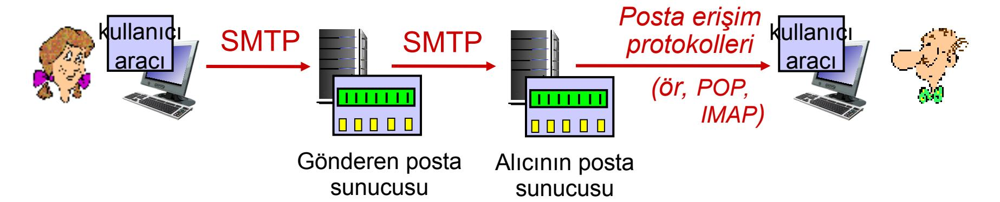

- SMTP: alıcının sunucusuna gönder/depola.
- Posta erişim protokolü: sunucudan alma.
  - POP: Post Office Protocol [RFC 1939]: yetkilendirme, indirme
  - IMAP: Internet Mail Access Protocol [RFC 1730]: ek özellikler, örneğin sunucu üzerinde mesajların değiştirilebilmesi vb.
  - HTTP: gmail, Hotmail, Yahoo! Mail, vb.

## POP3 protokolü

#### *yetkilendirme safhası*

- Istemci komutları:
  - **user:** kullanıcı ismini belirt
  - **pass:** parola
- sunucu karşılık
  - **+OK**
  - **-ERR**

#### *işlem safhası,* istemci:

- **list:** mesaj numaralarını sırala.
- **retr:** numara ile mesajı al
- **dele:** sil
- **quit**

```
 C: list 
 S: 1 498 
 S: 2 912 
 S: . 
 C: retr 1 
 S: <message 1 contents>
 S: . 
 C: dele 1 
 C: retr 2 
 S: <message 1 contents>
 S: . 
 C: dele 2 
 C: quit 
    S: +OK POP3 server ready 
    C: user bob 
    S: +OK 
    C: pass hungry 
    S: +OK user successfully logged on
```

 **S: +OK POP3 server signing off**

# POP3 (devam) ve IMAP

### *POP3*

- Önceki örnek POP3 "indir ve sil" modunu kullanır.
  - Ali aracını değiştirse epostaları okuyamaz.
- POP3 "indir-vesakla": farklı aracılarda mesajların kopyası bulunur.
- POP3 oturumlar arası durumsuzdur.

#### *IMAP*

- Bütün mesajları aynı yerde saklar: sunucuda.
- Kullanıcıların mesajları klasörlere ayırmasına izin verir.
- Oturumlar arası kullanıcı durumunu saklar.
  - Klasör isimleri ve mesaj numaraları ile klasör isimleri arasındaki eşleştirme gibi bilgiler saklanır.

# Bölüm 2: konular

- 2.1 Ağ uygulamalarının prensipleri
- 2.2 Web and HTTP
- 2.3 FTP
- 2.4 Electronik posta
  - SMTP, POP3, IMAP
- 2.5 DNS

- 2.6 P2P uygulamaları
- 2.7 UDP ve TCP ile soket programlama

## DNS: domain name system

#### *insanlar:* Birçok belirteç:

 TCKN, isim, pasaport #

#### *Internet cihazlar, yönlendiriciler:*

- IP adresi (32 bit) datagramları adreslemek için kullanılır.
- "isim", örneğin, www.yahoo.com – insanlar tarafından kullanılır.
- *S:* IP adresinden isim eşleme, veya tam tersi, nasıl yapılabilir?

#### *Domain Name System:*

- *dağınık veritabanı* isim sunucuları hiyerarşisi şeklinde tanımlanmıştır.
- *Uygulama-katmanı protokolü:* cihazlar, isim sunucuları isimlere erişmek için haberleşirler (adres/isim çevirisi).
  - not: İnternet çekirdek fonksiyonu uygulamakatmanı protokolü olarak tanımlanmış.
  - Karmaşıklık ağ "kenarına" bırakılmış.

## DNS: hizmetler, yapısı

#### *DNS hizmetleri*

- Cihaz adından IP adresine çeviri.
- Cihaz paylaşımlama (İng: host aliasing).
  - kanonik, takma isimler
- Posta sunucusu paylaşımlama
- Yük dağıtımı
  - Çoklanmış Web sunucuları: Birçok IP adresi aynı isme denk gelebilir.

#### *Neden merkesi DNS kullanılmaz?*

- Tek noktada hata sistemi durdurur.
- Trafik hacmi
- Uzak merkezi veritabanı
- Bakım.

*C: ağ büyüdükçe sorun olur.*

### DNS: dağınık ve hiyerarşik bir veritabanı

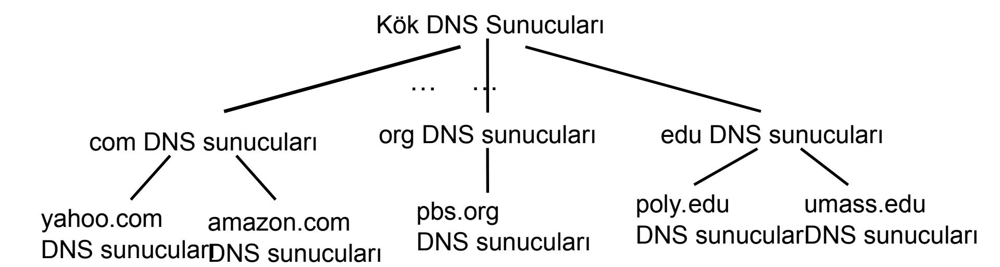

Istemci www.amazon.com için IP adresini istiyor; 1. yöntem:

- Istemci kök sunucusuna sorarak .com DNS sunucusunun adresini alır.
- İstemci .com DNS sucunusuna sorarak amazon.com DNS sunucusunun adresini alır.

Istemci amazon.com DNS sunucusuna sorarak www.amazon.com için IP adresini alır. Uygulama Katmanı 2-17

## DNS: kök isim sunucuları

- Yerel isim sunucusu ismi bulamadığında iletşime geçer.
- Kök isim sunucu:
  - Isim eşleştirmesi bilinmiyorsa yetkili isim sunucusu ile iletişime geçer.
  - Eşlemeyi alır
  - Yerel isim sunucusuna bildirir.

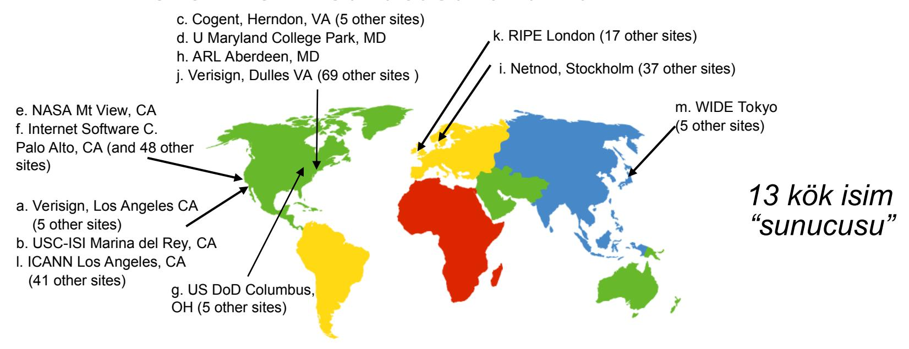

### En Üst Alan, yetkili sunucular

### *En Üst alan (İng: top-level domain (TLD)) sunucuları:*

- com, org, net, edu, aero, jobs, museums gibi alan isimleri ile en-üst seviye ülke alanlarından sorumludur, ör: uk, fr, ca, jp, tr.
- Network Solutions şirketi .com TLD için sunucuyu sürdürür.
- Educause .edu alanı için.

### *Yetkili DNS sunucuları:*

- Organizasyonun kendi DNS sunucuları, organizasyonun isme sahip cihazları için yetkilendirici cihaz ismi IP çevirisi yapar.
- Hizmet sağlayıcı veya organizasyon tarafından yönetilebilir.

## Yerel DNS isim sunucusu

- Hiyerarşinin parçası olmak zorunda değil.
- Her ISP (yerleşik ISP, şirket veya üniversite) kendisi bir yerel DNS isim sunucusuna sahip olabilir.
  - Ayrıca "varsayılan isim sunucusu" olarak adlandırılır.
- Bir cihaz DNS sorgusu yaptığında, sorgu yerel DNS sunucusuna gönderilir.
  - Sunucuda önbelleklenmiş taze isim-adres çeviri çiftleri bulunur (ancak tarihi geçmiş olabilir!).
  - Vekil olarak çalışır, sorguyu hiyerarşiye iletir.

## DNS isim çözme örneği

 cis.poly.edu adresindeki cihaz gaia.cs.umass.edu adresinin IP numarasını istiyor.

### *Döngüsel sorgu:*

- Iletişime geçilen sunucu bir sonraki iletişimi geçilecek sunucunun adresini cevap olarak döner.
- "Bu ismi bilmiyorum,ama şu sunucuya sorabilirsi n".

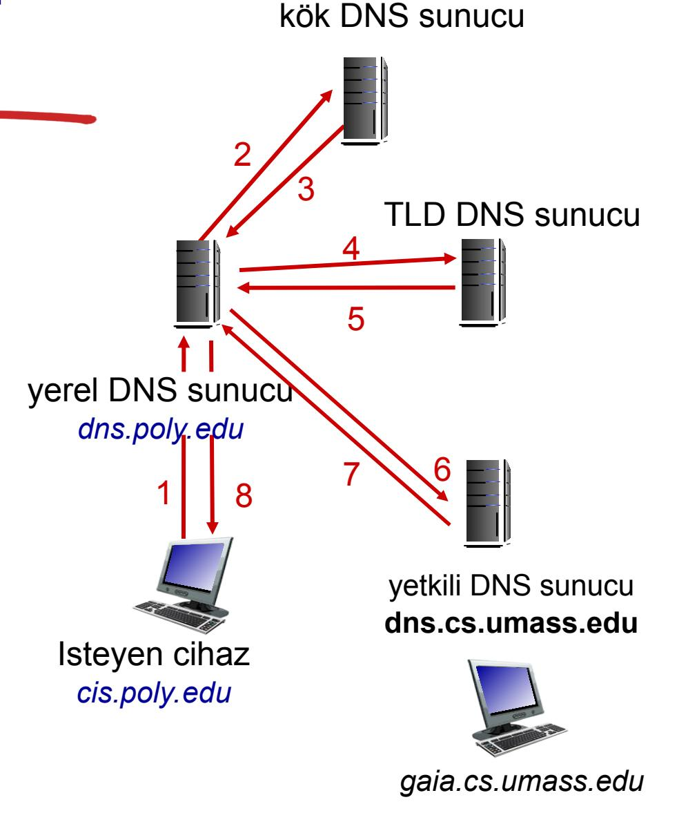

## DNS isim çözme örneği

### Yinelenmeli sorgu:

- Isim çözme işini iletişime geçilen isim sunucusuna bırakır.
- Hiyerarşinin üst seviyelerine fazla yük bindirir.

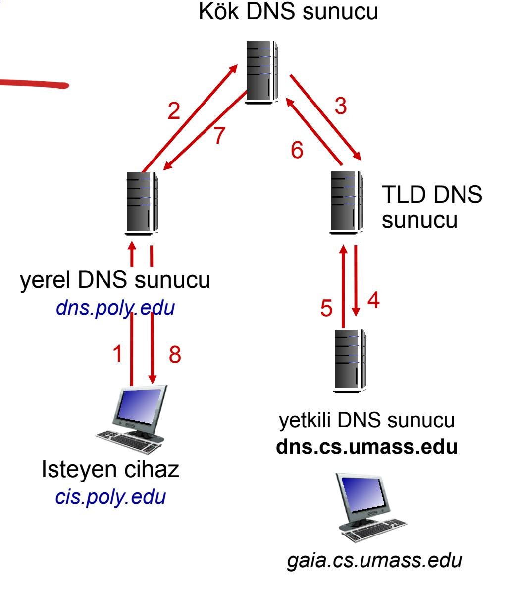

### DNS: kayıtları önbellekleme ve yenileme.

- Herhangi bir isim sunucusu bir eşlemeyi öğrendiğinde bu eşlemeyi önbellekler.
- Önbelleklenmiş kayıt bir süre sonra hafızadan silinir (Yaşam süresi (YS), İng: TTL)
  - TLD sunucuları genellikle yerel isim sunucularından önbelleklenir.
    - Böylece kök sunucuları çok sık ziyaret edilmez.
- Önbelleklenmiş kayıtların tarihi geçebilir (en iyi gayret isim-adres çevirisi).
  - Eğer cihaz IP adresini değiştirirse, bütün TTL süreleri geçinceye kadar İnternet'in geri kalan kısmı tarafından bu durum bilinmeyebilir.
- yenile/haberdaret mekanizmaları IETF standartlarında belirtilmiştir.
  - RFC 2136

## DNS kayıtları

*DNS:* kaynak kayıtlarını (KK) depolayan dağınık veritabanı.

KK format: **(isim, değer, tip, ys)**

### tip=A

- **isim** cihaz adı
- **değer** IP adresi.

### tip=NS

- **isim** alan (Ör, foo.com)
- **değer** bu alan adı için yetkili isim sunucusunun cihaz adı.

### tip=CNAME

- **isim** kanonik (gerçek) isim için takma ad.
- www.ibm.com gerçekte servereast.backup2.ibm.com
- **değer** kanonik isim.

### tip=MX

**Değer isim** ile alakalı posta sunucusunun cihaz ismi.

## DNS protokolü, mesajları

*Sorgu ve cevap* mesajları, ikisi de aynı mesaj formatında.

### msj başlığı

- kimliklendirme: 16 bit # sorgu için, sorguya cevap aynı # kullanır.
- bayraklar:
  - sorgu veya cevap
  - yinelenme isteniyor mu
  - Yinelenme mümkün mü
  - Cevap yetkili mi

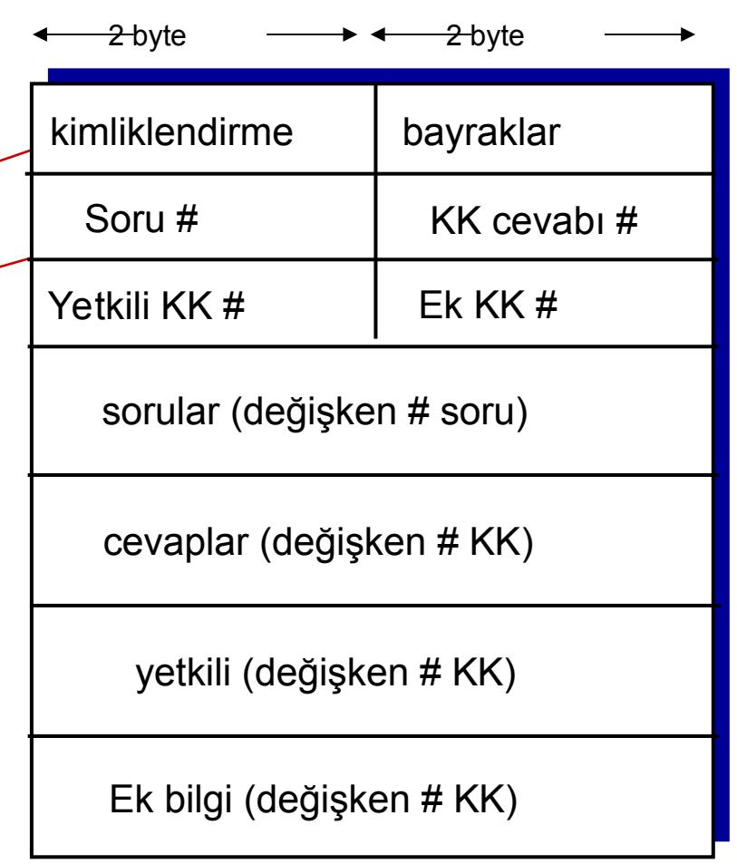

## DNS protokolü, mesajları

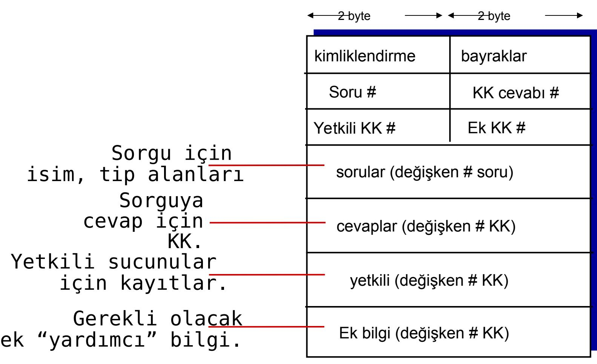

## DNS yeni kayıt ekleme

- Örnek: "Network Uptopia" isminde yeni bir şirket kuruyoruz.
- *DNS kayıtçısında* (ör:, Network Solutions) networkuptopia.com adresini kayıtlarız.
  - Gerekli cihaz isimleri ve yetkili isim sunucusunun (öncül ve ikincil) IP adresini bildiririz.
  - Kayıtçı TLD sunucusuna iki yeni kayıt ekler. **(networkutopia.com, dns1.networkutopia.com, NS) (dns1.networkutopia.com, 212.212.212.1, A)**
  - www.networkuptopia.com adresi için yetkili sunucuda tip A kaydı, networkuptopia.com posta sunucusu için MX kaydı oluştururuz.
  - Ayrıca birden fazla sunucumuz var ise yetkili sunucu yük dağıtımı yapabilir.

### DNS sunucularına saldırı

### DdoS saldırıları

- Kök sunucusunu aşırı trafik ile bombala.
  - Bu güne kadar başarılı olamamıştır.
  - Trafik filtreleme.
  - Yerel DNS sunucuları TLD sunucuların IP adreslerini önbellekler, kök sunuculara ulaşmaz.
- TLD sunucuları bombala
  - Daha tehlikeli.

### Yönlendirme saldırıları

- Ortada-adam
  - Sorguları yakala
- DNS zehirleme
  - DNS sunucularına sahte cevaplar yolla, cevaplar önbelleklensin.

### DNS yararlanarak DDos saldırısı yapma

- Sahte kaynak adresi ile sorgular gönder: hedef IP içerir.
- Çok mesaj gönderilmesini sağlamak gerekir.

# Bölüm 2: konular

- 2.1 Ağ uygulamalarının prensipleri
- 2.2 Web and HTTP
- 2.3 FTP
- 2.4 Electronik posta
  - SMTP, POP3, IMAP
- 2.5 DNS

- 2.6 P2P uygulamaları
- 2.7 UDP ve TCP ile soket programlama

# Saf P2P mimarisi

- *Her zaman açık sunucu bulunmaz.*
- Rasgele uç sistemler direk olarak haberleşir.
- Üyeler belli aralıklarla bağlanır ve IP adreslerini değiştirirler.

#### *örnekler:*

- Dosya paylaşımı (BitTorrent)
- Yayınlama (KanKan)
- VoIP (Skype)

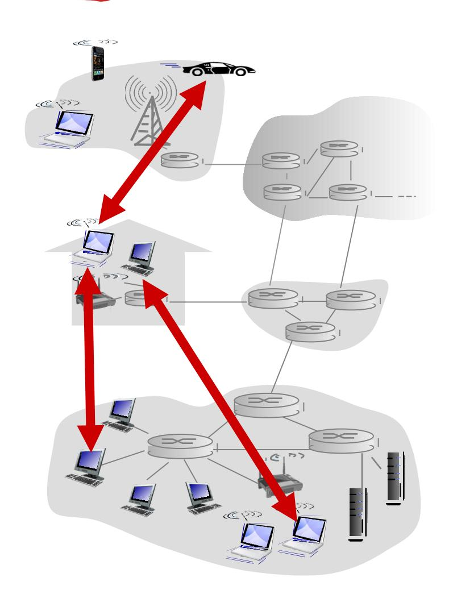

### File paylaşımı: istemci-sunucu vs P2P

Soru: Bir dosyayı (F büyüklüğünde) N
 üyeye dağıtmak ne kadar süre alır?

"üye yükleme/indirme kapasitesi sınırlı bir kaynak.

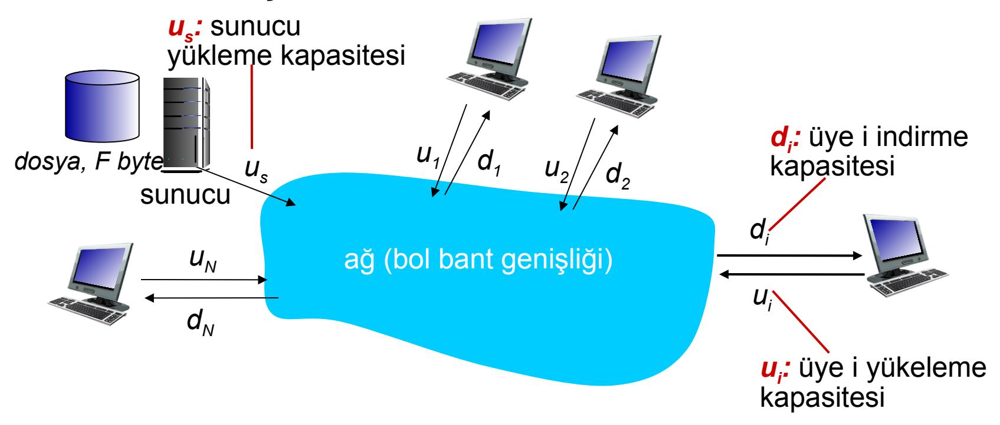

### Dosya dağıtım süresi: istemci-sunucu

- *Sunucu iletimi:* Sıralı şekilde N tane dosyayı göndermeli (yüklemeli)
  - Bir kopyayı göndermek için süre: *F/u<sup>s</sup>*
  - N kopyayı göndermek için süre: *NF/u<sup>s</sup>*

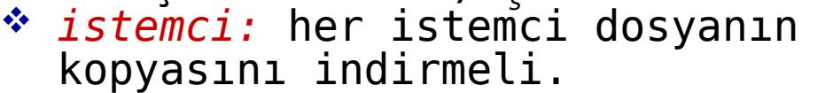

- dmin = min istemci indirme hızı
- min istemci indirme süresi: F/dmin

*Istemci sunucu mimarisi ile N istemci F büyüklüğünde bir dosyayı gönderme süresi* *Dc-s = max{NF/us,,F/dmin}*

ağ

*us*

*F*

*di*

*ui*

## Dosya dağıtım süresi: P2P

- Sunucu iletimi: en azından bir kopyayı yüklemeli.
  - Bir kopya göndermek için süre:  $F/u_s$
- \* *istemci*: her istemci bir kopya indirmelidir.
  - min istemci indirme

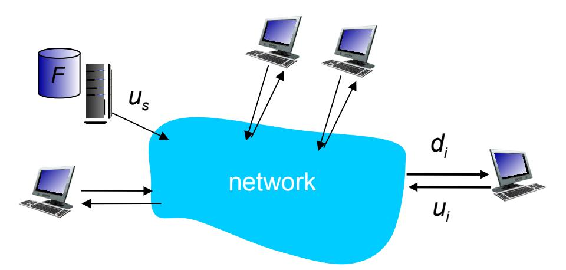

- süresi: F/d<sub>min</sub> **❖ istemciler:** toplamda NF byte indirecekler.
  - max yükleme hızı (max indirme hızını limitler)  $u_s + \Sigma u_i$

P2P yaklaşımı ile F büyüklüğünde N dosyayı dağıtma zamanı

$$D_{P2P} > max\{F/u_{s,},F/d_{min,},NF/(u_{s} + \Sigma u_{i})\}$$

N'e bağlı doğrusal olarak artar/...

... ancak aynı zaman bu da artar, her gelen üye yeni yükleme kapasitesi getirir.

## İstemci-sunucu vs. P2P: örnek

istemci yükleme hızı = *u*, *F/u* = 1 saat, *u<sup>s</sup> = 10u, dmin ≥ us*

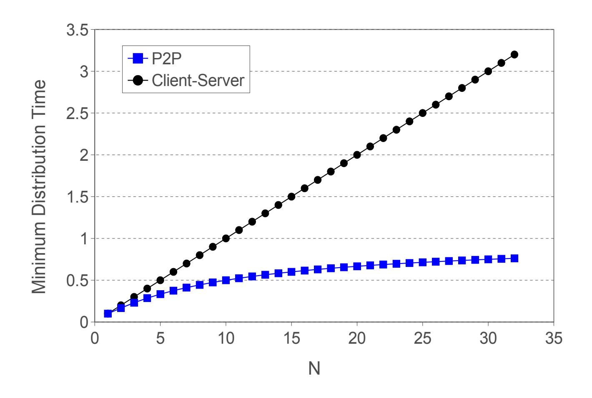

### P2P dosya paylaşımı: BitTorrent

- Dosya 256 Kb parçalara bölünür.
- Torrent içindeki üyeler dosya parçalarını gönderir / alır.

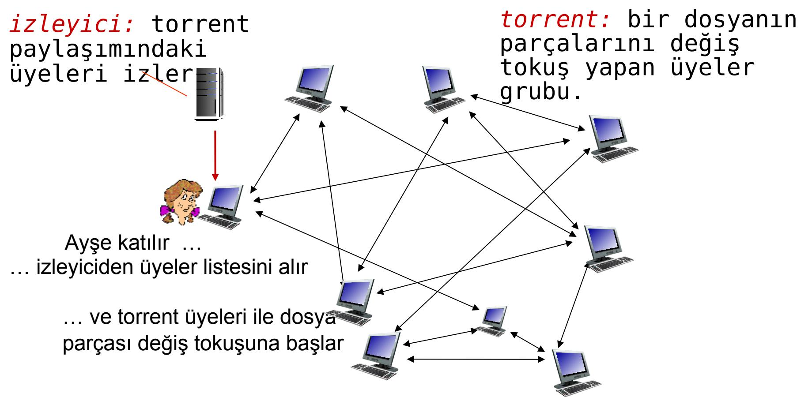

### P2P dosya paylaşımı: BitTorrent

- Üyelerin torrent katılımı:
  - Başta parçası yok, ancak zaman geçtikçe diğer üyelerden edinecektir.
  - Izleyiciye kayıt olur ve üye listesini alır, üyelerin bir kısmına bağlanır ("komşular").

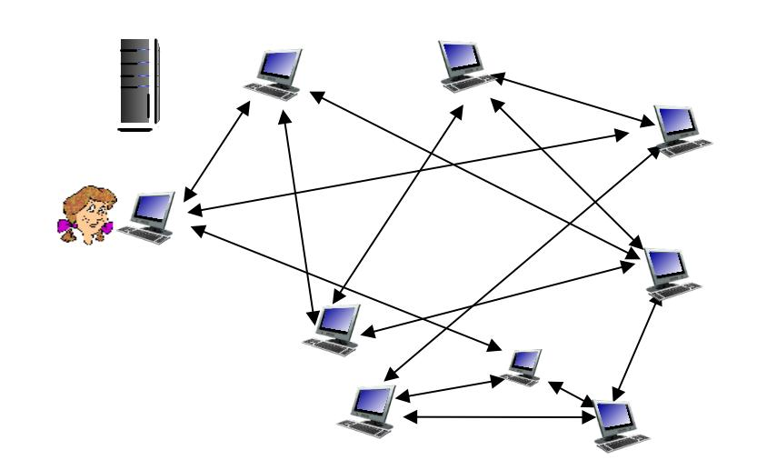

- Indirirken, üye aynı zamanda diğer üyelere parça yükler.
- Üyeler parça değişimi yaptığı üyeleri değiştirebilir.
- *churn:* üyeler gelip gidebilir.
- Bir üye dosyanın tamamına sahip olduğunda (bencil) ayrılabilir veya (fedakar) torrent içinde kalabilir.

### BitTorrent: dosya parçaları isteme / gönderme

#### *Parça isteme:*

- Belli bir zamanda farklı üyeler dosya parçalarının farklı bir altkümesine sahiptir.
- Belli aralıklarla Ayşe, her üyeye sahip olduğu parçaların listesini sorar.
- Ayşe sahip olmadığı parçaları diğer üyelerden ister, öncelikle en az bulunan parça olmak üzere.

#### *Parça gönderme: tit-for-tat*

- Ayşe kendisine en yüksek hızda parça gönderen dört üyeye parça gönderir.
  - Diğer üyeler Ayşe tarafından boğulur (Ayşe'den parça alamazlar).
  - Her 10 saniyede en çok gönderen 4lü tekrar hesaplanır.
- Her 30 saniyede rastgele bir üye seçlir ve parça gönderilir.
  - "iyimser" yaklaşımla bu üye beslenir.
  - Parça gönderilen üye bir süre sonra en iyi 4lü içine girebilir.

### BitTorrent: tit-for-tat

- (1) Ayşe "iyimser" olarak Ali'ye parça gönderir
- (2) Ayşe Ali'nin en çok gönderen 4lü üyesine girer;
- Ali karşılık verir
- (3) Ali Ayşe'nin en çok gönderen 4'lü üyesine girer.

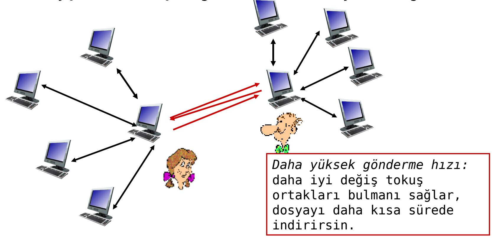

# Bölüm 2: konular

- 2.1 Ağ uygulamalarının prensipleri
- 2.2 Web and HTTP
- 2.3 FTP
- 2.4 Electronik posta
  - SMTP, POP3, IMAP
- 2.5 DNS

- 2.6 P2P uygulamaları
- 2.7 UDP ve TCP ile soket programlama

## Soket programlama

*hedef:* Sunucu/istemci mimarisi ile soket kullanarak uygulama yazmayı öğrenelim.

*soket:* uygulama işlemleri ve uçtan uca taşıma protokolü arası kapı.

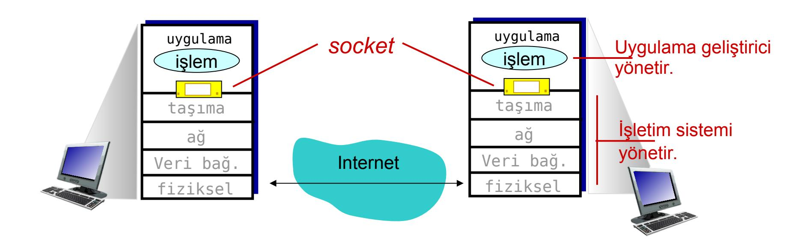

## Soket programlama

### *Taşıma hizmeti için iki ayrı soket tipi:*

- *UDP:* güvenilir olmayan datagram
- *TCP:* güvenilir, byte yayın odaklı

#### *Uygulama örneği:*

- 1. İstemci klavyeden bir karakter satırı okur (veri) ve veriyi sunucuya gönderir.
- 2. Sunucu veriyi alır ve karakterleri büyük harfe çevirir.
- 3. Sunucu değiştirilmiş veriyi istemciye gönderir.
- 4. İstemci değiştirilmiş veriyi alır ve ekranında gösterir.

### UDP ile soket programlama

UDP: sunucu ile istemci arasında "bağlantı" yok.

Veri göndermeden önce elsıkışma yapılmaz.

Gönderici IP heden adresi ve port numarasını her pakete iliştirir.

Alıcı alınan paketten IP adresi ve port numarası

UDP: gönderilen veri kaybolabilir veya sırası bozulmuş şekilde alınabilir.

Uygulama tarafından bakıldığında:

UDP güvenilir olmayan şekilde byte gruplarının ("datagtamlar") istemci ile sunucu arasında taşınmasını sağlar.

Uygulama Katmanı 2-42

### İstemci/sunucu soket etkileşimi: UDP

ClientSocket kapat ClientSocket üzerinden datagram oku soket oluştur: clientSocket = socket(AF\_INET,SOCK\_DGRAM) Sunucu IP ve port = x olan datagram olustur, clientSocket üzerinden gönder Oluştur: soket, port= x: serverSocket = socket(AF\_INET,SOCK\_DGRAM) serverSocket'den datagram oku ServerSocket'e istemci adresi ve port numarası Ile cevap yaz sunucu (serverIP'de çalışıyor) istemci

## Örnek uygulama: UDP istemci

### *Python UDPClient*

```
from socket import *
                        serverName = 'hostname'
                        serverPort = 12000
                        clientSocket = socket(socket.AF_INET, 
                         socket.SOCK_DGRAM)
                        message = raw_input('Input lowercase sentence:')
                        clientSocket.sendto(message,(serverName, serverPort))
                        modifiedMessage, serverAddress = 
                         clientSocket.recvfrom(2048)
                        print modifiedMessage
                        clientSocket.close()
Python soket kütüphanesi
Sunucu için UDP soketi
oluştur
Kullanıcıdan klavye 
girdisi al 
Sunucu adresini ve port 
numarasını mesaja ekle; 
sokete gönder
Alınan mesajı yazdır ve 
soketi kapat
Soketten okuduğun 
karakterleri string'e çevir
```

## Örnek uygulama: UDP sunucu

### *Python UDPServer*

```
from socket import *
                         serverPort = 12000
                         serverSocket = socket(AF_INET, SOCK_DGRAM)
                         serverSocket.bind(('', serverPort))
                         print "The server is ready to receive"
                         while 1:
                          message, clientAddress = serverSocket.recvfrom(2048)
                          modifiedMessage = message.upper()
                          serverSocket.sendto(modifiedMessage, clientAddress)
UDP soket oluştur
Soketi yerel port numarası 
12000 ile eşleştir.
Sonsuz 
döngü
UDP soketten mesajı oku, 
istemcinin adresi al 
(istemci ip ve port)
```

Istemciye büyük harfli

mesajı geri gönder

## TCP ile soket programlama

#### Istemci sunucuya erişmeli

Sunucu işlemi çalışıyor olmalı.

Sunucu, istemcinin erişimini karşılayan soketi (kapıyı) önceden oluşturmalı.

#### Istemci sunucu ile şu şekilde iletişime geçer:

Sunucu işleminin IP adresi ve port numarasını belirterek TCP soketi oluşturur.

*Istemci soket oluşturduğunda: istemci TCP tarafı sunucu TCP tarafına bağlantıyı oluşturur.*

Istemci kendisi ile iletişime geçtiğinde, sunucu TCP tarafı sunucu işleminin iletişime geçen istemci ile haberleşebilmesi için yeni soket oluşturur.

> Bu sayede sunucu birden fazla istemci ile konuşabilir.

Kaynak port numarası ile farklı istemciler belirlenebilir.

Uygulama tarafından bakıldığında

TCP istemci ve sunucu arasında güvenilir, doğru sıralı byte-akışı şeklinde taşıma ("pipe") sağlar.

### İstemci/sunucu soket etkileşimi: TCP

### SUNUCU (hostid'de çalışıyor) istemci

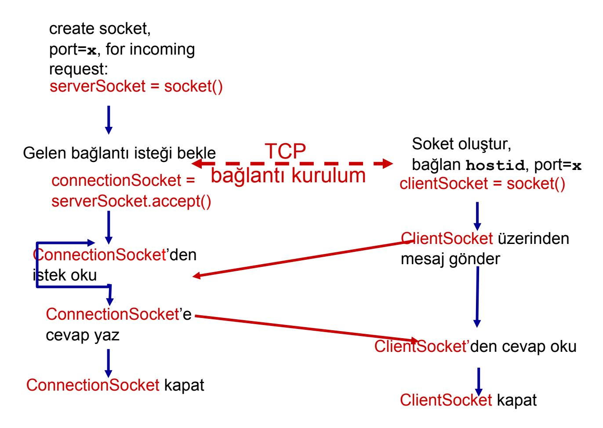

## Örnek uygulama: TCP istemci

### *Python TCPClient*

```
from socket import *
                         serverName = 'servername'
                         serverPort = 12000
                         clientSocket = socket(AF_INET, SOCK_STREAM)
                         clientSocket.connect((serverName,serverPort))
                         sentence = raw_input('Input lowercase sentence:')
                         clientSocket.send(sentence)
                         modifiedSentence = clientSocket.recv(1024)
                         print 'From Server:', modifiedSentence
                         clientSocket.close()
Sunucu için TCP soketi 
oluştur, uzak port 12000
Sunucu ismi ve port 
numarası eklemeye gerek 
yok.
```

## Örnek uygulama: TCP sunucu

### *Python TCPServer*

from socket import \* serverPort = 12000 serverSocket = socket(AF\_INET,SOCK\_STREAM) serverSocket.bind(('',serverPort)) serverSocket.listen(1) print 'The server is ready to receive' while 1: connectionSocket, addr = serverSocket.accept() sentence = connectionSocket.recv(1024) capitalizedSentence = sentence.upper() connectionSocket.send(capitalizedSentence) connectionSocket.close() TCP karşılama soketi oluştur Sunucu gelen TCP istekleri için dinlemeye başlar. Sonsuz döngü Sunucu gelen istekler için accept() fonksiyonunda bekler, dönüş yaparsa yeni soket oluşturulur. Soketten mesaj okunur (ancak adres UDP benzeri okunmaz) Bu istemciye soket kapanır

(ancak karşılama soketi

halen açık)

### Bölüm 2: özet

### *Ağ uygulaması üzerine konumuz tamamlandı.*

- Uygulama mimarileri
  - istemci-sunucu
  - P2P
- Uygulama hizmeti ihtiyaçları
  - güvenilirlik, bant genişliği, gecikme
- Internet taşıma hizmeti modeli
  - Bağlantı-odaklı, güvenilir: TCP
  - Güvenilir olmayan, datagram: UDP

- Belli protokoller:
  - HTTP
  - FTP
  - SMTP, POP, IMAP
  - DNS
  - P2P: BitTorrent
- soket programlama: TCP, UDP soketleri

### Bölüm 2: özet

#### *En önemli konu: protokoller hakkında bilgi aldık.*

- Tipik istek/cevap mesaj değişimi:
  - Istemci bilgi veya hizmet ister.
  - Sunucu veri, durum kodu ile karşılık verir.
- mesaj formatı:
  - başlık: veri hakkında bilgi veren alanlar.

veri: iletilen bilgi.

### *Önemli konular:*

- kontrol vs. veri mesajları
  - bant-içi, bant-dışı
- merkesi vs. dağınık
- Durum bilgisi tutmayan vs. durum bilgisi tutan
- güvenilir vs. güvenilir olmayan msj transferi
- "karmaşıklık ağ kenarına"

# Bölüm 3 Taşıma Katmanı

Doç. Dr. Mehmet Dinçer Erbaş Bolu Abant İzzet Baysal Üniversitesi Mühendislik Fakültesi Bilgisayar Mühendisliği Bölümü


 All material copyright 1996-2020 J.F Kurose and K.W. Ross, All Rights Reserved Slaytlar ders kitabından adapte edilmiştir.

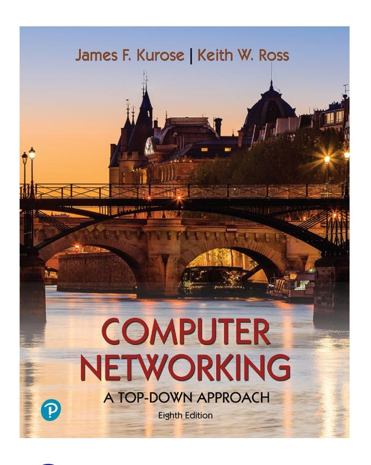

*Computer Networking: A Top-Down Approach*  8 th edition Jim Kurose, Keith Ross Pearson, 2020

# Bölüm 3: Taşıma Katmanı

## hedefimiz:

- Taşıma katmanı hizmeti prensiplerini anlamak:
  - Çoklama, çoklama çözme
  - Güvenilir veri transferi.
  - Akış kontrolü
  - Sıkışma kontrolü.

- İnternet taşıma katmanı protokollerini öğrenmek:
  - UDP: bağlantısız taşıma
  - TCP: bağlantı-odaklı güvenilir taşıma
  - TCP sıkışma kontrolü

# Bölüm 3: konular

- 3.1 taşıma-katmanı hizmetler
- 3.2 çoklama ve çoklama çözme
- 3.3 bağlantısız taşıma: UDP
- 3.4 güvenilir veri transferi prensipleri

- 3.5 bağlantı-odaklı taşıma: TCP
  - Segment yapısı
  - Güvenilir veri transferi
  - Akış kontrolü
  - Bağlantı yönetimi
- 3.6 sıkışma kontrolü prensipleri
- 3.7 TCP sıkışma kontrolü

## Taşıma hizmetleri ve protokolleri

- Farklı cihazlar üzerinde çalışan uyg. Işlemleri arasında mantıksal bağlantı kurar.
- Taşıma protokolleri uç sistemlerde çalışır.
  - gönderen taraf: uyg. mesajını segment ismi verilen parçalara ayırır, ağ katmanına gönderir.
  - alan taraf: segmentleri geri birleştirir, mesajı yeniden oluşturur, uyg. katmanına gönderir.
- Uygulamalara birden fazla protokol imkanı sunar.
  - Internet: TCP ve UDP

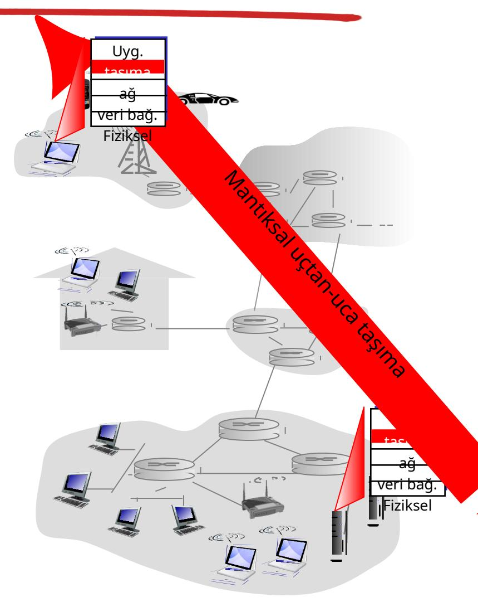

# Taşıma vs. ağ katmanı

- Ağ katmanı: cihazlar arası mantıksal bağlantı.
- \* Taşıma katmanı: işlemler arası mantıksal bağlantı
  - Ağ katmanı servisine dayanır ve ağ katmanı servisini geliştirir.

### ev benzerliği:

Ayşe'nin evindeki 12 çocuk, Ali'nin eindeki 12 çocuğa mektp göndersin:

- cihazlar = evler
- işlemler = çocuklar
- Uyg. mesajları = zarf içinde mektuplar
- taşıma protokolü = Ev içindeki çocuklara mektup dağıtan Ayşe ve Ali.
- ağ-katmanı protokolü = postal service

## Internet taşıma-katmanı protokolleri

- güvenilir, sıralı teslimat (TCP)
  - sıkışma kontrolü
  - Akış kontrolü
  - Bağlantı kurulumu
- Güvenilir olmayan, sırasız teslimat: UDP
  - IP'nin "en-iyi gayret" ya klaşımının devamı gibidir.
- Sağlanmayan hizmetler:
  - Gecikme garantisi
  - Bant genişliği garantisi

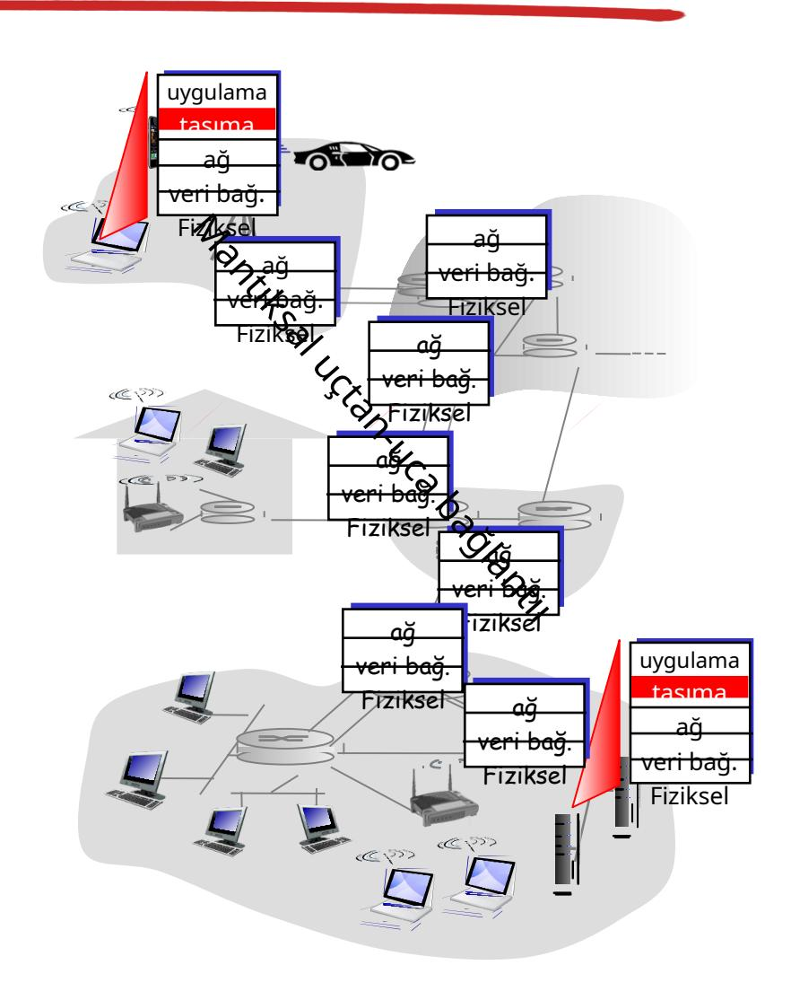

# Bölüm 3: konular

- 3.1 taşıma-katmanı hizmetler
- 3.2 çoklama ve çoklama çözme
- 3.3 bağlantısız taşıma: UDP
- 3.4 güvenilir veri transferi prensipleri

- 3.5 bağlantı-odaklı taşıma: TCP
  - Segment yapısı
  - Güvenilir veri transferi
  - Akış kontrolü
  - Bağlantı yönetimi
- 3.6 sıkışma kontrolü prensipleri
- 3.7 TCP sıkışma kontrolü

## Çoklama/Çoklama çözme

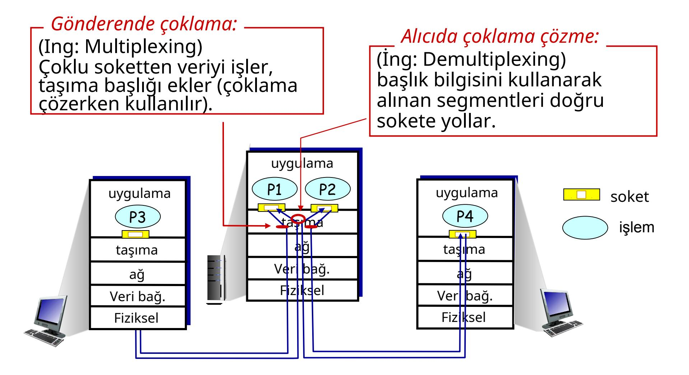

## Çoklama çözme nasıl çalışır?

- Cihaz IP datagramı alır.
  - Her datagram kaynak IP adresi ve hedef IP adresi içerir.
  - Her datagram bir taşıma katmanı segmenti içerir.
  - Her segment kaynak ve hedef port numarası içerir.
- Cihaz IP adreslerini ve port numaralarını kullanarak segmenti uygun sokete yönlendirir.

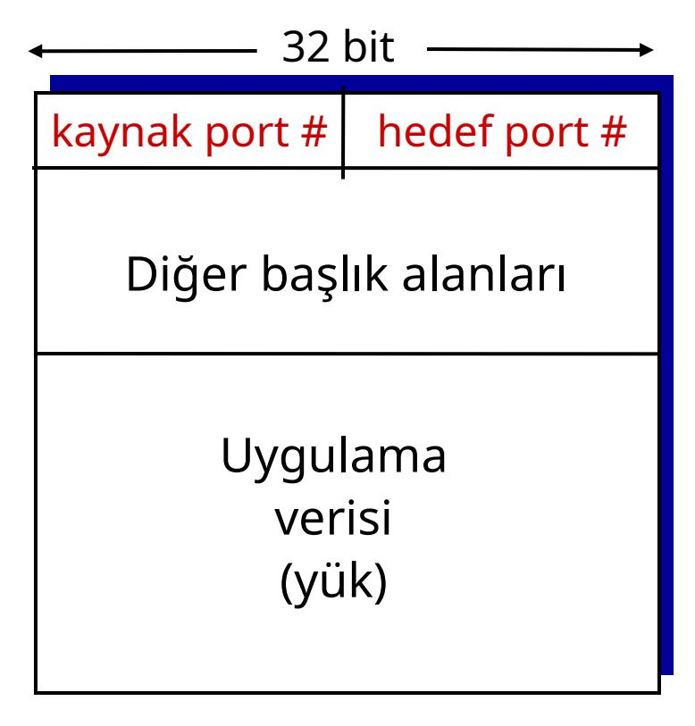

TCP/UDP segment formatı

## Bağlantısız çoklama çözme

*hatırlatma:* oluşturulan soket cihazyerel port # ile oluşturulur:

```
 DatagramSocket mySocket1 
  = new 
 DatagramSocket(12534);
```

- *hatırlatma:* UDP soketinden datagram göndermek için şunlar belirtilmelidir
  - hedef IP adres
  - hedef port #

- Cihaz UDP segmenti aldığında:
  - Segmentteki hedef port # kontrol eder.
  - UDP segmenti belirtilen port # yönlendirir.


Hedef cihazda aynı hedef IP, port # sahip olan bütün datagramlar (farklı kaynak IP ve/veya kaynak port üzerinden gelseler bile) aynı sokete yönlendirilir.

## Bağlantısız çoklama çözme: örnek

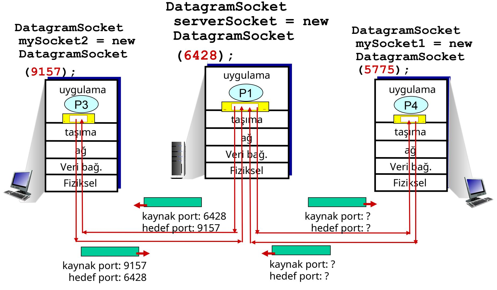

## Bağlantı-odaklı çoklama çözme

- TCP soketi 4 bilgi ile belirlenir:
  - kaynak IP adresi
  - kaynak port numarası
  - hedef IP adresi
  - hedef port numarası
- Çoklama çöz: alıcı dört değerin tamamını kullanarak segmenti uygun sokete yönlendirir.

- Sunucu cihaz eşzamanlı birçok TCP soketini destekleyebilir:
  - Her soket kendine ait 4 bilgi tarafından belirlenir.
- Web sunucuları bağlanan her istemci için farklı bir soket kullanır.
  - Devamlı olmayan HTTP her istek için farklı soket kullacaktır.

## Bağlantı-odaklı çoklama çözme: örnek

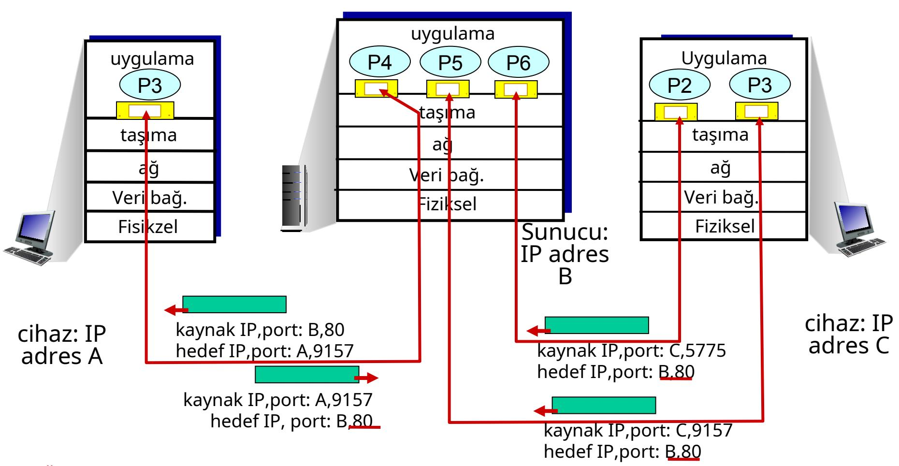

Üç segment, herbiri IP adres B, port 80 gönderilmiş, çoklama çözme sonucu farklı soketlere yönlendirilir.

## Bağlantı-odaklı çoklama çözme: örnek

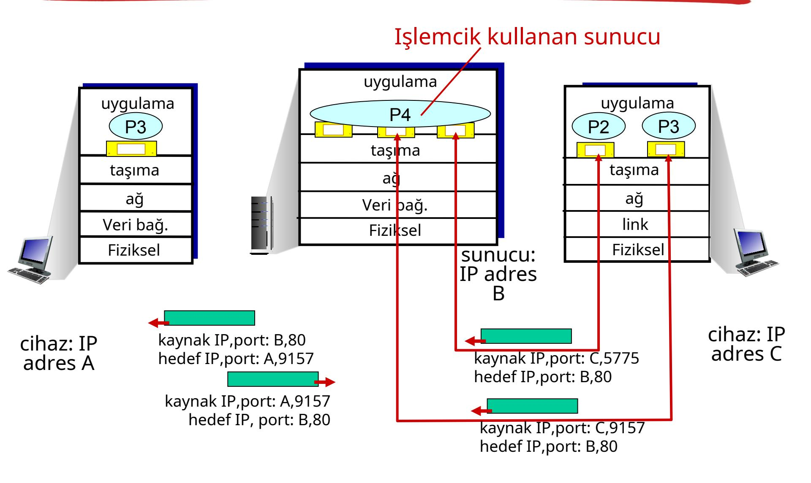

# Bölüm 3: konular

- 3.1 taşıma-katmanı hizmetler
- 3.2 çoklama ve çoklama çözme
- 3.3 bağlantısız taşıma: UDP
- 3.4 güvenilir veri transferi prensipleri

- 3.5 bağlantı-odaklı taşıma: TCP
  - Segment yapısı
  - Güvenilir veri transferi
  - Akış kontrolü
  - Bağlantı yönetimi
- 3.6 sıkışma kontrolü prensipleri
- 3.7 TCP sıkışma kontrolü

### UDP: User Datagram Protocol [RFC 768]

- "asgari", "temel" Internet taşıma protokolü
- "en iyi gayret" hizmet, UDP segmentleri:
  - kaybolabilir.
  - Sırası bozulmuş şekilde uygulamaya teslim edilebilir.
- *bağlantısız:*
  - UDP gönderici ve alıcı arasında el sıkışma yoktur.
  - Her UDP segmenti diğerlerinden bağımsız olarak ele alınır.

- UDP kullanımı:
  - Yayın yapan çoklu-ortam uygulamaları. (kayıp tolere edilebilir, hız hassasiyeti)
  - DNS
  - SNMP
- UDP üzerinden güvenilir transfer:
  - Uygulama katmanına güvenilirlik eklenmelidir.
  - Uygulamaya özel hata düzeltme!

## UDP: segment başlığı

kaynak port # hedef port # 32 bits uygulama verisi (yük) uzunluk checksum

UDP segment format

uzunluk, UDP segment byte cinsi büyüklüğü, başlık dahil.

### Neden UDP var?

- Bağlantı kurulumu yoktur (gecikmeye neden olabilir).
- Basit: gönderen ve alıcıda bağlantı durumu yok.
- Küçük başlık
- Sıkışma kontrolü yok: UDP ile istenildiği kadar paket gönderilebilir.

## **UDP** checksum

# Hedef: gönderilen segment üzerinde "hata" te spit etme (e.g., değişen bit)

#### gönderen:

- Başlık dahil segment içeriğini 16-bit tamsayı olarak alır.
- checksum: segment içeriğinin toplamı (birin tamamlayıcısı toplam)
- Gönderici UDP checksum alanına hesaplanan değeri koyar.

#### alan:

- Alınan segment için checksum değerini hesaplar.
- Hesaplanan checksum değeri ile gönderilen checksum değeri aynı mı?
  - HAYIR hata tespit edildi
  - EVET hata tespit edilmedi. Ancak hata olabilir mi? Sonra bahsedeceğiz.

# Internet checksum: örnek

örnek: iki 16-bit tamsayıyı toplayalım

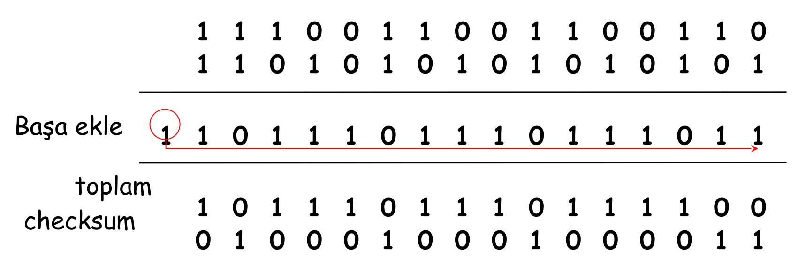

*Not:* Başta kalan sayı var ise en sona eklenir.

# Bölüm 3: konular

- 3.1 taşıma-katmanı hizmetler
- 3.2 çoklama ve çoklama çözme
- 3.3 bağlantısız taşıma: UDP
- 3.4 güvenilir veri transferi prensipleri

- 3.5 bağlantı-odaklı taşıma: TCP
  - Segment yapısı
  - Güvenilir veri transferi
  - Akış kontrolü
  - Bağlantı yönetimi
- 3.6 sıkışma kontrolü prensipleri
- 3.7 TCP sıkışma kontrolü

### Güvenilir veri transferi prensipleri

- Uygulama, taşıma ve bağlantı katmanları için önemli
  - Ağ konusunda en önemli konulardan biri.

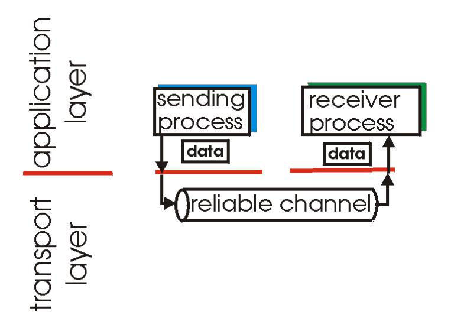

Güvenilir olmayan kanalın özellikleri güvenilir veri transferi protokolünün özelliklerini (rdt) belirleyecektir.

Taşıma Katmanı 3-21

### Güvenilir veri transferi prensipleri

- Uygulama, taşıma ve bağlantı katmanları için önemli
  - Ağ konusunda en önemli konulardan biri.

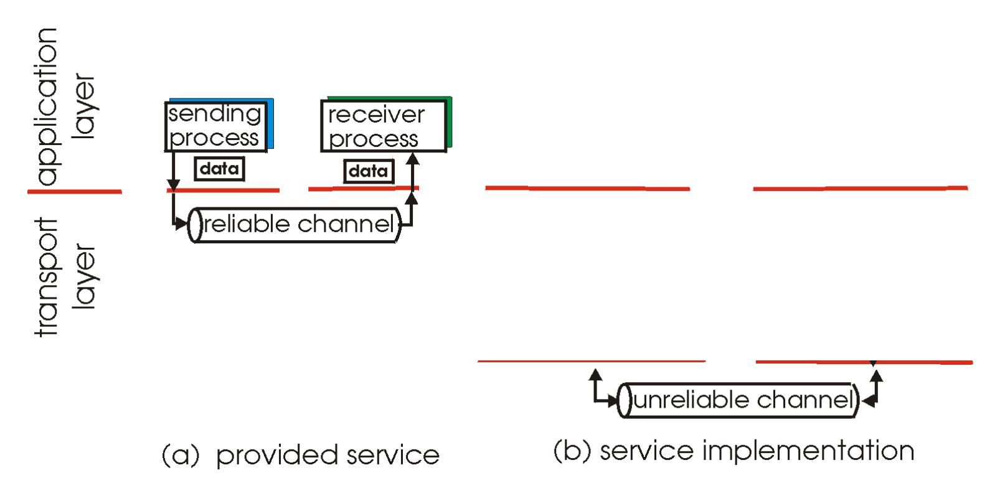

 Güvenilir olmayan kanalın özellikleri güvenilir veri transferi protokolünün özelliklerini (rdt) belirleyecektir.

Taşıma katmanı 3-22

### Güvenilir veri transferi prensipleri

- Uygulama, taşıma ve bağlantı katmanları için önemli
  - Ağ konusunda en önemli konulardan biri.

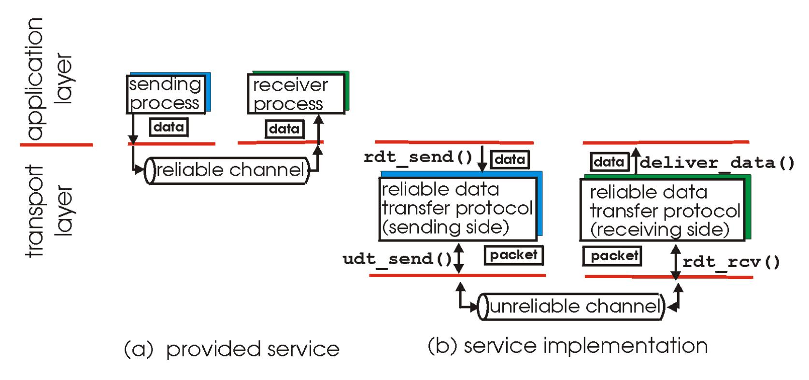

Güvenilir olmayan kanalın özellikleri güvenilir veri transferi protokolünün özelliklerini (rdt) belirleyecektir.

Taşıma Katmanı 3-23

## Güvenilir veri transferi

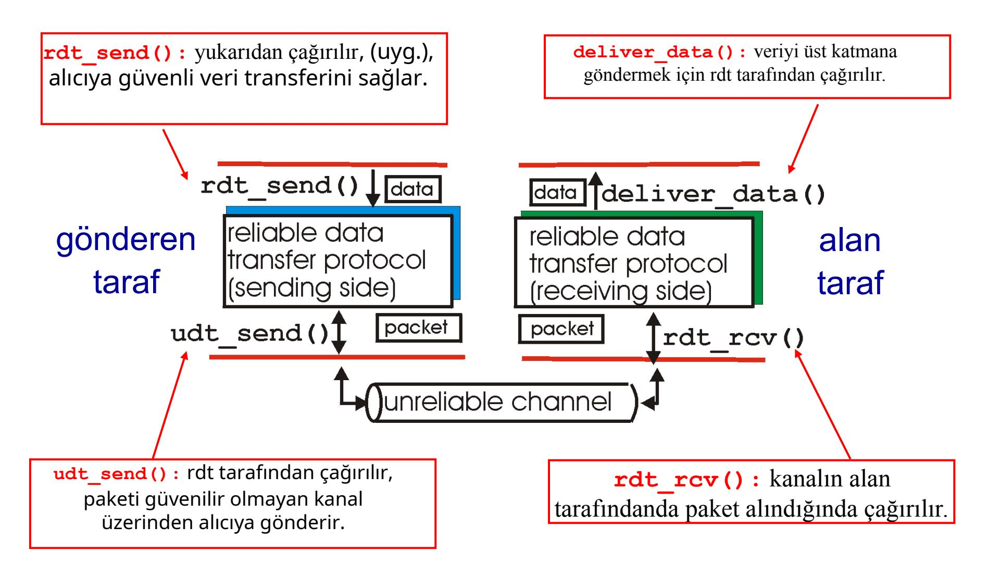

## Güvenilir veri transferi

### Bu bölümde

- Aşamalı olarak gönderici ve alıcı tarafından güvenilir veri transferi protokolünü (rdt) geliştireceğiz.
- Tek taraflı veri transferine odaklanacağız.
  - Ancak kontrol bilgisi iki taraflı akacak.
- Sonlu durum bilgisi (FSM) yöntemi ile gönderici ve alıcıyı tanımlayacağız.

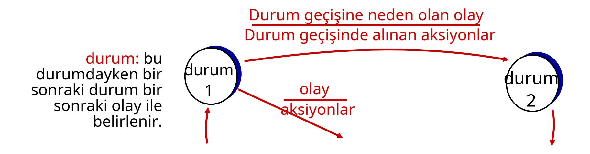

### rdt1.0: güvenilir kanal üzerinden güvenilir transfer

- Altaki kanal tam anlamıyla güvenilir.
  - Bit hatası yok
  - Paket kaybı yok
- Gönderici ve alıcı için ayrı FSM:
  - Gönderici alttaki kanala veri gönderir.
  - Alıcı alttaki kanaldan veri alır.

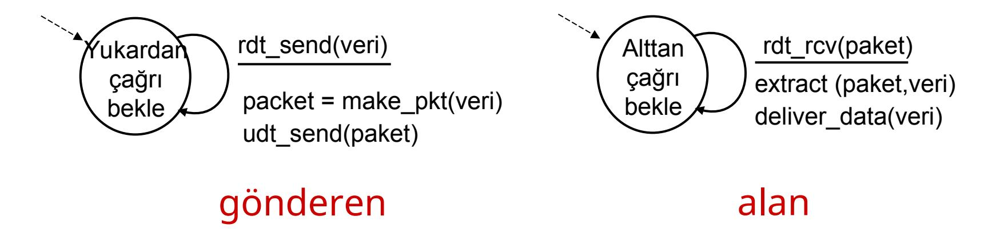

### rdt2.0: bit hataları olabilen kanal

- Alttaki kanal paketteki bitleri değiştirebilir.
  - checksum ile bit hatalarını tespit edebiliriz.
- Sorun: hata durumunda ne vapılmalı?

## İnsanlar sohbet sırasında "hata" olursa bu durumu nasıl çözer?

## rdt2.0: bit hataları olabilen kanal

- Alttaki kanal paketteki bitleri değiştirebilir.
  - checksum ile bit hatalarını tespit edebiliriz.
- *Sorun*: hata durumunda ne yapılmalı?
  - *Onaylamalar (ACKs):* alıcı göndericiye paketin doğru alındığını açıkça söyler.
  - *negatif onaylama (NAKs):* alıcı göndericiye pakette hata olduğunu açıkça söyler.
  - Gönderici NAK alırsa paketi tekrar yollar.
- **rdt2.0** (geliştirilmiş **rdt1.0**):
  - Hata tespiti
  - alıcı geribildirimi: kontrol mesajları (ACK,NAK) alıcı → gönderici

## rdt2.0: FSM tanımı

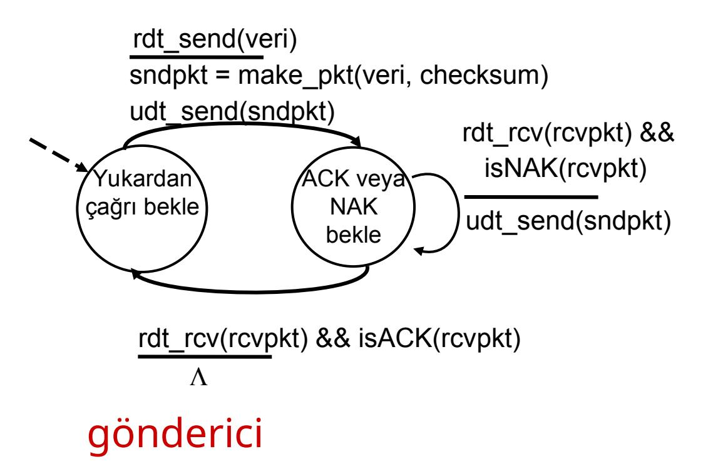

### alıcı

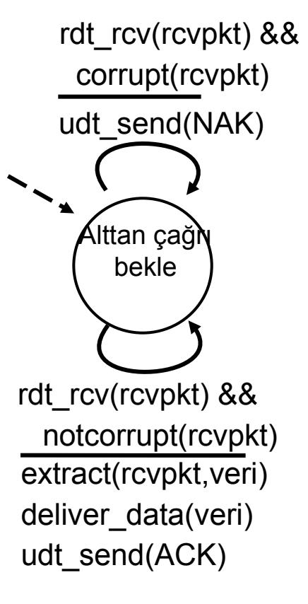

## rdt2.0: operation with no errors

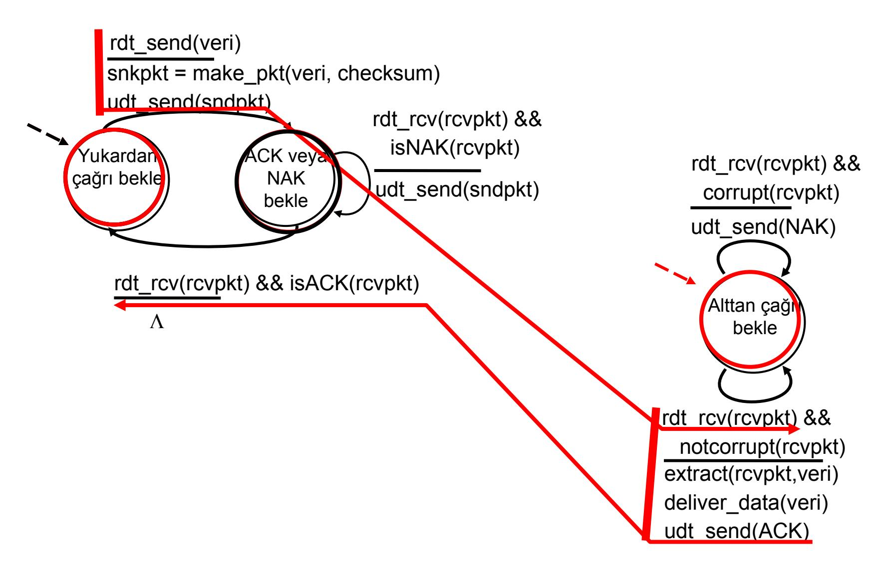

## rdt2.0: error scenario

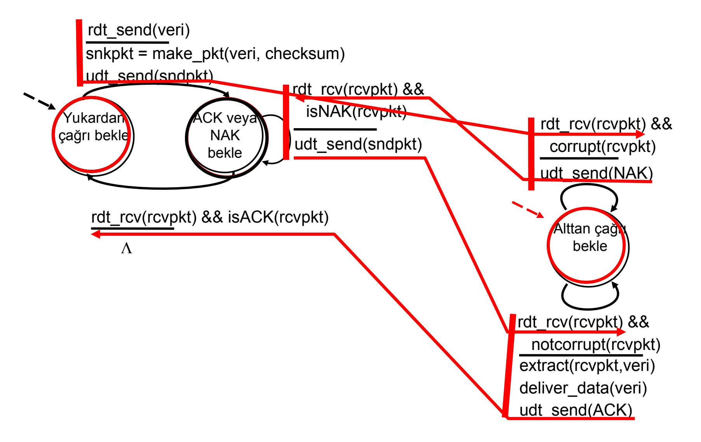

## rdt2.0 önemli bir sorun içeriyor!

## ACK/NAK mesaji bozulursa ne olacak?

- Gönderici alıcı ne olduğunu bilemez!
- Kafasına göre tekrar gönderemez: aynı paketten iki kopya olabilir.

## Fazla kopya sorunu şu şekilde halledilir:

- Gönderici bozuk ACK/NAK alırsa paketi tekrar yollar.
- Gönderici her pakete sıra numarası ekler.
- Alıcı kopya paket alırsa görmezden gelir (yukarı yollamaz).

### dur ve bekle

Gönderici bir paket yollar, sonra alıcıdan karşılık bekler.

### rdt2.1: gönderici, bozuk ACK/NAK sorununu çözdü

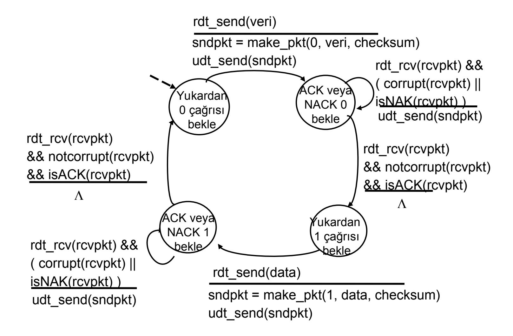

### rdt2.1: alıcı, bozuk ACK/NACK sorununu çözdü

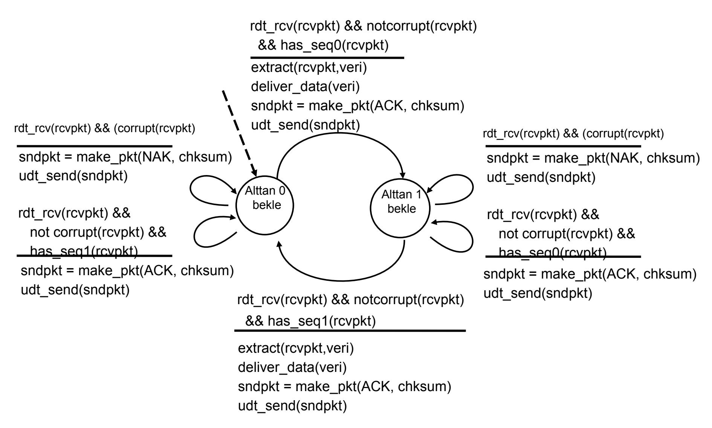

# rdt2.1: İnceleme

#### gönderici:

- Paketlere sıra # eklendi
- Iki sıra # (0,1) yeterli olacaktır. Neden?
- Alınan ACK/NACK bozuk mu diye kontrol edilmelidir.
- İki kat fazla durum gerekti.
  - Durumlar sonraki "beklenen" paketin sıra numarası 0 veya 1 olması gerektiğini "hatırlamalıdır".

#### alıcı:

- Alınan paketin kopya olup olmadığını kontrol etmelidir.
  - Durum bir sonra beklenen paketin sıra numarasının 0 veya 1 olması gerektiğini belirliyor.
- Not: alıcı son gönderdiği ACK/NACK mesajının gönderici tarafından alındığını ve alınmadığını bilemez.

## rdt2.2: NAK gerektirmeyen protokol

- rdt2.1 ile aynı fonksiyonlara sahip, ancak sadece ACK kullanıyor.
- NAK yerine, alıcı düzgün şekilde aldığı son paket için ACK gönderiyor.
  - Alıcı ACK gönderilen paketin sıra numarasını açıkça belirtmelidir.
- Gönderici kopya ACK alırsa NAK almış gibi aksiyon alır: sırada gönderilen paketi tekrar gönder.

## rdt2.2: gönderici ve alıcının bir kısmı

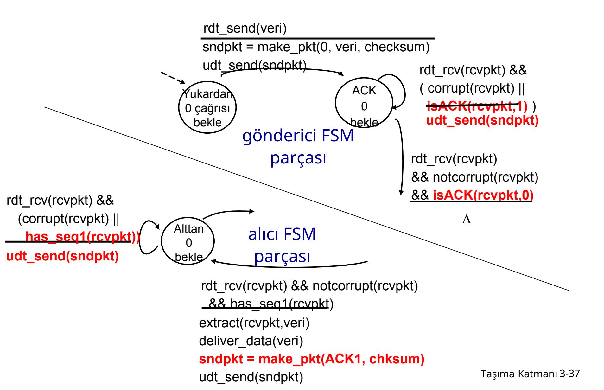

## rdt3.0: hata ve kayıp olabilen kanal

- Yeni varsayım: alttaki kanal paketleri kaybedebilir (ACK ve veri).
  - checksum, sıra #, ACK mesajı, tekrar gönderme yararlıdır … ama yeterli değil.
- Yaklaşım: gönderici "makul" bir süre ACK mesajı için bekler.
- Bu süre içerisinde ACK gelmezse tekrar gönderir.
- Eğer paket (veya ACK) sadece gecikmişse (kaybolmamışsa):
  - Tekrar gönderim ile aynı paketin kopyası oluşacaktır, ancak sıra # sayesinde bu sorun çözülür.
  - Alıcı ACK gönderilen paketin sıra numarası belirtmelidir.
- Geri sayım sayacı gerekir.

## rdt3.0 sender

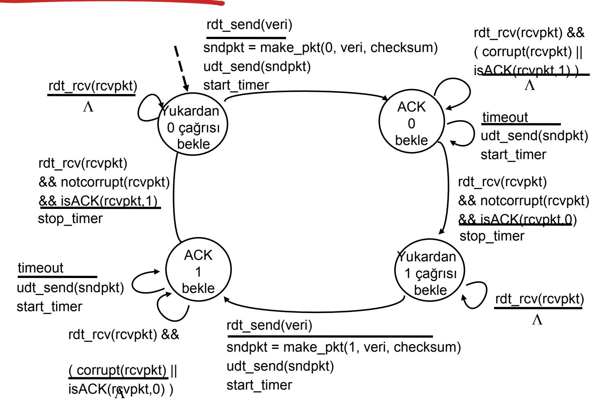

# rdt3.0 örneği

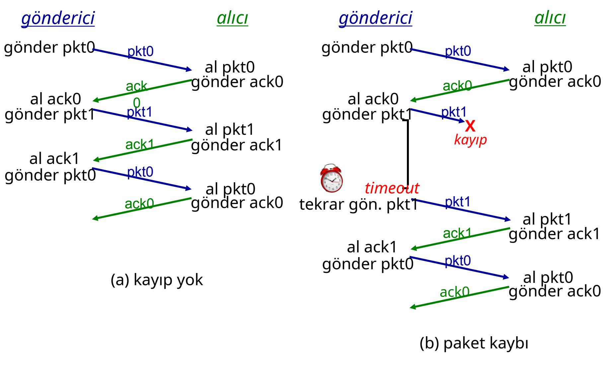

## rdt3.0 örneği

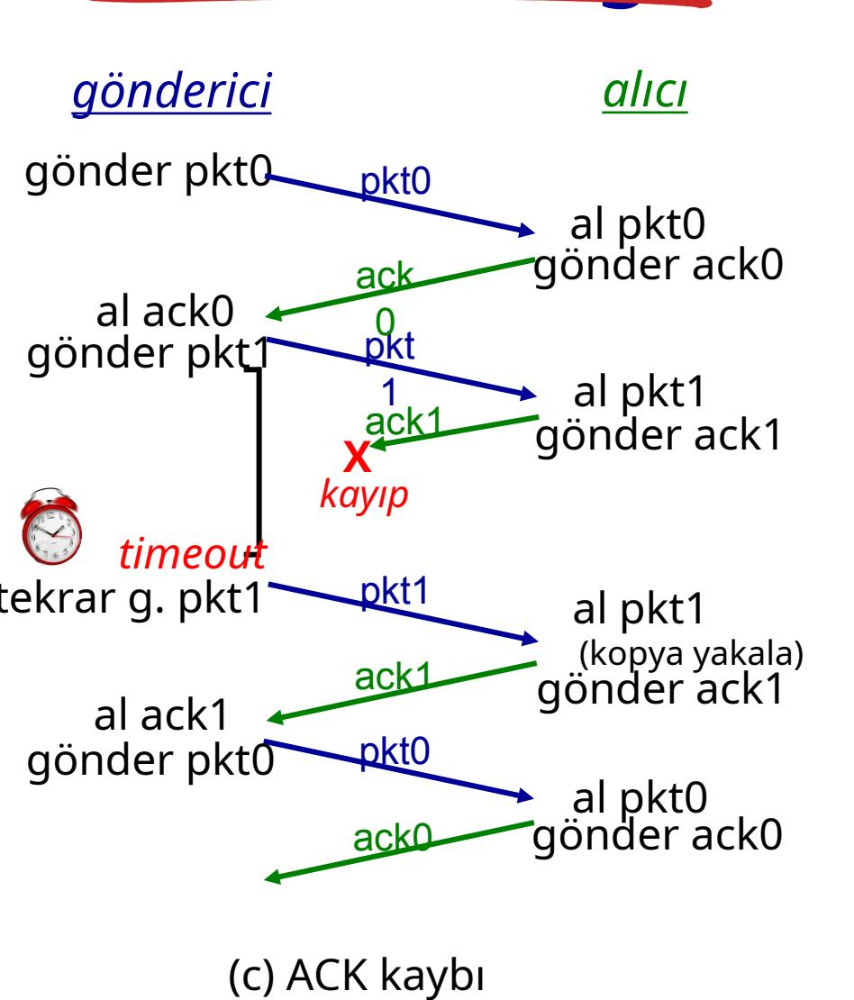

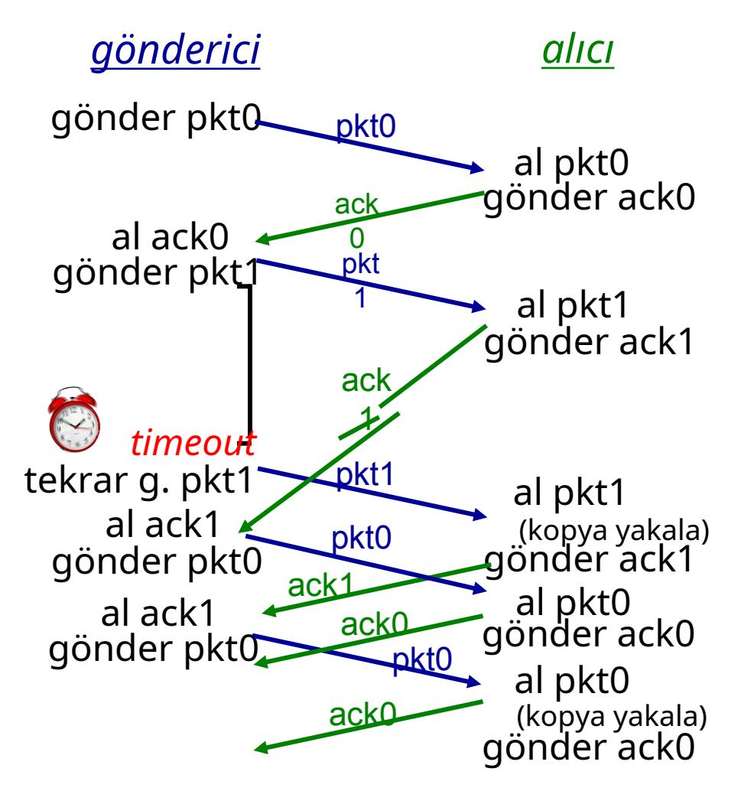

(d) zamansız timeout/ gecikmiş ACK

## rdt3.0 performansı

- rdt3.0 doğru çalışır, ancak performansı gerçekten kötüdür.
- \* Ör: 1 Gb/sn bant, 15 ms yayılma gecikmesi, 8000 bit paket:

$$D_{iletim} = \frac{L}{R} = \frac{8000 \text{ bit}}{10^9 \text{ bit/sn}} = 8 \text{ microsecs}$$

U gönderici: kullanım – göndericinin gönderme ile meşgul olduğu süre oranı

$$U_{g\ddot{o}nderici} = \frac{L/R}{GDS + L/R} = \frac{0.008}{30.008} = 0.00027$$

- Eğer GDS=30 ms, 1KB pkt her 30 msec: 33kB/saniye işhacmi 1 Gb/sn link üzerinde
- Görüldüğü üzere ağ protokolü fiziksel kaynakların kullanımını sınırlandırıyor.

### rdt3.0: dur-ve-bekle operasyonu

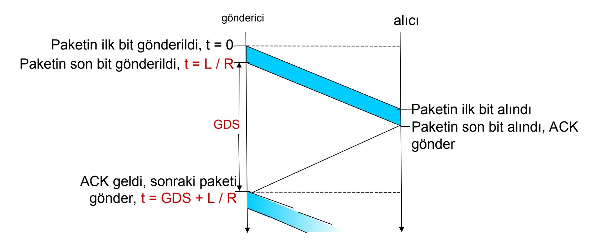

$$U_{g\ddot{o}nderici} = \frac{L/R}{GDS + L/R} = \frac{0.008}{30.008} = 0.00027$$

### Arka arkaya gönderen (İng: pipelined) protokoller

pipelining: gönderici çoklu, "henüz ulaşmamış", ACK-almamış paket gönderimine izin verir.

- Sıra sayısı miktarı artırılmalıdır.
- Gönderici ve alıcıda önbellekleme yapılmalıdır.

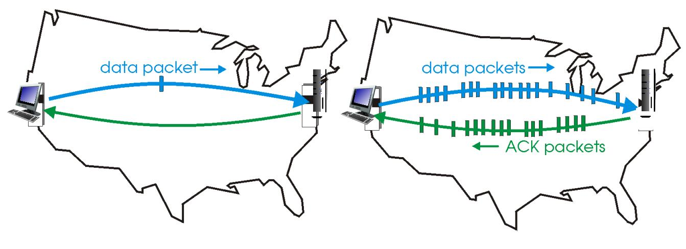

 Arka arkaya gönderen protokollerin iki türü vardır: *geri-Git-N (İng: go-Back-N), seçici tekrar (İng: Selective repeat)*

## Pipelining: yüksek kullanım

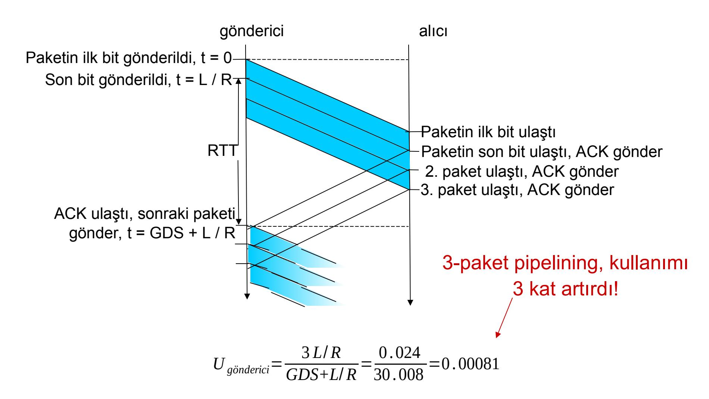

# Pipelined protokoller

#### **Geri-git-N:**

- Gönderici N taneye kadar ACK'lenmemiş paketi gönderebilir.
- Alıcı sadece toplu ACK gönderir.
  - Arada boşluk olursa ACK göndermez.
- Gönderici ACK gönderilmemiş en eski paket için kronometre çalıştırır.
  - Bekleme süresi geçtiğinde, ACK gönderilmemiş tüm paketler tekrar gönderilir.

### <u>Seçici tekrar:</u>

- Gönderici N taneye kadar ACK'lenmemiş paketi gönderebilir.
- Alıcı her paket için bireysel ack gönderir.
- Gönderici her ACK gönderilmemiş paket için kronometre çalıştırır.
  - Zaman geçtiğinde, sadece zamanı geçen ACK gönderilmemiş paketi tekrar gönderir.

# Geri-Git-N: gönderici

- Paket başlığında k-bit sıra #
- N büyüklüğünde "pencere" kadar, birbirini takip eden ACK almamış paket gönderilebilir.

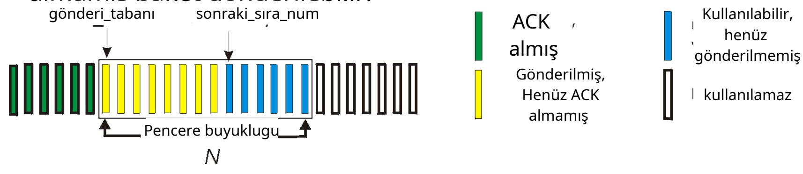

- ACK(n): sıra # n dahil, bütün paketler için ACK gönderir *"toptan ACK"*
  - Kopya ACK alınabilir (alıcıya bakınız).
- Henüz ACK almamış en eski paket için zaman tutulur.
- *timeout(n):* paket n ve pencere içerisindeki daha büyük sıra # sahip bütün paketler tekrar yollanır.

## GGN: göndericinin genişletilmiş FSM

```
Taşıma Katmanı 3-48
                            Wait start_timer
                                          udt_send(sndpkt[base])
                                          udt_send(sndpkt[base+1])
                                          …
                                          udt_send(sndpkt[nextseqnum-
                                          1])
                                          timeout
                       rdt_send(veri)
                       if (nextseqnum < base+N) {
                        sndpkt[nextseqnum] = make_pkt(nextseqnum,veri,chksum)
                        udt_send(sndpkt[nextseqnum])
                        if (base == nextseqnum)
                        start_timer
                        nextseqnum++
                        }
                       else
                        refuse_data(data)
                         base = getacknum(rcvpkt)+1
                         If (base == nextseqnum)
                          stop_timer
                          else
                          start_timer
                         rdt_rcv(rcvpkt) && 
                          notcorrupt(rcvpkt) 
  base=1
  nextseqnum=1
rdt_rcv(rcvpkt) 
 && corrupt(rcvpkt)
```

## GGN: alıcı genişletilmiş FSM

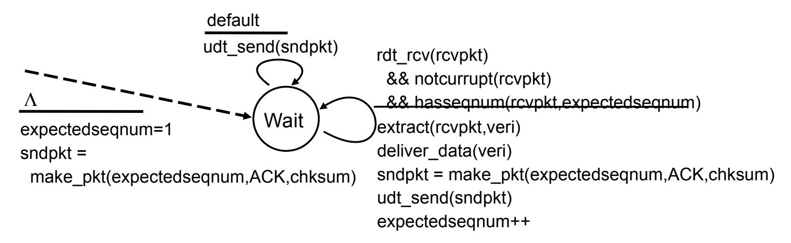

Sadece-ACK: daima en yüksek sıra # sahip sıralı, düzgün alınmış paket için ACK gönderilir.

- Kopya ACK gönderilebilir.
- sadece **expectedseqnum** hatırlanması yeterlidir.
- Sıra dışı pkt:
  - Görmezden gel (önbellekleme yapma): *alıcı önbelleği yok!*
  - En yüksek sıra # sahip, sıralı gelmiş paket için tekrar ACK gönder.

## GGN örneği

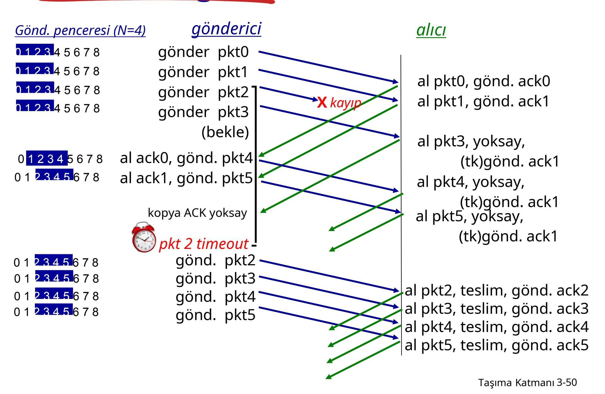

## Seçici tekrar

- Alıcı düzgün alınmış paketlerin her biri için ACK gönderir.
  - Gerektiği gibi paketleri önbellekler, bu sayede paketler üst katmana sıralı teslim edilir.
- Gönderici sadece ACK alınmayan paketleri tekrar gönderir.
  - ACK almamış her paket için kronometre çalıştırılır.
- Gönderici penceresi
  - *N* tane birbirini takip eden sıra #.
  - Gönderilen ancak ACK almamış sıra # sınırlar.

## Seçici tekrar: gönderici, alıcı pencereleri

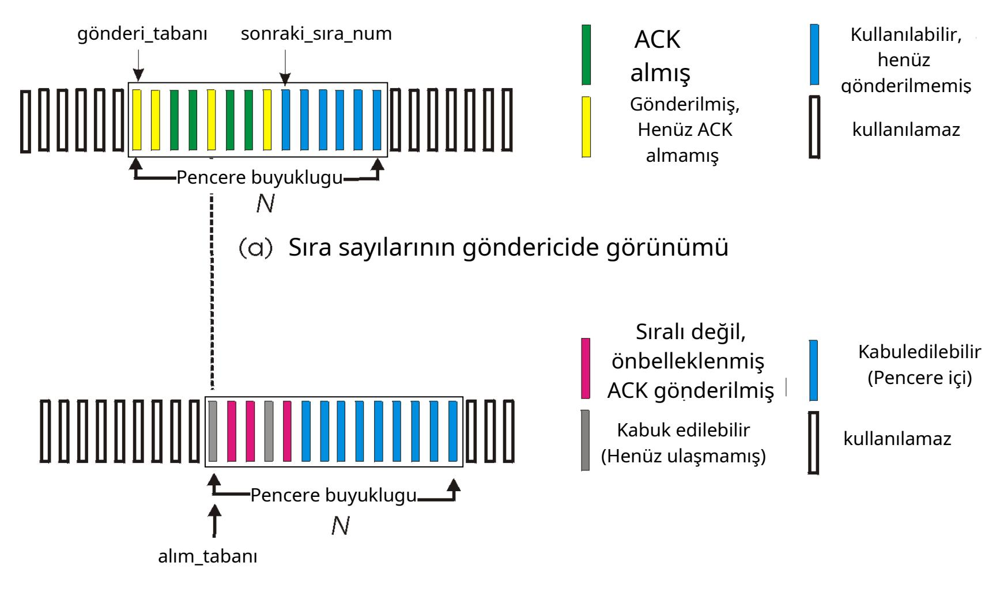

Sıra sayılarının alıcıda görünümü

# Seçici tekrar

### gönderici

#### Üstten veri gelince:

 Bir sonraki uygun sıra # pencere içinde ise, paketi gönder.

#### timeout(n):

 pkt n tekrar gönder, kronometreyi tekrar çalıştır.

ACK(n) [sendbase,sendbase+N] içinde:

- Pkt n alındı olarak işaretle
- n en küçük sıra numarasına sahip ACK almamış paket ise, pencere taban değerini bir sonraki en küçük ACK almamış sıra numarasına ilerlet.

### alıcı

[alım\_tabanı, alım\_tabanı+N-1] içinde pkt

- gönder ACK(n)
- Sıra dışı: önbellekle
- Sıralı: teslim et (ayrıca diğer sıralı pktleri teslim et), pencereyi bir sonraki henüz alınmayan sıra numarasına ilerlet.

[alım\_tabanı-N,alım\_tabanı-1] içinde paket n

ACK(n)

aksi takdirde:

yoksay

## Seçici tekrar örneği

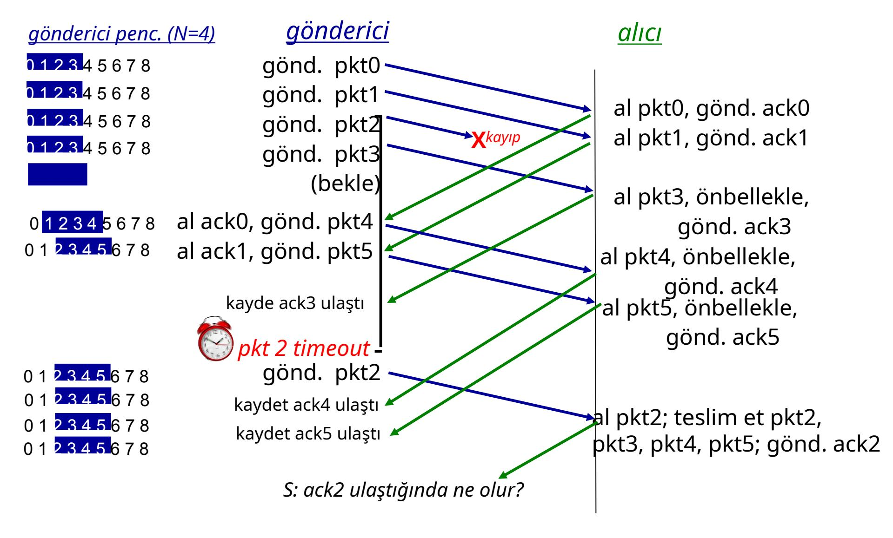

# Seçici tekrar: ikilem

#### örnek:

- \* sıra #: 0, 1, 2, 3
- pencere genişliği=3
- Alıcı iki farklı senaryoda fark görmez.
- Kopya veri yeni olarak kabul edildi (b).
- S: (b) durumunu engellemek için sıra # sayısı ile pencere büyüklüğü arasındaki ilişki ne olmalıdır?

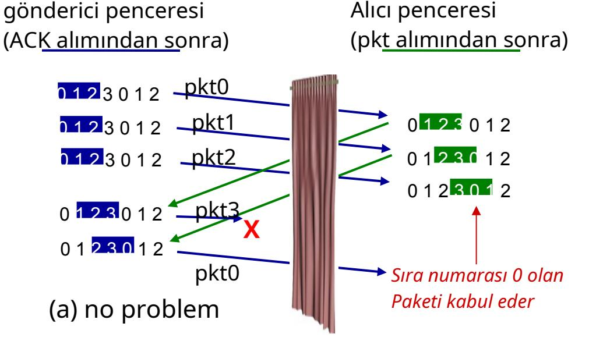

Alıcı karşı tarafta ne olduğunu göremez. Alıcı davranışı iki durumda aynıdır. Bir şeyler yanlış gidiyor.

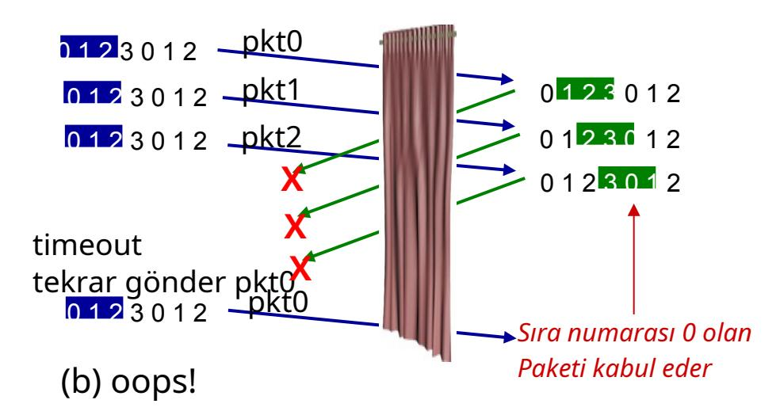

# Bölüm 3 Taşıma Katmanı

Doç. Dr. Mehmet Dinçer Erbaş Bolu Abant İzzet Baysal Üniversitesi Mühendislik Fakültesi Bilgisayar Mühendisliği Bölümü


 All material copyright 1996-2020 J.F Kurose and K.W. Ross, All Rights Reserved Slaytlar ders kitabından adapte edilmiştir.

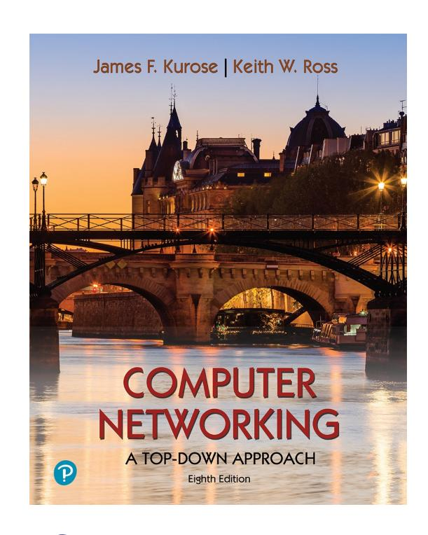

*Computer Networking: A Top-Down Approach*  8 th edition Jim Kurose, Keith Ross Pearson, 2020

# Bölüm 3: konular

- 3.1 taşıma-katmanı hizmetler
- 3.2 çoklama ve çoklama çözme
- 3.3 bağlantısız taşıma: UDP
- 3.4 güvenilir veri transferi prensipleri

- 3.5 bağlantı-odaklı taşıma: TCP
  - Segment yapısı
  - Güvenilir veri transferi
  - Akış kontrolü
  - Bağlantı yönetimi
- 3.6 sıkışma kontrolü prensipleri
- 3.7 TCP sıkışma kontrolü

### TCP: Genel bakış RFCs: 793,1122,1323, 2018, 2581

- uçtan-uca:
  - Bir gönderici, bir alıcı.
- Güvenilir, sıralı byte yayını:
  - "Mesaj sınırı" yoktur.
- pipelined:
  - TCP sıkışma and akış kontrol pencere büyüklüğünü belirler.

- tam iki-yönlü veri:
  - Aynı bağlantıda çift yönlü veri akışı.
  - MSB: maksimum segment büyüklüğü
- bağlantı-odaklı:
  - El sıkışma (kontrol mesajları değiş tokuşu) gönderici, alıcı durumunu veri gönderimi öncesi tanımlar.
- Akış kontrollü:
  - Gönderici aşırı veri ile alıcıyı boğmaz.

## TCP segment yapısı

URG: acil veri (genellikle kullanılmaz)

> ACK: ACK # geçerli

PSH: veriyi hemen teslim (genellikle kullanılmaz)

> RST, SYN, FIN: bağlantı oluşturma (setup, sonlandır emirleri)

> > Internet checksum (UDP gibi)

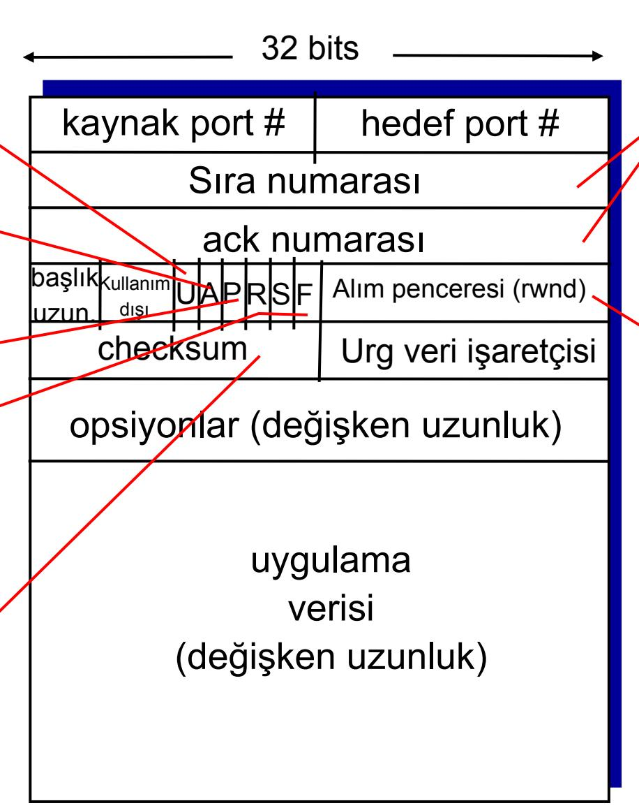

Veri byte sayısı olarak sayar (segment değil)

Alıcının kabul edebileceği byte sayısı

## TCP numaraları, ACK mesajları

#### sıra numaraları:

 Segment verisindeki ilk byte için yayın sırası.

#### acknowledgements:

- Karşı taraftan bir sonraki beklenen byte sıra numarası.
- Toplu ACK
- S: Alıcı sıra dışında gelen segmentlere ne yapar?
  - A: TCP bunu tanımlamamıştır,

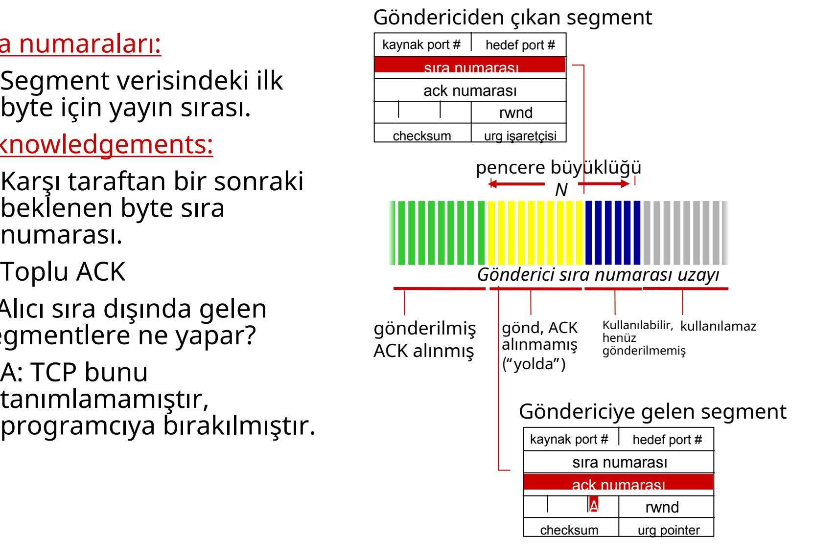

# TCP sıra numarası, ACK

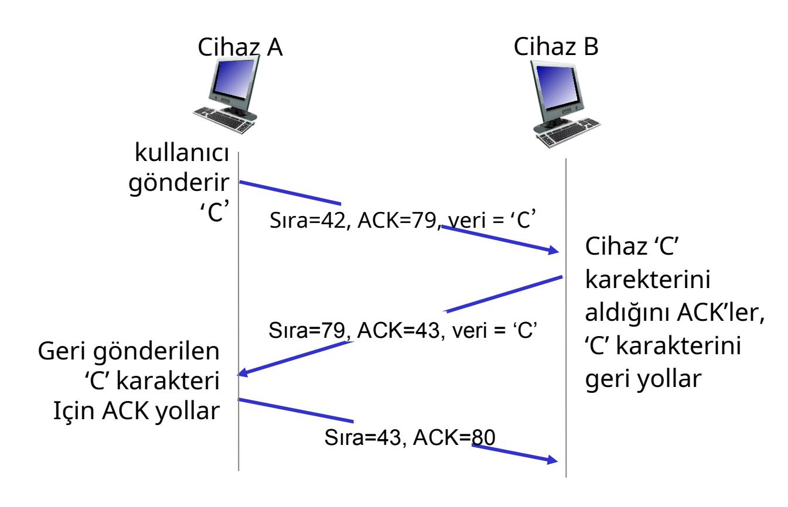

basit telnet örneği

## TCP gidiş dönüş süresi, timeout

- S: TCP timeout süresini nasıl seçelim?
- GDS'den uzun olmalı.
  - Ama GDS değişken.
- *Çok kısa:* vakitsiz timeout, gereksiz tekrar göndermeler.
- *Çok uzun:* segment kaybına geç reaksiyon.

- S: GDS değerini nasıl kestirebiliriz?
- **ÖrnekGDS**: segment gönderiminden ACK alımına kadar geçem süreyi ölçeriz.
  - Tekrar gönderimleri görmezden geliriz.
- **ÖrnekGDS** değişkendir, daha "düzgün" bir tahmin isteriz.
  - Yakın zamanda hesaplanan değerlerin ortalaması alırız, sadece en son **ÖrnekGDS** kullanmayız.

## TCP gidiş dönüş süresi, timeout

#### TahminiGDS = $(1-\alpha)$ \*TahminiGDS + $\alpha$ \*ÖrnekGDS

- Üstel ağırlıklı hareketli ortallama (İng:exponential weighted moving average)
- Eski gözlemlerin etkisi üstel olarak azalır.
- \* Çoklukla kullanılan değer:  $\alpha = 0.125$

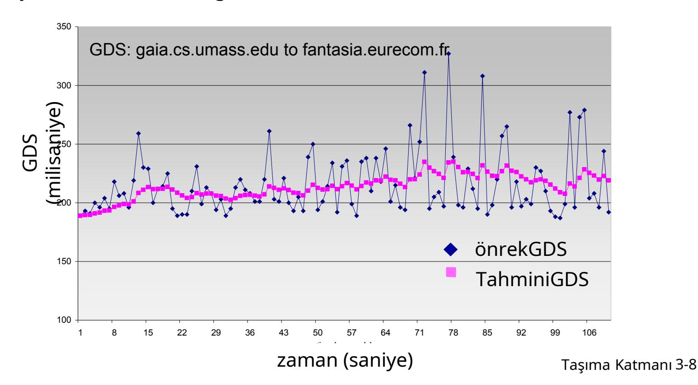

## TCP gidiş dönüş süresi, timeout

- timeout süresi: **TahminiGDS** üstüne "güvenlik payı "
  - yüksek değişim gösteren **TahminiRTT ->** geniş güvenlik payı
- ÖrnekGDS sapmasını TahminiGDS üzerinden hesapla: **DevGDS = (1-)\*DevGDS + \*|ÖrnekGDS-TahminiGDS| (genelde, = 0.25)**

**TimeoutSüresi = TahminiGDS + 4\*DevGDS** Tahmini GDS "güvenlik payı "

# Bölüm 3: konular

- 3.1 taşıma-katmanı hizmetler
- 3.2 çoklama ve çoklama çözme
- 3.3 bağlantısız taşıma: UDP
- 3.4 güvenilir veri transferi prensipleri

- 3.5 bağlantı-odaklı taşıma: TCP
  - Segment yapısı
  - Güvenilir veri transferi
  - Akış kontrolü
  - Bağlantı yönetimi
- 3.6 sıkışma kontrolü prensipleri
- 3.7 TCP sıkışma kontrolü

## TCP güvenilir veri, transferi

- TCP, IP güvenilir olmayan hizmeti üzerine güvenilir veri transferi hizmeti verir.
  - pipelined segment gönderimi
  - toplu ack
  - Tek tekrar gönderim kronometresi.
- Tekrar gönderim şu durumlarda olur.
  - timeout olduğunda
  - kopya ack gönderiminde

Öncelikle basitleştirilmiş bir TCP göndericiyi inceleyelim.

- Kopya ACK gönderimini yoksay
- Akış kontrolünü ve sıkışma kontrolünü görmezden gelelim.

# TCP gönderici olayları:

### *Uyg. verisi geldiğinde:*

- Sıra numarası ile segment oluştur.
- Sıra numarası, segmentteki ilk byte için byte-akış numarasıdır.
- Kronometre çalışmıyorsa başlat.
  - Zaman en eski ACK almamış segment için hesaplanır.
  - Sonlanma süresi:: **TimeOutSüresi**

#### *timeout:*

- Timeout olan segment tekrar gönderilir.
- Kronometre tekrar başlatılır.

#### *ack alınınca:*

- Daha önce ack almamış bir segment için ise
  - ACK almış veri bilgisini güncelle.
  - ACK almamış paketler var ise kronometreyi başlat.

# TCP gönderici (basitleştirilmiş)

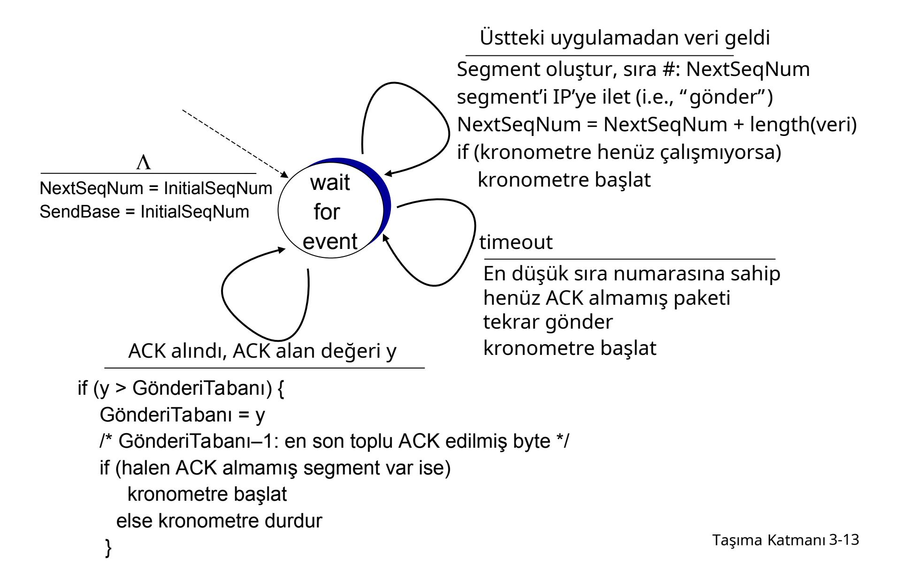

## TCP: tekrar gönderim örneği

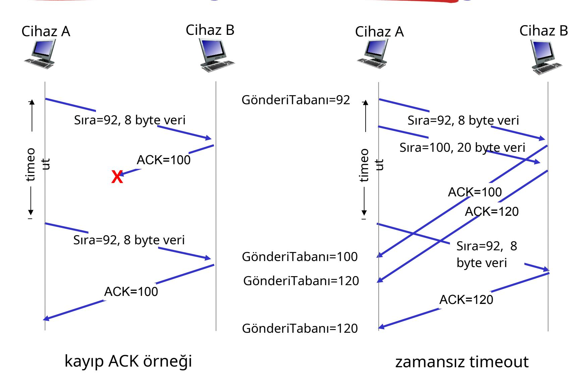

## TCP: tekrar gönderim örneği

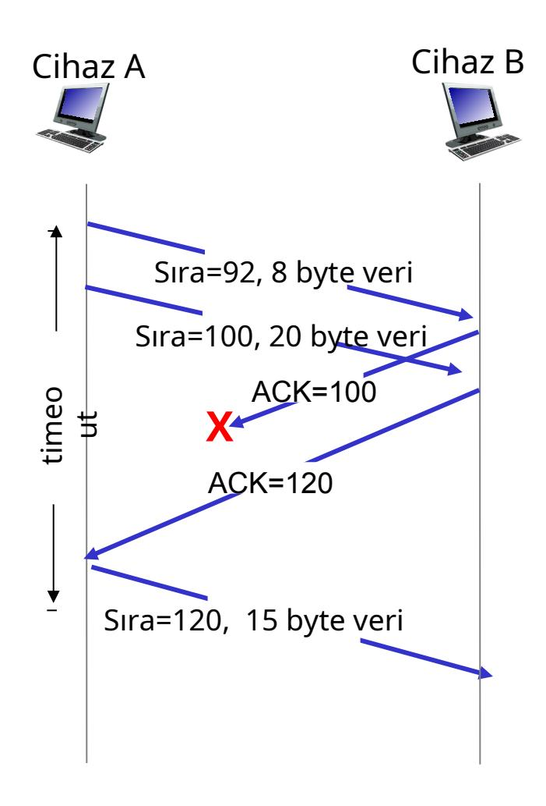

toplu ACK

## TCP ACK oluşturma [RFC 1122, RFC 2581]

| alıcıda olay                                                                                                                                    | TCP alıcı aksiyonu                                                                                     |
|-------------------------------------------------------------------------------------------------------------------------------------------------|--------------------------------------------------------------------------------------------------------|
| beklenilen sıra numarası<br>ile segment gelişi. Beklenen<br>sırası numarasına kadar tüm                                                         | geciktirilmiş ACK. Bir sonraki segment<br>Için 500 ms bekle. Sonraki segment<br>gelmez ise ACK gönder. |
| veri için ACK yollanmış<br>beklenilen sıra numarası<br>ile segment gelişi. Bir başka                                                            | Hemen toplu ACK gönder.<br>Bekleyen iki sıralı segment için ACK.                                       |
| alınan segment ACK bekliyor<br>Beklenen sıra numarasından<br>yüksek sıra numarasına sahip<br>sıra dışı segment gelişi.<br>Boşluk tespit edildi. | Hemen kopya ACK gönder,<br>beklenilen bir sonraki sıra<br>numarasını belirt.                           |
| Kısmi veya tam olarak boşluk<br>dolduran segment gelişi.                                                                                        | Segment boşluğun alt kısmını<br>Dolduruyorsa hemen ACK gönder.                                         |

Taşıma Katmanı 3-16

### TCP hızlı tekrar gönderim

- Time-out süresi genellikle görece uzundur:
  - Kayıp paketi tekrar yollamak için uzun üsre beklenir.
- Kayıp segment durumunu kopya ACK gönderiminden belirle.
  - Gönderici genellikle birçok segment arka arkaya gönderir.
  - Segment kaybolursa muhtemelen birçok kopya ACK gönderilecektir.

### *TCP hızlı tekrar gönderim*

Gönderici aynı veri için 3 ACK alırsa

("üçlü kopya ACK" ), ACK almamış en düşük sıra numarasına sahip segment tekrar gönder.

 Muhtemelen ack almayan segment kayıp, timeout süresini bekleme.

### TCP hızlı tekrar gönderim

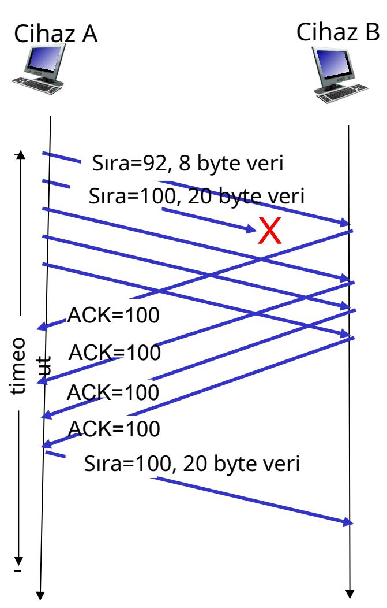

Gönderici üçlü kopya ACK aldığında hızlı tekrar gönderim.

# Bölüm 3: konular

- 3.1 taşıma-katmanı hizmetler
- 3.2 çoklama ve çoklama çözme
- 3.3 bağlantısız taşıma: UDP
- 3.4 güvenilir veri transferi prensipleri

- 3.5 bağlantı-odaklı taşıma: TCP
  - Segment yapısı
  - Güvenilir veri transferi
  - Akış kontrolü
  - Bağlantı yönetimi
- 3.6 sıkışma kontrolü prensipleri
- 3.7 TCP sıkışma kontrolü

# TCP akış kontrolü

Uygulama TCP soket önbelleğinden veri alabilir.

> … TCP alıcının teslim ettiğinden daha yavaş (göndericinin gönderdiğinden)

#### *akış kontrolü*

Alıcı göndericiyi kontrol eder, böylece gönderici alıcının önbelleğini aşırı veri göndererek taşırmaz.

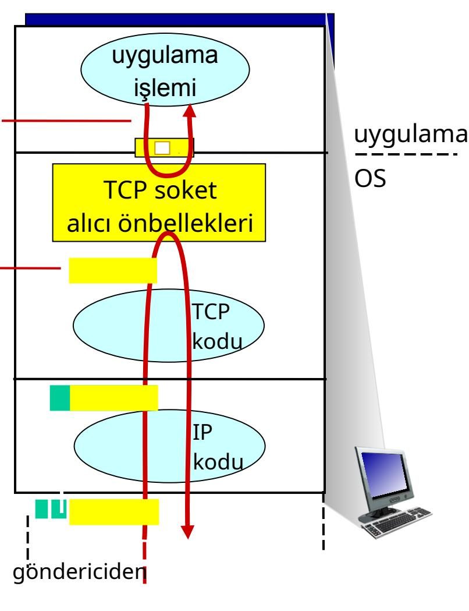

alıcı protokol dizini

# TCP akış kontrolü

- Alıcından kullanıcıya TCP segment başlığının **rwnd** alanında alıcı önbellekte boş alanı "ilan eder".
  - **RcvBuffer** büyüklüğü soket opsiyonu olarak ayalarnı (genellikle 4096 byte olarak ayarlanır).
  - Birçok işletim sistemi **RcvBuffer** değerini otomatik olarak ayarlar.
- **rwnd** değeri ile alıcı ACK almadan gönderilebilecek veri miktarını sınırlar.
- Bu sayede alıcı önbelleğinin taşmaması garanti edilir.

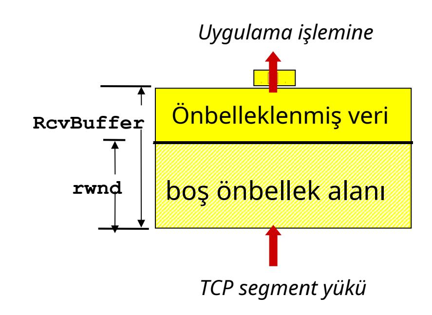

*Alıcı-tarafı önbellekleme*

# Bölüm 3: konular

- 3.1 taşıma-katmanı hizmetler
- 3.2 çoklama ve çoklama çözme
- 3.3 bağlantısız taşıma: UDP
- 3.4 güvenilir veri transferi prensipleri

- 3.5 bağlantı-odaklı taşıma: TCP
  - Segment yapısı
  - Güvenilir veri transferi
  - Akış kontrolü
  - Bağlantı yönetimi
- 3.6 sıkışma kontrolü prensipleri
- 3.7 TCP sıkışma kontrolü

## Bağlantı yönetimi

Veri göndermeden önce, gönderici/alıcı "elsıkışır":

- Bağlantı kurma konusunda anlaşır (birbirinin bağlantı kurmak istediğini bilir).
- Bağlantı değişkenleri üzerinde anlaşır.

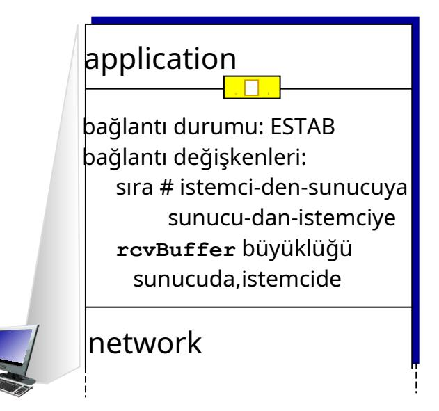

```
bağlantı durumu: ESTAB
bağlantı değişkenleri:
  sıra # istemci-den-sunucuya
   sunucu-dan-istemciye
  rcvBuffer büyüklüğü
   sunucuda,istemcide 

application
network
```

```
Socket clientSocket = 
 newSocket("hostname","port 
  number");
```

```
Socket connectionSocket = 
  welcomeSocket.accept();
```

## Bağlantı kurma konusunda anlaşma

### 2-yönlü elsıkışma:

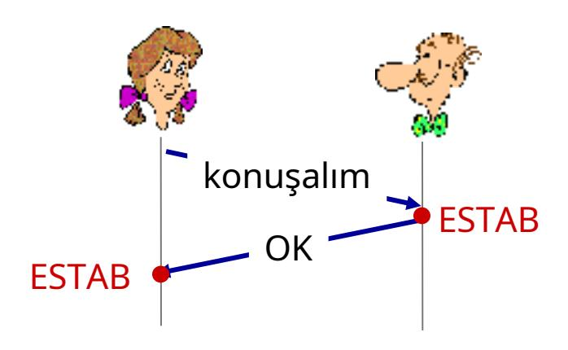

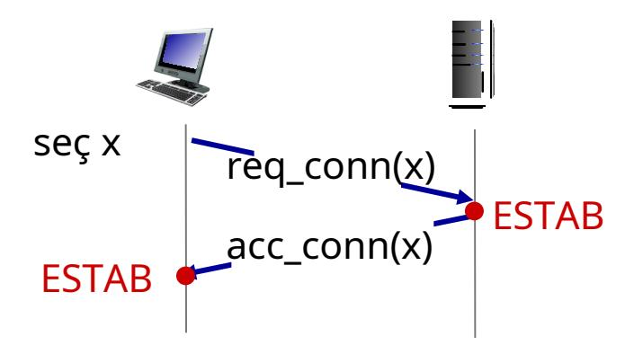

- *S:* 2-yönlü elsıkışma ağ bağlantısında her zaman çalışır mı?
- Değişken gecikmeler
- Paket kaybı nedeniyle tekrar gönderilen mesajlar (ör: req\_conn(x))
- Mesaj yeniden sıralanması.
- Karşı tarafı "görmek" mümkün değildir.

## Bağlantı kurma konusunda anlaşma

### 2-yönlü elsıkışmanın çalışmadığı örnekler:

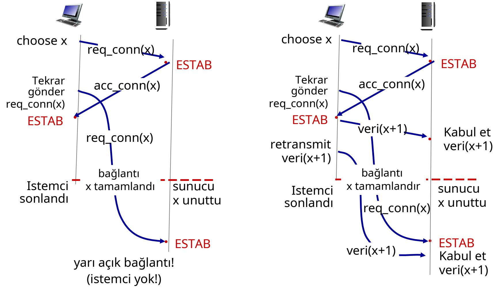

## TCP 3-yönlü elsıkışma

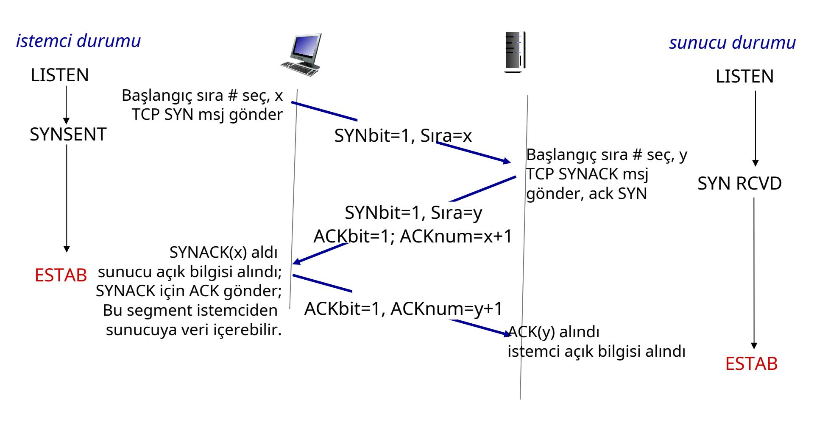

### TCP 3-yönlü elsıkışma: FSM

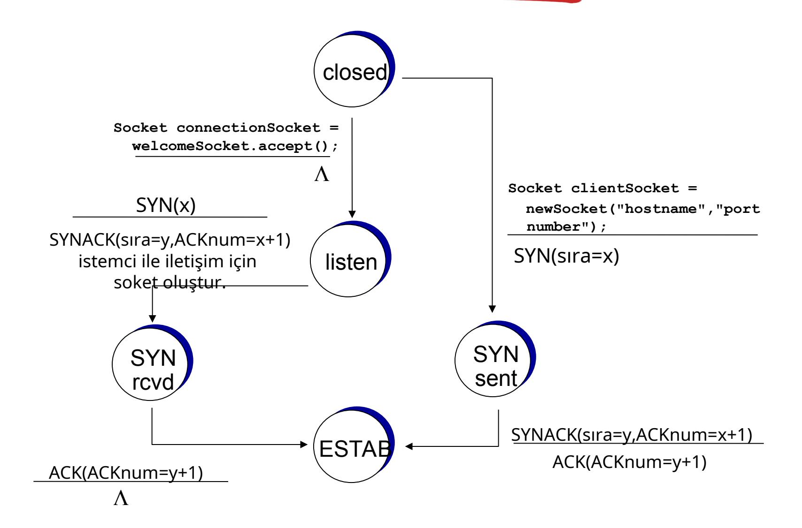

## TCP: bağlantıyı sonlandırma

- Istemci, sunucu, iki taraf bağlantının kendi tarafını kapatır.
  - FIN bit = 1 olan TCP segment gönder.
- Alınan FIN mesajına ACK gönderek cevap ver.
  - FIN alınınca, ACK içine kendi FIN mesajı eklenebilir.
- Eşzamanlı FIN değişimi mümkündür.

## TCP: bağlantıyı sonlandırma

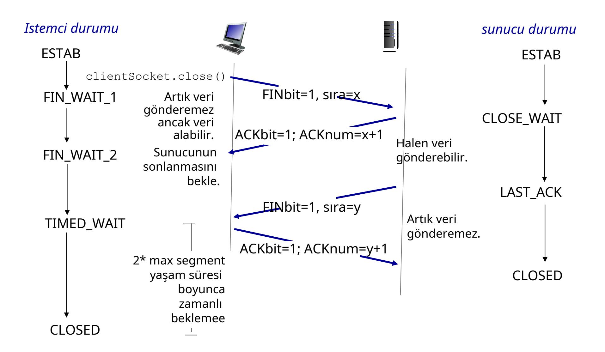

# Bölüm 3: konular

- 3.1 taşıma-katmanı hizmetler
- 3.2 çoklama ve çoklama çözme
- 3.3 bağlantısız taşıma: UDP
- 3.4 güvenilir veri transferi prensipleri

- 3.5 bağlantı-odaklı taşıma: TCP
  - Segment yapısı
  - Güvenilir veri transferi
  - Akış kontrolü
  - Bağlantı yönetimi
- 3.6 sıkışma kontrolü prensipleri
- 3.7 TCP sıkışma kontrolü

## Sıkışma kontrolü prensipleri

#### *sıkışma*:

- tanım: "aşırı kaynak aşırı veriyi aşırı hızda gönderiyor ve ağ bu durumu idare edemiyor".
- Akış kontrolünden farklıdır.
- Belirtiler:
  - Kayıp paketler (yönlendiricilerin önbellekleri taşıyor).
  - Uzun gecikmeler (yönlendirici önbelleklerinde uzun sıralar).
- En önemli 10 problem içerisinde!

Iki gönderici, iki alıcı

 Bir yönlendirici, sınırsız önbellek

çıkış bağ kapasitesi: R

Tekrar gönderim yok

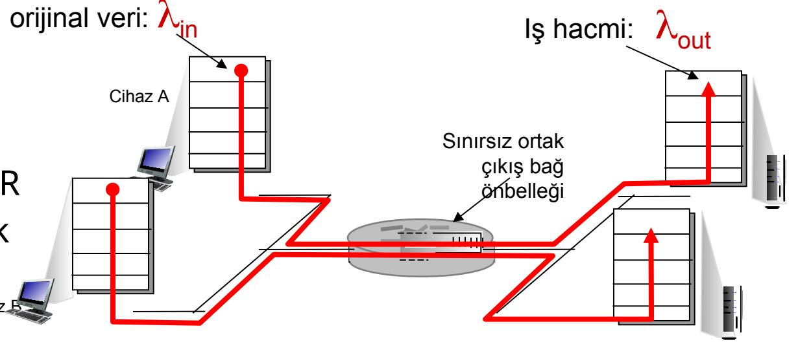

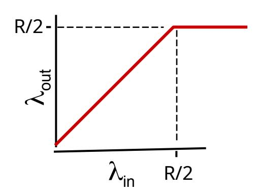

 maksimum bağlantı başı iş hacmi: R/2

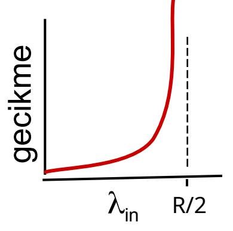

 geliş hızı, λ<sub>in</sub>, kapasiteye yaklaştıkça, uzun gecikmeler.

- bir yönlendirici, *sınırlı* önbellek
- Timeout olan paketleri gönderici tarafından tekrar gönderilir.
  - uygulama-katmanı girdi = uygulama-katmanı çıktı:in = out
  - taşıma-katmanı girdi tekrar gönderimleri içerir:in in '

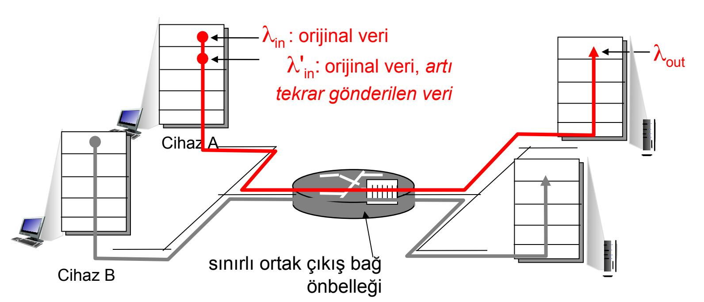

### varsayım: tam bilgi

 Gönderici sadece yönlendirici önbelleğinde yer var ise göndersin.

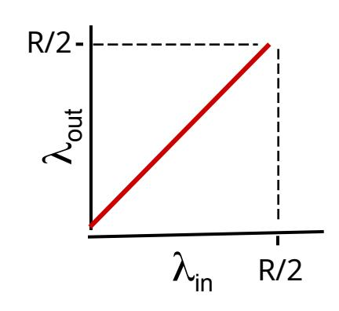

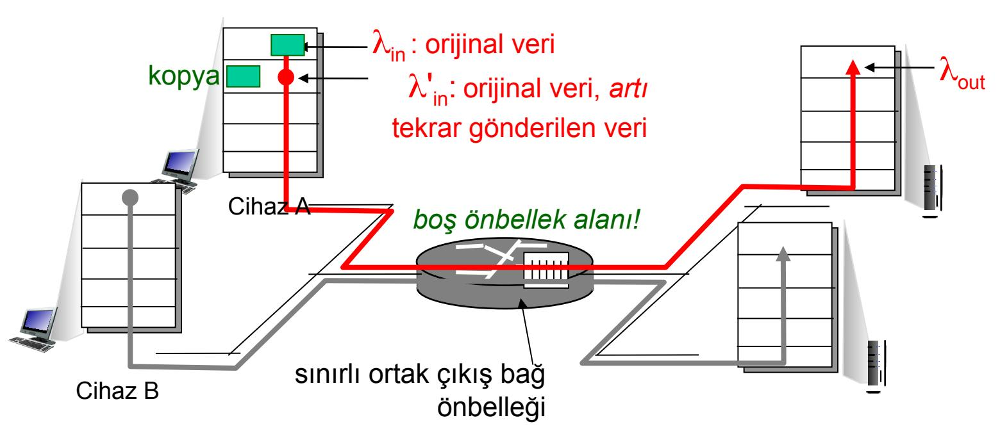

*varsayım: kayıp olursa biliniyor* paketler kaybolabilir veya dolu yönlendirici önbelleği nedeniyle düşürülebilir.

 Gönderici paket kayboldu bilgisi gelirse tekrar gönderiyor.

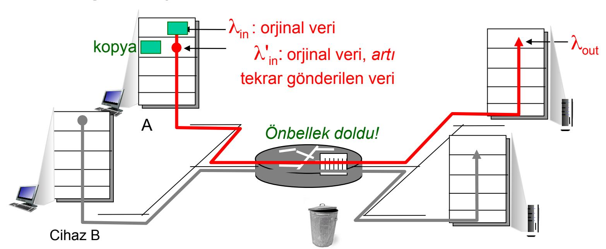

*varsayım: kayıp olursa biliniyor* paketler kaybolabilir veya dolu yönlendirici önbelleği nedeniyle düşürülebilir.

Gönderici paket kayboldu bilgisi gelirse tekrar gönderiyor.

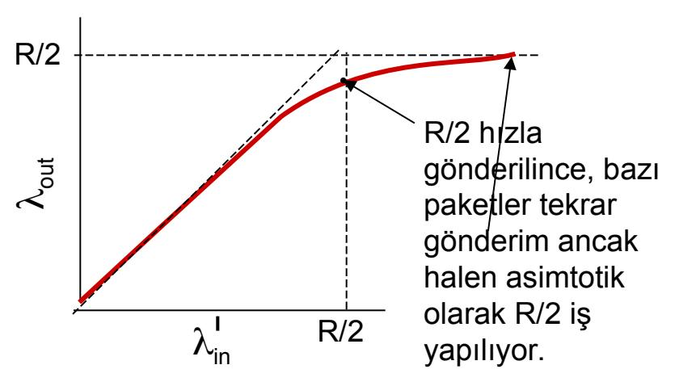

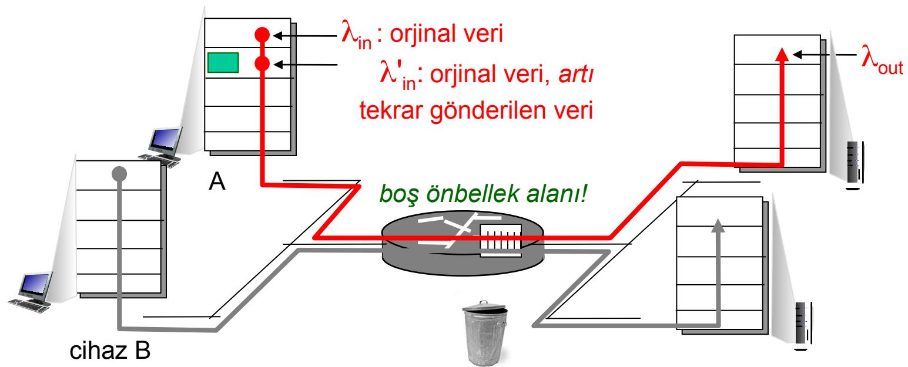

### Gerçekçi: kopyalar

- Paketler kaybolabilir veya dolu yönlendirici önbelleği sebebiyle düşürülebilir.
- Gönderici timeout alabilir, iki kopya gönderebilir, bu iki kopya karşı tarafa ulaşabilir.

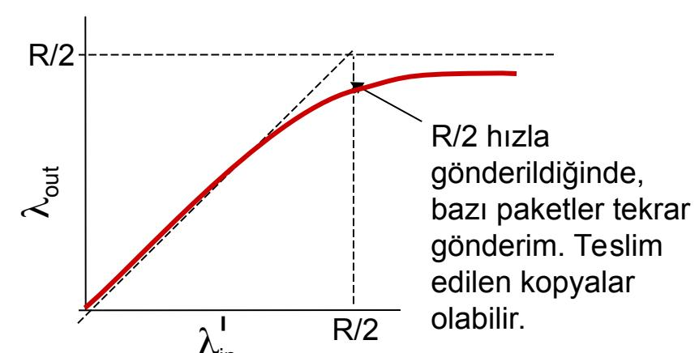

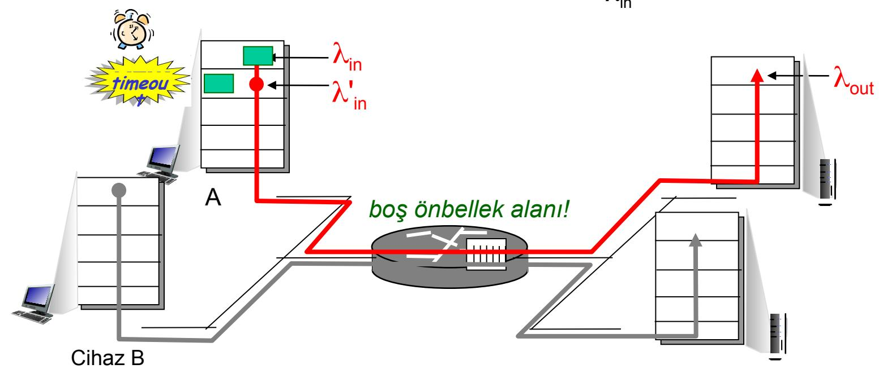

#### *Gerçekçi: kopyalar*

- Paketler kaybolabilir veya dolu yönlendirici önbelleği sebebiyle düşürülebilir.
- Gönderici timeout alabilir, iki kopya gönderebilir, bu iki kopya karşı tarafa ulaşabilir.

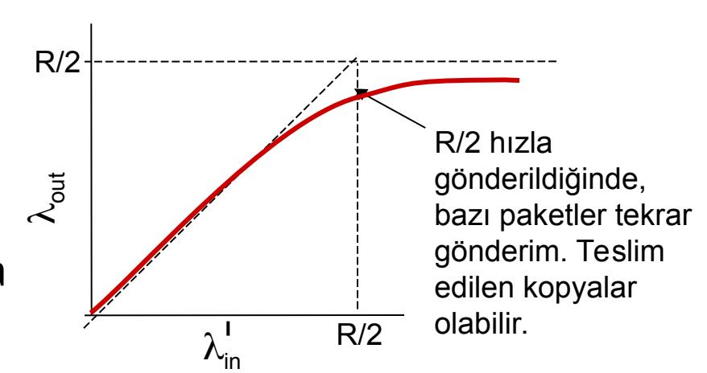

### S k man n "maliyeti" ı ış ı :

- Yapılan iş için daha fazla emek (tekrar gönderimler sebebiyle) harcanıyor.
- Gereksiz tekrar gönderimler: bağ üzerinde aynı paketin kopyaları taşınıyor.
  - Yapılan iş azalıyor.

- Dört gönderici
- Paylaşılan yollar
- timeout/tekrar gönderim

 $\underline{S:} \lambda_{in} \text{ ve } \lambda_{in}$ ' arttıkça ne olur?

C: kırmızı  $\lambda_{in}$  arttıkça, yukarı yönlendiriciye gelen paketler düşmeye başlar, mavinin iş hacmi 0'a düşer.

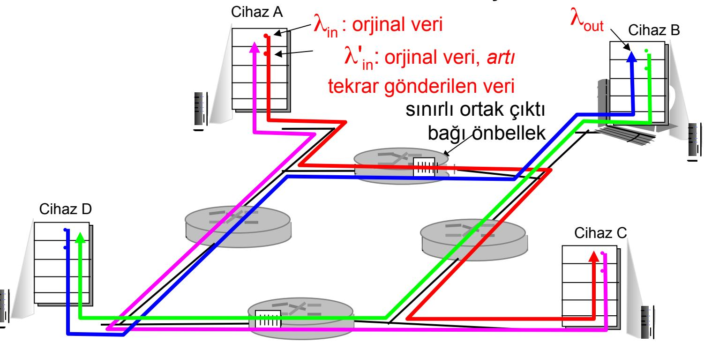

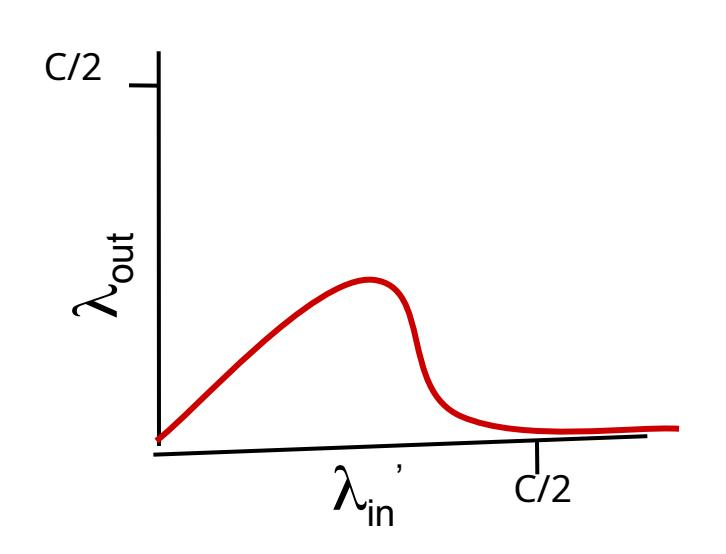

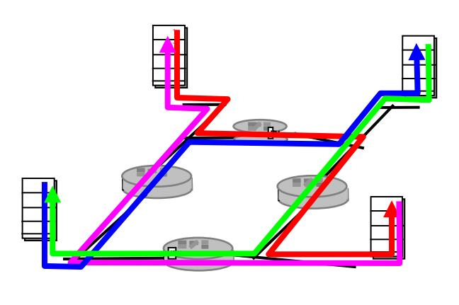

### Sıkışmanın bir başka "maliyeti":

 Bir paket düşürüldüğünde, paketin oraya kadarki yolculuğu sırasınca harcanan bant genişliği boşa gider.

### Sıkışma kontrolü yöntemleri

Sıkışma kontrolü amaçlı iki bilinen yöntem vardır:

#### Uçtan uca sıkışma kontrolü

- Ağdan direk geribildirim alınmaz.
- Sıkışma olduğu uç sistemler tarafından gözlemlenen gecikme ve kayıplardan anlaşılır.
- TCP bu yaklaşımı kullanır.

#### Ağ-destekli sıkışma sıkışma kontrolü

- Yönlendiriciler uç sistemlere geribildirim yaparlar.
  - Sıkışma olduğunu belirtmek için bir bit kullanılır. (SNA, DECbit, TCP/IP ECN, ATM)
  - Göndericiye belli bir hızda göndermesi belirtilir.

### Örnek sistem: ATM ABR sıkışma kontrolü

#### ABR: available bit rate:

- "elastik hizmet"
- Göndericinin yolu "boş" ise:
  - Gönderici boş bant genişliğinden faydalanabilir.
- Göndericinin yolu sıkışık ise:
  - Gönderici minimum garanti hıza kadar yavaşlatılır.

#### RM (resource management) hücreleri:

- Veri hücrelerinin arasında gönderici tarafından yollanır.
- RM içindeki bitleri yönlendiriciler değiştirebilir. ("a ğ-destekli*"*)
  - *NI bit:* hızı arttırmamalısın (hafif sıkışma).
  - *CI bit:* sıkışma var.
- RM hücereleri, alıcı tarafından göndericiye geri gönderilir.

### Örnek sistem: ATM ABR sıkışma kontrolü

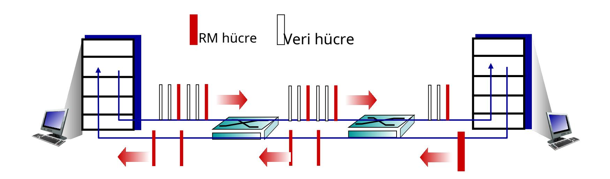

- RM hücresinde iki byte ER (explicit rate, gönderim hızı) alanı
  - Sıkışıklık yaşayan yönlendirici hürenin ER değerini azaltabilir.
  - Göndericinin gönderme hızı maksimum desteklenebililen hız olarak sınırlanır.
- Veri hücrelerinde EFCI: sıkışma yaşayan yönlendirici 1 olarak ayarlar.
  - Bir önceki RM hücresinde EFCI bit ayarlı ise, alıcı geri gönderilen RM hücresinde CI bit ayarlar.

# Bölüm 3: konular

- 3.1 taşıma-katmanı hizmetler
- 3.2 çoklama ve çoklama çözme
- 3.3 bağlantısız taşıma: UDP
- 3.4 güvenilir veri transferi prensipleri

- 3.5 bağlantı-odaklı taşıma: TCP
  - Segment yapısı
  - Güvenilir veri transferi
  - Akış kontrolü
  - Bağlantı yönetimi
- 3.6 sıkışma kontrolü prensipleri
- 3.7 TCP sıkışma kontrolü

### TCP sıkışma kontrolü: toplamalı artış çarpmalı azalış

- *yaklaşım:* gönderici, kayıp oluncaya kadar, kullanabilir bant genişliğini keşfetmek için iletim hızını artırır (pencere büyüklüğü).
  - *Toplamalı artış (İng: additive increase):* **cwnd** değerini kayıp oluncaya kadar her GDS'de 1 MSB artır.
  - *Çarpmalı azalış (İng: multiplicative decrease)*: **cwnd** değerini kayıp olunca yarıya indir.

AIMD testere dişi davranışı: kullanılabilir bant genişliği arama

**cw nd:** T

CPgönderici

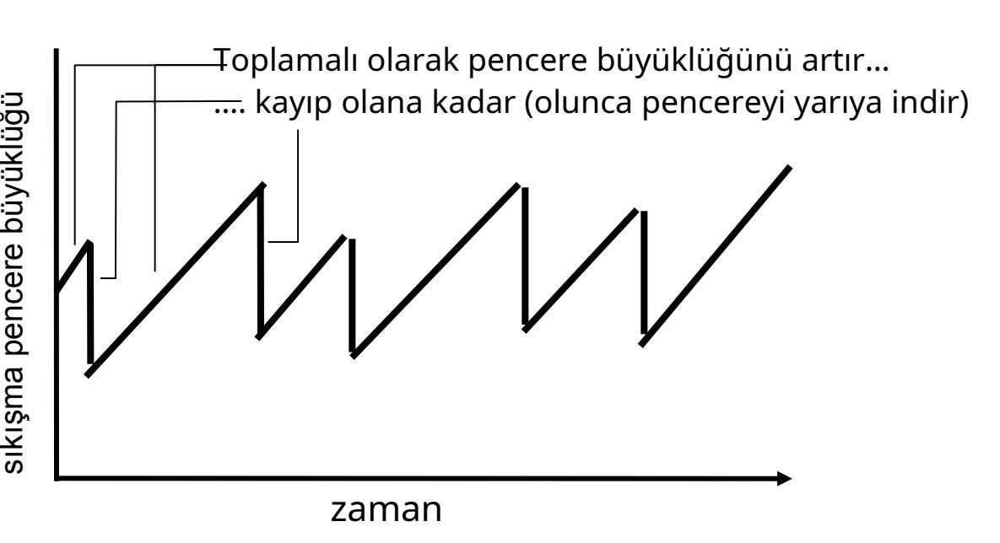

## TCP Sıkışma Kontrolü: detaylar

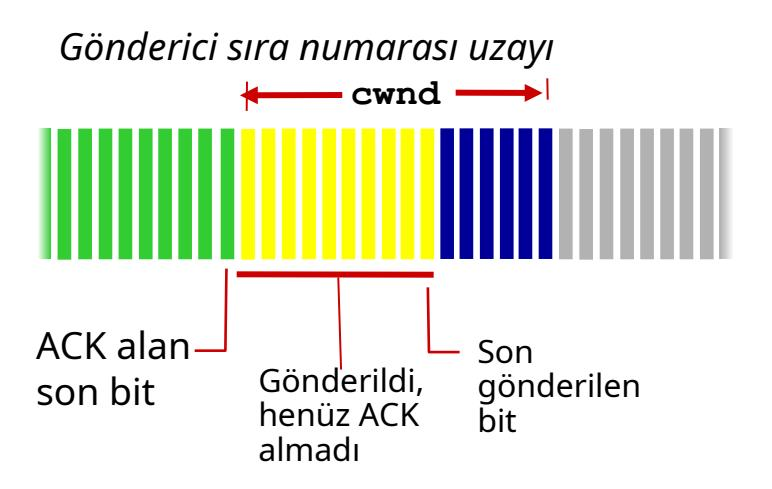

gönderici iletimi sınırlandırır:

cwnd dinamiktir, gözlenen ağ sıkışmasına göre değeri belirlenir.

### TCP gönderim hızı:

\* kabaca: cwnd byte gönder, ACK için GDS kadar bekle, sonra daha fazla byte gönder.

$$hiz \approx \frac{cwnd}{GDS}$$
 byte/sn

# TCP Yavaş Başlangıç

- Bağlantı başladığında, ilk kayıp olana kadar hızı üstel olarak artır.
  - başta **cwnd** = 1 MSB
  - Her GDS süresinde **cwnd** değerini ikiye katla.
  - Her ACK alındığında **cwnd** değerini artırarak yapılır.
- *özet:* baştaki hız düşük ama üstel hızla artış gösterir.

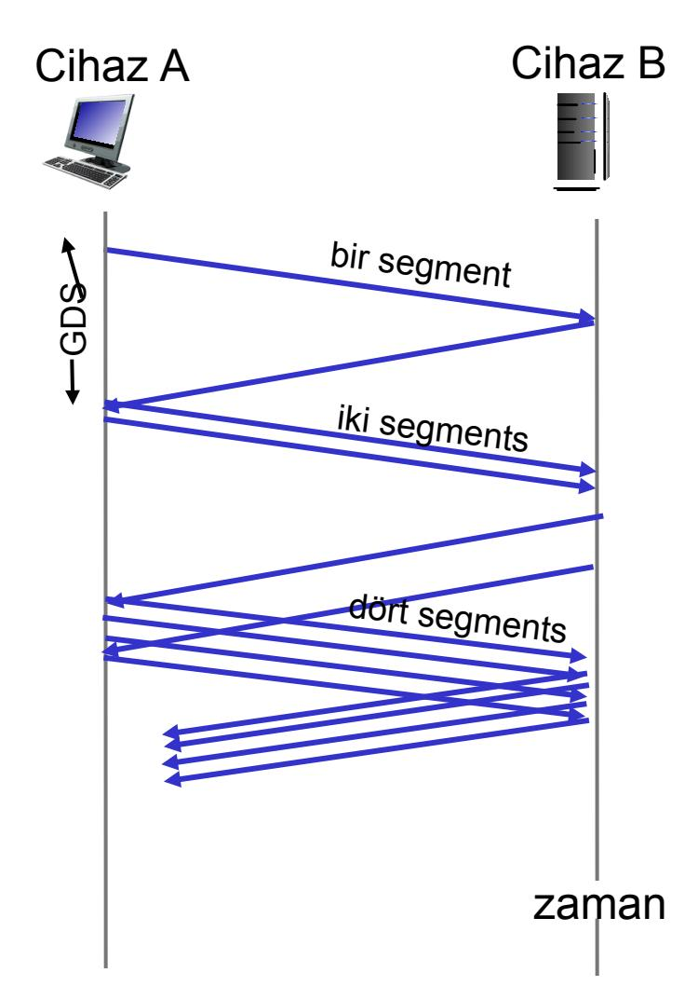

## TCP: kayıp tespiti ve reaksiyonu

- Timeout ile anlaşılan kayıp:
  - **cwnd** 1 MSB olarak ayarlanır;
  - Sonra eşik değerine kadar pencere üstel artar (yavaş başlangıçtaki gibi), daha sonra doğrusal olarak artar.
- 3 kopya ACK ile anlaşılan kayıp: TCP RENO
  - Kopya ACK geliyorsa ağ halen biraz segment iletebiliyor demektir.
  - **cwnd** yartıya indirilir daha sonra doğrusal artar.
- TCP Tahoe her zaman cwnd değerini 1 MSB yapar (timeout veya 3 kopya ACK durumunda)

### TCP: yavaş başlangıçtan ÇE moduna geçiş

- S: Ne zaman üstel artıştan doğrusal artışa geçilmeli?
- C: when cwnd timeout olmadan yarı değerine indiği noktada.

### **Ayarlama:**

- \* değişken ssthresh
- Kayıp olduğunda, ssthresh değeri kayıp öncesi cwnd değerinin yarısı olarak ayarlanır.

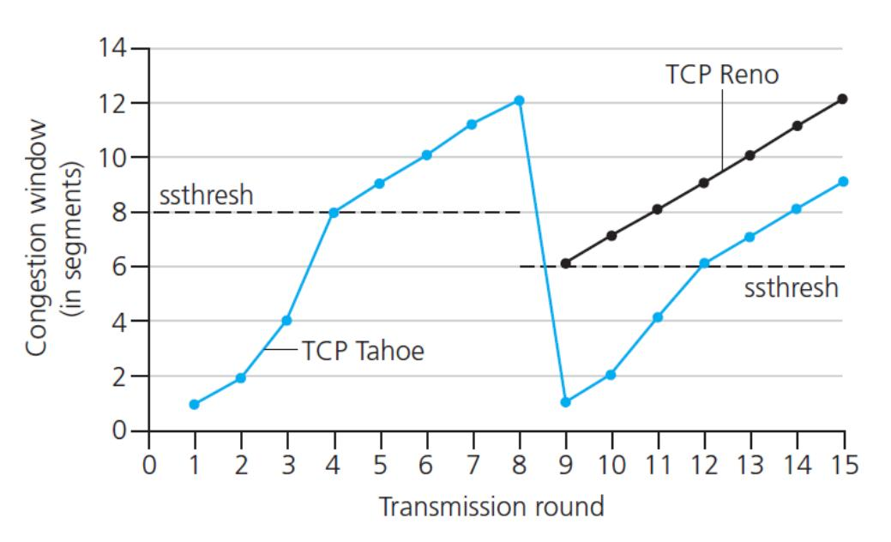

## Özet: TCP Sıkışma Kontrolü

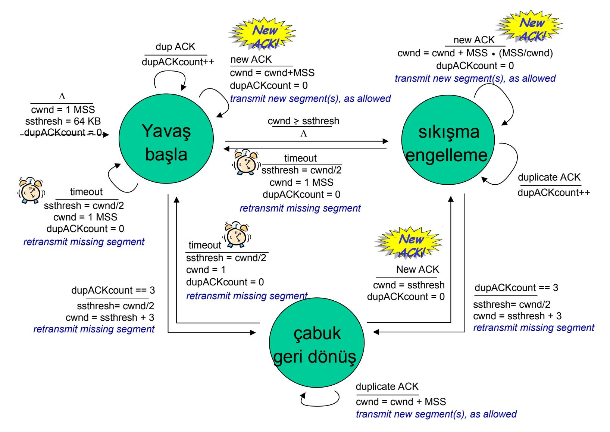

# TCP İş hacmi

- GDS ve pencere büyüklüğü üzerinden TCP ortalama iş hacmini nasıl hesaplarız?
  - Yavaş başlangıç görmezden gelelim, devamlı veri gönderilsin.
- W: kayıp olduğunda pencere büyüklüğü (byte)
  - ort. pencere büyüklüğü (# gönderilen byte): ¾ W
  - Her GDS için ort. iş hacmi 3/4W

ort TCP iş hacmi = 
$$\frac{3}{4} \frac{W}{GDS}$$
 bytes/sec

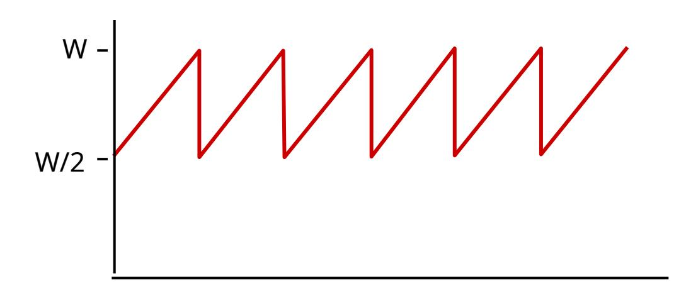

### TCP Geleceği: yüksek hızlarda transfer

- Örnek: 1500 byte segment, 100ms GDS, 10 Gb/sn iş hacmi istiyoruz
- W = 83,333 gönderilebilecek segment
- Kayıp ihtimali (L) ile iş hacmi hesabı [Mathis 1997]:

TCP iş hacmi = 1.22 **.** MSB GDS L

- ➜ 10 Gbp/sn iş hacmi için, kayıp ihtimali L = 2·10-10  *çok düşük bir kayıp ihtimali*
- Yüksek hız için TCP yeni versiyonları

# TCP Adalet

*adalet hedefi:* K TCP oturumu R hızında aynı bağı paylaşırsa, her bir bağlantı R/K hız elde etmeli

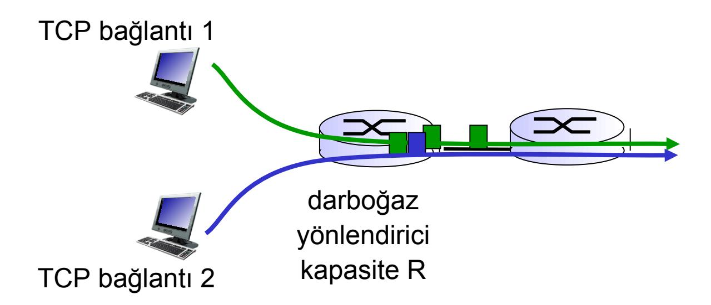

## Neden TCP adaletli davranır?

#### Iki mücadele eden oturum:

- Iş hacmi arttıkça, toplamalı artış sayesinde eğim 1'e yaklaşır.
- Çarpmalı azalış sayesinde iki oturumun oranı birbirine yaklaşır.

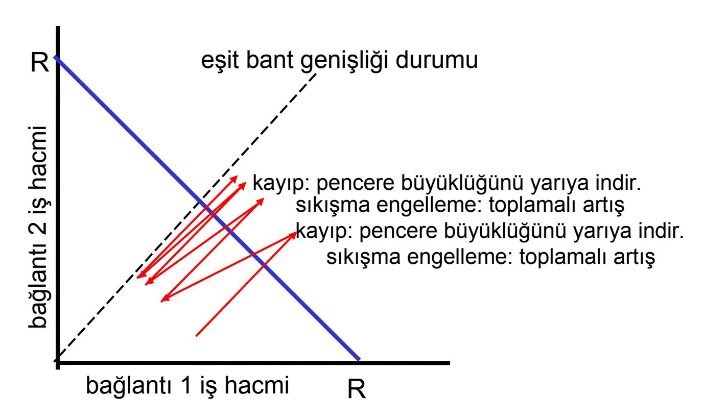

# Adalet

#### *Adalet ve UDP*

- Çoklu-ortam uyg. genelde TCP kullanmaz
  - Sıkışma kontrolü tarafından yavaşlatılmak istemezler.
- Onun yerine UDP:
  - Sabit hızda ses/görüntü gönderirler, katıp paketleri telore ederler.

### *Adalet, paralel TCP bağlantıları*

- Uygulamalar iki cihaz arasında çoklu paralel bağlantı açabilirler.
- web tarayıcıları yapar.
- Ör: R hızında bağ 9 bağlantı içeriyor:
  - Yeni bağlantı kuran uyg. 1 TCP bağlantısı açarsa, R/10 bağ genişliği alır.
  - Yeni bağlantı kuran uyg. 11 TCP bağlantısı açarsa, R/2 bağ genişliği alır.

# Bölüm 3: özet

- Taşıma katmanı hizmet prensipleri:
  - multiplexing, demultiplexing
  - Güvenilir veri transferi
  - Akış kontrolü
  - Sıkışma kontrolü
- İnternet üzerindeki protokoller.
  - UDP
  - TCP

#### sonra:

- Ağ kenarını bırakıyoruz (uygulamai taşıma katmanı)
- Ağ çekirdeğine